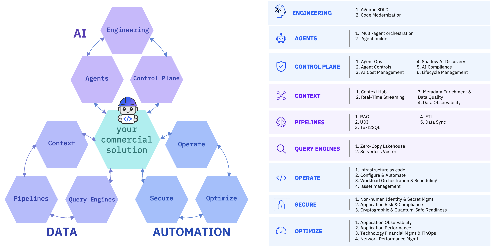

## Introduction

The **Technology Building Block** is a curated set of IBM capabilities developed by the Build Engineering team to accelerate solution delivery and demonstrate the value of the IBM technology stack, with a focus on Embeddable AI and Automation.

These building blocks showcase seamless integration across IBM Data & AI and Automation platforms, delivering reusable engineering patterns that simplify implementation and reduce time-to-value.

> **Note**: The building blocks are **AI-tool agnostic** — they can be used with **IBM Bob**, **Claude**, **GitHub Copilot**, or any other AI coding assistant. Bob is the recommended tool for the included modes and skills, but all runnable assets (FastAPI services, Python scripts, Terraform IaC) work independently of any AI assistant.

For more information, see the [documentation](https://ibm-self-serve-assets.github.io/building-blocks-docs/)

---

## What is the Technology Building Block?

The Building Block is a **reference implementation framework** that accelerates engineering and partner-facing engagements. It enables teams to:

- Rapidly **prototype, deploy, and validate** AI-powered applications.
- Seamlessly **integrate IBM services** like **watsonx.ai**, **watsonx.data**, **Instana**, **Turbonomic** and other IBM offerings with partner and open-source ecosystems.
- Present **business-aligned outcomes** showcasing seamless integration and value delivery through reusable building blocks that highlight the full potential of IBM's capabilities.

Embeddable capabilities across key domains:

- **AI Agents** – APIs and SDKs from watsonx Orchestrate, watsonx.ai, and open source that enable orchestration and intelligent task automation.
- **Trusted AI** – Capabilities from watsonx.governance and watsonx.ai that support model validation, guardrails, and governance workflows.
- **Data for AI** – Solutions powered by watsonx.data and watsonx.ai for tasks such as Auto-RAG, model fine-tuning, and Text-to-SQL.
- **Automation** – Automated engineering patterns across Operate (IaC, configuration), Secure (secrets, continuous compliance, quantum-safe), and Optimize (observability, FinOps, performance).

---

## AI — Artificial Intelligence, Agents, & Trust

The **[AI Building Blocks](ai/README.md)** deliver reusable engineering patterns, agent creation frameworks, governance tooling, and full-lifecycle software development automation. They are organized into three domains:

| Domain | Building Block | Primary Products / Capabilities |
|---|---|---|
| **Agents** | [Agent Builder](ai/agents/agent-builder/) | IBM watsonx Orchestrate ADK + Tools + Knowledge Bases |
| **Agents** | [Multi-Agent Orchestration](ai/agents/multi-agent-orchestration/) | IBM watsonx Orchestrate + AI Gateway + MCP/A2A |
| **AI Engineering** | [Agentic SDLC](ai/ai-engineering/agentic-sdlc/) | IBM Bob + In-IDE Agentic Development |
| **AI Engineering** | [Code Modernization](ai/ai-engineering/code-modernization/) | IBM Bob + Legacy Refactoring + Java/Maximo |
| **AI Engineering** | [headlessbob](ai/ai-engineering/headless-bob/) | Node.js + REST/ACP APIs + Threads UI |
| **AI Engineering** | [Integrate as Code](ai/ai-engineering/integrate-as-code/) | IBM iPaaS + watsonx Orchestrate Workflows |
| **AI Trust** | [AI Trust](ai/ai-trust/) | IBM watsonx.governance + Model Eval + Guardrails |

[Explore all AI building blocks →](ai/README.md)

---

## Automation — Enterprise IT & Cloud Automation

The **[Automation Building Blocks](automation/README.md)** deliver automated engineering patterns, infrastructure code, observability, compliance, and cost optimization capabilities. They are organized into three domains:

| Domain | Building Block | Primary Products / Capabilities |
|---|---|---|
| **Operate** | [Infrastructure as Code](automation/operate/infrastructure-as-code/) | Terraform + OpenTofu + JMeter + Multi-Cloud |
| **Operate** | [Configure & Automate](automation/operate/configure-and-automate/) | Ansible + Automation Playbooks |
| **Operate** | [Workload Orchestration & Scheduling](automation/operate/workload-orchestration-and-scheduling/) | IBM Workload Automation + Enterprise Scheduling |
| **Operate** | [Asset Management](automation/operate/asset-management/) | IBM Maximo Application Suite + Code Modernization |
| **Secure** | [Non-Human Identity & Secret Management](automation/secure/non-human-identity-and-secret-management/) | IBM Security Verify + HashiCorp Vault |
| **Secure** | [Application Risk & Continuous Compliance](automation/secure/application-risk-and-continuous-compliance/) | IBM Concert + Continuous Resilience |
| **Secure** | [Cryptographic & Quantum-Safe Readiness](automation/secure/cryptographic-and-quantum-safe-readiness/) | IBM Quantum Safe Explorer + IBM Guardium |
| **Optimize** | [Full-Stack Application Observability](automation/optimize/full-stack-application-observability/) | IBM Instana + OpenTelemetry |
| **Optimize** | [Application Performance](automation/optimize/application-performance/) | IBM Turbonomic |
| **Optimize** | [Technology Financial Management & FinOps](automation/optimize/technology-financial-management-and-finops/) | IBM Apptio + Cloudability |
| **Optimize** | [Network Performance Management](automation/optimize/network-performance-management/) | Network Observability & Diagnostics |
| **Optimize** | [Budget & Forecasting](automation/optimize/budget-and-forecasting/) | IBM Planning Analytics (TM1) |

[Explore all Automation building blocks →](automation/README.md)

---

## Data — Intelligent Data Platform

The **[Data Building Blocks](data/README.md)** provide a composable foundation for making enterprise data connected, contextual, trusted, and ready for analytics and AI. They are organized into three use-case groups:

| Group | Building Block | Primary Products |
|---|---|---|
| **Context** | [Context Hub](data/context/context-hub/) | IBM Confluent + IBM watsonx.data + IBM watsonx.data intelligence |
| **Context** | [Real-Time Streaming](data/context/real-time-streaming/) | IBM Confluent (Kafka + Flink + connectors + governance) |
| **Context** | [Metadata Enrichment & Data Quality](data/context/metadata-enrichment/) | IBM watsonx.data intelligence |
| **Context** | [Data Observability](data/context/data-observability/) | IBM watsonx.data integration + IBM Data Observability by Databand |
| **Pipelines** | [RAG](data/pipelines/rag/) | IBM watsonx.data OpenRAG + OpenSearch |
| **Pipelines** | [UDI — Unstructured Data Integration](data/pipelines/udi/) | IBM watsonx.data integration + Docling for IBM watsonx |
| **Pipelines** | [Text2SQL](data/pipelines/text2sql/) | IBM watsonx.data intelligence |
| **Pipelines** | [ETL / ELT](data/pipelines/etl/) | IBM DataStage (watsonx.data integration) + IBM watsonx.data |
| **Pipelines** | [Data Sync](data/pipelines/data-sync/) | IBM Aspera Sync |
| **Query Engines** | [Zero-Copy Lakehouse](data/query-engines/zero-copy-lakehouse/) | IBM watsonx.data (Presto + Spark + Apache Iceberg) |
| **Query Engines** | [Serverless Vector](data/query-engines/serverless-vector/) | IBM watsonx.data + Astra DB Serverless |

[Explore all Data building blocks →](data/README.md)

---

## License

This project is licensed under the [Apache 2.0 License](LICENSE).
