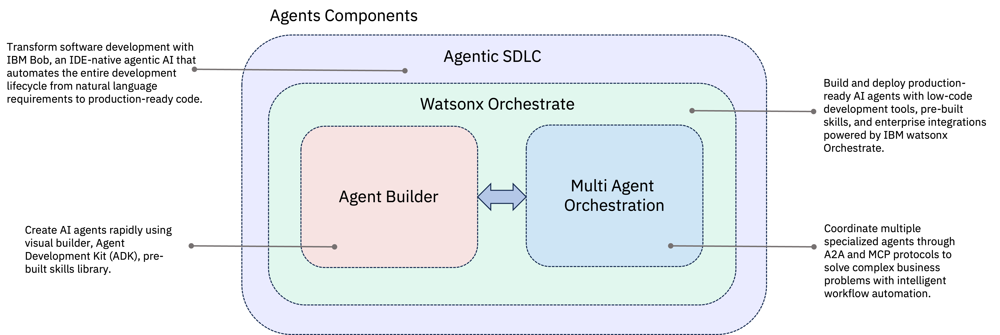

# IBM Building Blocks for Agents

Welcome to the **Agents** building blocks.  
This resource helps you get started on creating, deploying, and managing autonomous AI agents that automate business workflows, orchestrate complex tasks, and accelerate software development through intelligent automation. These capabilities are powered by **IBM watsonx Orchestrate** and **IBM Bob**.

Building enterprise-ready AI agents requires a structured approach across creation, orchestration, and development automation — from rapidly assembling individual agents to coordinating multi-agent systems and automating the full software development lifecycle. This repository provides frameworks, best practices, and tools to ensure your AI agents are production-ready and enterprise-grade.

---

## 📂 Repository Structure

The content is organized into 3 main building blocks:

### 1. **[Agent Builder](agent-builder/)**
Create and deploy autonomous, task-driven AI agents that interact with enterprise applications, tools, and data using the **IBM watsonx Orchestrate Agentic Development Kit (ADK)**. Agent Builder reduces custom engineering effort and accelerates agent-based automation across business functions — with configurable behaviors, enterprise integrations, and deployable artifacts ready for production.

- **Python-based ADK** — build agents using Python library and CLI tools
- **Tool & API Integration** — connect agents to enterprise systems, apps, and data sources
- **Prompt Configuration** — define agent instructions, rules, and operational boundaries
- **Lifecycle Management** — version, test, and deploy agents with confidence
- **Bob Modes** — guided agent development with domain-specific, voice, and REST integration modes

### 2. **[Multi-Agent Orchestration](multi-agent-orchestration/)**
Coordinate multiple specialized AI agents to collaborate intelligently on complex enterprise workflows. Agents don't work in isolation — Multi-Agent Orchestration routes tasks dynamically, shares context across agents, and integrates with external systems through open standards. It provides the connective tissue for building distributed, interoperable agent systems that scale.

- **Dynamic Task Delegation** — automatically route tasks to the most capable specialized agent
- **Shared Memory & Context** — agents exchange structured knowledge through a unified memory layer
- **Chained Reasoning** — combine outputs from multiple agents to form comprehensive responses
- **MCP Integration** — connect to external systems via Model Context Protocol
- **A2A Protocol** — enable agent-to-agent communication and collaboration across platforms

### 3. **[Agentic SDLC](agentic-sdlc/)**
Transform software development with **IBM Bob**, an IDE-native agentic AI that automates the entire software development lifecycle from natural language requirements to production-ready code. Agentic SDLC embeds intelligence directly into real codebases and pipelines, enabling teams to build software faster, safer, and closer to business intent.

- **Intent-to-Software Generation** — natural language requirements to production-grade code
- **Agentic Development Modes** — specialized modes for planning, coding, refactoring, testing, and documentation
- **In-Context Code Intelligence** — continuous semantic awareness of your codebase and dependencies
- **Real-Time Code Review** — automated refactoring, quality checks, and security pattern enforcement
- **Pipeline Integration** — CI/CD automation from IDE through to production deployment

---

## 🚀 Getting Started
1. Browse the building block that best fits your needs — agent creation, multi-agent orchestration, or development automation.
2. Follow the documentation in each folder to integrate the building block into your application.
3. Check `bob-modes/` in each folder for AI-assisted development workflows (available for Agent Builder and Multi-Agent Orchestration).

---

## 🤝 Contributing
We welcome contributions! Please submit issues, suggest improvements, or open pull requests to expand the resources and keep this repository valuable for all partners.
