# IBM Orchestrate Agentic for Contextual Knowledge Hub  

> A multi-agent workflow powered by **IBM Watsonx Orchestrate** that enables automated, contextual knowledge retrieval across IBM products.  

---

## Table of Contents
- [Overview](#overview)
- [Architecture](#architecture)
- [Features](#features)
- [Technology Stack](#technology-stack)
- [Prerequisites](#prerequisites)
- [Project Structure](#project-structure)
- [Developer Guide](#developer-guide)
- [Examples](#examples)
- [Business Value](#business-value)
- [Use Cases](#use-cases)
- [Benefits](#benefits)
- [Contributing](#contributing)
- [License](#license)

---

## 🧠 Overview  

This project demonstrates how to build a **multi-agent workflow** using **Watsonx Orchestrate** to collect, process, and aggregate contextual knowledge across IBM products.  

The **Contextual Knowledge Hub** acts as the **supervisory agent**, intelligently redirecting user queries to product-specific sub-agents — each responsible for providing answers about its corresponding IBM product.  

By the end of this lab, you will have:  
- A **main orchestrator agent** (Contextual Knowledge Hub)  
- Multiple **sub-agents** (Watsonx Orchestrate, Watsonx Assistant, Cognos Analytics, Watsonx AI, Watsonx Code Assistant)  
- A complete end-to-end setup for **automated information retrieval, processing, and Q&A**  

--- 

### Developer Architecture  

```mermaid
flowchart TD
    A[User Query] --> B[🤖 Contextual Knowledge Hub Agent]
    B <-->|Final Response| A
    B -->|Routes| C[🤖 Wx Orchestrate Agent]
    C -->|Response| B
    B -->|Routes| D[🤖 Wx Assistant Agent]
    D -->|Response| B
    B -->|Routes| E[🤖 Cognos Analytics Agent]
    E -->|Response| B
    B -->|Routes| F[🤖 Wx AI Agent]
    F -->|Response| B
    B -->|Routes| G[🤖 Wx Code Assistant Agent]
    G -->|Response| B
```



---

## 🏗 Architecture  

The **Contextual Knowledge Hub** orchestrates user queries across multiple product-specific sub-agents, ensuring contextual, accurate, and AI-driven responses.  

---

## ✨ Features

- Context-Aware Knowledge Routing: Automatically routes user queries to the most relevant IBM product-specific agent for precise, contextual responses.

- Multi-Agent Collaboration: Enables multiple specialized agents to work together seamlessly for comprehensive, cross-product knowledge retrieval.

- Intelligent Query Decomposition: Breaks down complex queries into smaller tasks and aggregates results from relevant IBM systems.

- Adaptive Learning: Continuously improves accuracy and context understanding through feedback loops powered by watsonx.ai.

---

## 🧩 Technology Stack  

- **IBM Watsonx Orchestrate** ([SaaS](https://cloud.ibm.com/catalog/services/watsonx-orchestrate) or Developer Edition)  
- IBM Watsonx **[Agentic Development Kit (ADK)](https://developer.watson-orchestrate.ibm.com/)**  
- Python **3.9+** 

---

## 🧱  Project Structure  

```bash
├── agents/                          
│   ├── agent-builder/              
│   │   ├── contextual_knowledge_hub/ 
│   │   │   ├── agents/ 
│   │   │   │   ├── cognos_analytics_agent.yaml 
│   │   │   │   ├── contextual_knowledge_hub.yaml 
│   │   │   │   ├── wx_ai_agent.yaml 
│   │   │   │   ├── wx_assistant_agent.yaml 
│   │   │   │   ├── wx_code_assistant_agent.yaml 
│   │   │   │   └── wxo_agent.yaml
│   │   │   ├── tools/ 
│   │   │   │   ├── cognos_analytics/ 
│   │   │   │   ├── wx.ai/ 
│   │   │   │   ├── wx.assistant/
│   │   │   │   ├── wx.code_assistant/ 
│   │   │   │   └── wxo/ 
│   │   │   └── README.md  
│   │   └── requirements.txt 
│   ├── AI_Gateway/  
│   │   ├── config/  
│   │   │   ├── anthropic-claude.yaml 
│   │   │   ├── google-genai.yaml
│   │   └── README.md 
│   └── README.md 
├── .gitignore
├── LICENSE
└── requirements.txt
```

---

## 🔧 Prerequisites

Before starting, ensure you have:

1. **IBM watsonx.Orchestrate Instance**
   - Create via [IBM Cloud Catalog](https://cloud.ibm.com/catalog)

2. **IBM Cloud API Key**
   - Generate from [IBM Cloud Account Settings](https://cloud.ibm.com/docs/account?topic=account-userapikey)

3. **Service Access**
   - Access permissions for watsonx.Orchestrate service

4. **Agentic Development Kit (ADK)**
   - IBM Watsonx [Agentic Development Kit (ADK)](https://developer.watson-orchestrate.ibm.com/)

5. **Python**
   - Python 3.9+

---

## 🚀 Developer Guide  

### 1. Install IBM Watsonx Orchestrate ADK  

Follow the [Agent Development Kit (ADK) Guide](https://developer.ibm.com/tutorials/getting-started-with-watsonx-orchestrate/):

```bash
pip install ibm-watsonx-orchestrate
```

Configure your environment:  
```bash
orchestrate env add -n dev_env -u <IBM_ORCHESTRATE_INSTANCE_URL> --iam-url <IAM_URL>
orchestrate env activate dev_env -a <API_KEY>
```

---

### 2. Register Tools & Agents  

Go to the **Contextual Knowledge Hub** directory:  
```bash
cd agents/agent-builder/contextual-knowledge-hub
```

Import tools for each product:  

#### Cognos Analytics  
```bash
orchestrate tools import -k python -f tools/cognos_analytics/get_cognos_features.py -r requirements.txt
orchestrate tools import -k python -f tools/cognos_analytics/get_cognos_info.py -r requirements.txt
orchestrate tools import -k python -f tools/cognos_analytics/get_cognos_pricing.py -r requirements.txt
orchestrate tools import -k python -f tools/cognos_analytics/get_cognos_resources.py -r requirements.txt
```

#### Watsonx Assistant  
```bash
orchestrate tools import -k python -f tools/wx.assistant/get_wx_assistant_features.py -r requirements.txt
orchestrate tools import -k python -f tools/wx.assistant/get_wx_assistant_info.py -r requirements.txt
orchestrate tools import -k python -f tools/wx.assistant/get_wx_assistant_pricing.py -r requirements.txt
orchestrate tools import -k python -f tools/wx.assistant/get_wx_assistant_resources.py -r requirements.txt
```

#### Watsonx Orchestrate  
```bash
orchestrate tools import -k python -f tools/wxo/get_wxo_features.py -r requirements.txt
orchestrate tools import -k python -f tools/wxo/get_wxo_info.py -r requirements.txt
orchestrate tools import -k python -f tools/wxo/get_wxo_integration.py -r requirements.txt
orchestrate tools import -k python -f tools/wxo/get_wxo_pricing.py -r requirements.txt
orchestrate tools import -k python -f tools/wxo/get_wxo_resources.py -r requirements.txt
```

#### Watsonx AI  
```bash
orchestrate tools import -k python -f tools/wx.ai/get_wxai_agent_development.py -r requirements.txt
orchestrate tools import -k python -f tools/wx.ai/get_wxai_info.py -r requirements.txt
orchestrate tools import -k python -f tools/wx.ai/get_wxai_knowledge_management.py -r requirements.txt
orchestrate tools import -k python -f tools/wx.ai/get_wxai_model_customization.py -r requirements.txt
orchestrate tools import -k python -f tools/wx.ai/get_wxai_model_library.py -r requirements.txt
orchestrate tools import -k python -f tools/wx.ai/get_wxai_pricing.py -r requirements.txt
orchestrate tools import -k python -f tools/wx.ai/get_wxai_rag_development.py -r requirements.txt
```

#### Watsonx Code Assistant  
```bash
orchestrate tools import -k python -f tools/wx.code_assistant/get_wxca_info.py -r requirements.txt
orchestrate tools import -k python -f tools/wx.code_assistant/get_wxca_pricing.py -r requirements.txt
```

#### Agents  
```bash
orchestrate agents import -f agents/cognos_analytics_agent.yaml
orchestrate agents import -f agents/wxo_agent.yaml
orchestrate agents import -f agents/wx_assistant_agent.yaml
orchestrate agents import -f agents/contextual_knowledge_hub.yaml
orchestrate agents import -f agents/wx_ai_agent.yaml
orchestrate agents import -f agents/wx_code_assistant_agent.yaml
```

---

### 3. Configure Agents in UI  

Open the chat UI, and configure **Contextual Knowledge Hub** as the master agent with sub-agents:  

1. Open the **Chat Server UI**  
2. Navigate to **Manage Agents**  
3. Select **Contextual Knowledge Hub (Master Agent)**  
4. Add sub-agents:  
   - Wx Orchestrate  
   - Wx Assistant  
   - Cognos Analytics  
   - Wx Code Assistant  
   - Wx AI  

---

## 📊 Examples

| Query | Routed To |
|--------|------------|
| “What are the pricing tiers of Watsonx AI?” | Wx_AI Agent |
| “List features of Cognos Analytics.” | Cognos_Analytics Agent |
| “How does Watsonx Orchestrate integrate with Workday?” | Wx_Orchestrate Agent |

---

## Business Value  

The **Contextual Knowledge Hub** empowers enterprises with:  

- **Customer Support Acceleration** → Agents provide instant product knowledge.  
- **Reduced Onboarding Time** → Contextual answers replace manual documentation searches.  
- **Enterprise Scalability** → Add new IBM products easily by creating new sub-agents.  
- **Governance & Control** → ADK ensures auditability, versioning, and safe orchestration.  

---

## Use Cases  

- **Product Q&A Hub** → Unified interface for IBM product knowledge.  
- **Sales Enablement** → Real-time contextual insights during demos.  
- **Market Research** → Aggregate product details dynamically.  
- **Knowledge Management** → AI-powered employee self-service.  

---

## Benefits  

- Faster decision-making with contextual AI  
- Improved productivity with quick knowledge retrieval  
- Seamless integration with IBM and third-party APIs  
- Scalable design – onboard new agents in hours  

---

## Contributing  

We welcome contributions from the community!  
1. Fork this repository  
2. Create a feature branch  
3. Commit and push your changes  
4. Submit a pull request (PR)  

---

## License  

This project is licensed under the **Apache 2.0 License**.  
> IBM Corporation 2025. All rights reserved.
