# IBM Orchestrate Agentic for Contextual Knowledge Hub  

## Overview  
This project demonstrates how to build a **multi-agent workflow** using **Watsonx Orchestrate** to collect, process, and aggregate contextual knowledge across IBM products.  

The **Contextual Knowledge Hub** acts as the **supervisory agent**. It intelligently redirects user queries to product-specific sub-agents, each responsible for answering questions about an IBM product.  

By the end of this lab, you will have:  
- A **main orchestrator agent** (Contextual Knowledge Hub)  
- Multiple **sub-agents** (Watsonx Orchestrate, Watsonx Assistant, Cognos Analytics, Watsonx AI, Watsonx Code Assistant)  
- A complete end-to-end setup for **automated information retrieval, processing, and Q&A**  

---

## Prerequisites  

- Access to **IBM Watsonx Orchestrate** [SaaS](https://cloud.ibm.com/catalog/services/watsonx-orchestrate) or Developer Edition.   
- IBM Watsonx **[Agentic Development Kit](https://developer.watson-orchestrate.ibm.com/) (ADK)**  
- Python **3.9+**  
- Git CLI  

---

## Architecture  

The **Contextual Knowledge Hub** orchestrates queries across product-specific sub-agents.  

### Developer Architecture  

```mermaid
flowchart TD
    A[User Query] --> B[🤖 Contextual Knowledge Hub Agent]
    B <-->|Final Response| A
    B -->|Routes| C[🤖 Wx Orchestrate Agent]
    C -->|Response| B
    B -->|Routes| D[🤖 Wx Assistant Agent]
    D -->|Response| B
    B -->|Routes| E[🤖 Cognos Analytics Agent]
    E -->|Response| B
    B -->|Routes| F[🤖 Wx AI Agent]
    F -->|Response| B
    B -->|Routes| G[🤖 Wx Code Assistant Agent]
    G -->|Response| B
    C --> |fetch info|H[🛠️ Tools:
    get_features
    get_info
    get_integration
    get_pricing
    get_resources
    ]
    D --> |fetch info|I[🛠️ Tools:
    get_features
    get_info
    get_pricing
    get_resources
    ]
    E --> |fetch info|J[🛠️ Tools:
    get_features
    get_info
    get_pricing
    get_resources]
    F --> |fetch info|K[🛠️ Tools:
    get_info
    get_info_agent_dev
    get_pricing
    get_info_knowledge_mgn,
    get_info_model_cust,
    get_info_model_lib,
    get_princing,
    get_info_rag]
    G --> |fetch info|L[🛠️ Tools:
    get_info
    get_procing]
    
```



---

## 📂 Project Structure  

```bash
├── agents/                          
│   ├── agent-builder/              
│   │   ├── contextual_knowledge_hub/ 
│   │   │   ├── agents/ 
│   │   │   │   └── cognos_analytics_agent.yaml 
│   │   │   │   └── contextual_knowledge_hub.yaml 
│   │   │   │   └── wx_ai_agent.yaml 
│   │   │   │   └── wx_assistant_agent.yaml 
│   │   │   │   └── wx_code_assistant_agent.yaml 
│   │   │   │   └── wxo_agent.yaml
│   │   │   ├── tools/ 
│   │   │   │   └── cognos_analytics/ 
│   │   │   │   └── wx.ai/ 
│   │   │   │   └── wx.assistant/
│   │   │   │   └── wx.code_assistant/ 
│   │   │   │   └── wxo/ 
│   │   │   └── README.md  
│   │   └── requirements.txt 
│   ├── AI_Gateway/  
│   │   ├── config/  
│   │   │    ├── anthropic-claude.yaml 
│   │   │    ├── google-genai.yaml
│   │   └── README.md 
│   └── README.md 
├── .gitignore
├── LICENSE
└── requirements.txt
```

---

##  Developer Guide  

### 1 Install IBM Watsonx Orchestrate ADK  

Getting started with [Agent Development Kit](https://developer.ibm.com/tutorials/getting-started-with-watsonx-orchestrate/)

```bash
pip install ibm-watsonx-orchestrate
```

Configure the environment:  

```bash
orchestrate env add -n dev_env -u <IBM_ORCHESTRATE_INSTANCE_URL> --iam-url <IAM_URL>
orchestrate env activate dev_env -a <API_KEY>
```

### 2 Register Tools & Agents  

- Go to the folder `contextual-knowledge-hub`

```bash
cd agents/agent-builder/contextual-knowledge-hub
```

- Import tools for each product (Watsonx AI, Orchestrate, Assistant, Cognos, Code Assistant).  
```bash
orchestrate tools import -k python -f tools/cognos_analytics/get_cognos_features.py -r requirements.txt
orchestrate tools import -k python -f tools/cognos_analytics/get_cognos_info.py -r requirements.txt
orchestrate tools import -k python -f tools/cognos_analytics/get_cognos_pricing.py -r requirements.txt
orchestrate tools import -k python -f tools/cognos_analytics/get_cognos_resources.py -r requirements.txt
```

- Adding Wx Assistant Tools
```bash
orchestrate tools import -k python -f tools/wx.assistant/get_wx_assistant_features.py -r requirements.txt
orchestrate tools import -k python -f tools/wx.assistant/get_wx_assistant_info.py -r requirements.txt
orchestrate tools import -k python -f tools/wx.assistant/get_wx_assistant_pricing.py -r requirements.txt
orchestrate tools import -k python -f tools/wx.assistant/get_wx_assistant_resources.py -r requirements.txt
```

- Adding Wx Orchestrate Tools
```bash
orchestrate tools import -k python -f tools/wxo/get_wxo_features.py -r requirements.txt
orchestrate tools import -k python -f tools/wxo/get_wxo_info.py -r requirements.txt
orchestrate tools import -k python -f tools/wxo/get_wxo_integration.py -r requirements.txt
orchestrate tools import -k python -f tools/wxo/get_wxo_pricing.py -r requirements.txt
orchestrate tools import -k python -f tools/wxo/get_wxo_resources.py -r requirements.txt
```

- Adding Wx AI Tools
```bash
orchestrate tools import -k python -f tools/wx.ai/get_wxai_agent_development.py -r requirements.txt
orchestrate tools import -k python -f tools/wx.ai/get_wxai_info.py -r requirements.txt
orchestrate tools import -k python -f tools/wx.ai/get_wxai_knowledge_management.py -r requirements.txt
orchestrate tools import -k python -f tools/wx.ai/get_wxai_model_customization.py -r requirements.txt
orchestrate tools import -k python -f tools/wx.ai/get_wxai_model_library.py -r requirements.txt
orchestrate tools import -k python -f tools/wx.ai/get_wxai_pricing.py -r requirements.txt
orchestrate tools import -k python -f tools/wx.ai/get_wxai_rag_development.py -r requirements.txt
```

- Adding Wx Code Assistant Tools
```bash
orchestrate tools import -k python -f tools/wx.code_assistant/get_wxca_info.py -r requirements.txt
orchestrate tools import -k python -f tools/wx.code_assistant/get_wxca_pricing.py -r requirements.txt
```

- Adding Agents
```bash
orchestrate agents import -f agents/cognos_analytics_agent.yaml
orchestrate agents import -f agents/wxo_agent.yaml
orchestrate agents import -f agents/wx_assistant_agent.yaml
orchestrate agents import -f agents/contextual_knowledge_hub.yaml
orchestrate agents import -f agents/wx_ai_agent.yaml
orchestrate agents import -f agents/wx_code_assistant_agent.yaml
```


### 3 Configuring Agents on UIOpen the chat UI, configure the **Contextual Knowledge Hub** as the master agent, and add all sub-agents.  
1. Open the chat server user interface.
2. Go to Manage Agents.
3. Choose the Contextual Knowledge Hub (master agent).
4. Add the following sub-agents to the configuration:
    - Wx_Orchestrate
    - Wx_Assistant
    - Cognos_Analytics
    - Wx_Code_Assistant
    - Wx_AI
5. Confirm that the master agent is properly configured with all sub-agents.

  

---

## Example Queries  

- *“What are the pricing tiers of Watsonx AI?”* → Routed to **Wx_AI Agent**  
- *“List features of Cognos Analytics.”* → Routed to **Cognos_Analytics Agent**  
- *“How does Watsonx Orchestrate integrate with Workday?”* → Routed to **Wx_Orchestrate Agent**  

---

## Business Value

The **Contextual Knowledge Hub** provides business leaders with:  

- **Customer Support Acceleration** → Agents provide **instant product knowledge** without manual searching.  
- **Reduced Onboarding Time** → New employees leverage contextual knowledge instead of navigating documentation.  
- **Enterprise Scalability** → Add new products by simply creating new sub-agents.  
- **Governance & Control** → ADK ensures **auditability, versioning, and safe orchestration**.  

---

## Use Cases  

- **Product Q&A Hub** → Single point of truth for IBM product questions.  
- **Sales Enablement** → Agents provide contextual answers during live customer demos.  
- **Market Research** → Aggregate product details dynamically across sources.  
- **Knowledge Management** → Central hub for AI-driven employee self-service.  

---

## Benefits  

- Faster **decision-making** with AI-driven contextual responses  
- Improved **employee productivity** by reducing manual search  
- Seamless **integration with IBM & external APIs**  
- Scalable design – new products can be onboarded in hours, not weeks  

---

## Executive Architecture (Value Flow)  


---

## Contributing  

We welcome contributions from the community!  

- Fork this repo  
- Create a feature branch  
- Submit a PR with enhancements  

---

## License  

This project is licensed under the **Apache 2.0 License**.  
