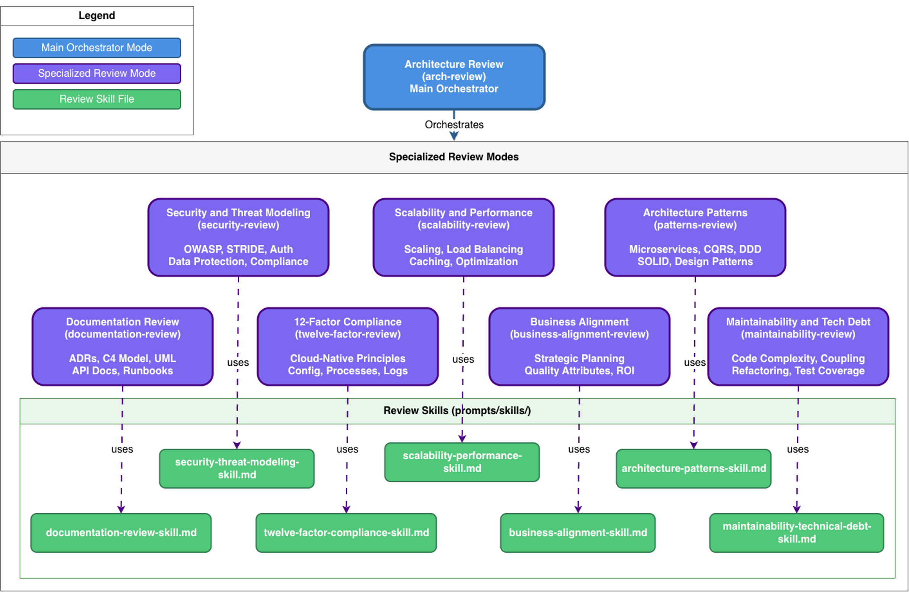

# Review & SDD Expert Bob Configuration

## Overview

The **Review & SDD Expert Bob Configuration** transforms IBM Bob into a powerful architecture review and requirements management partner. This comprehensive configuration provides specialized modes and reusable skills for software development lifecycle excellence, enabling teams to conduct thorough architecture reviews and implement spec-driven development practices.

📚 **[View Full Documentation](./.bob/documentation/README-ARCHITECTURE-REVIEW.md)**

## What It Does

- **Comprehensive Architecture Reviews**: Conduct multi-dimensional reviews using 8 specialized skills covering security, scalability, patterns, maintainability, and more
- **Spec-Driven Development**: Manage requirements, craft prompts, and maintain traceability throughout the development lifecycle
- **Adaptive Configuration**: Automatically detect gaps and propose new capabilities based on emerging requirements
- **Modular Skills**: Use individual skills independently or combine them for comprehensive reviews

## Why Use It?

- ✅ Ensure consistent, repeatable review methodology across projects
- ✅ Reduce time spent on manual architecture reviews and documentation
- ✅ Catch issues early with comprehensive coverage of architecture concerns
- ✅ Customize easily for organization-specific requirements and standards
- ✅ Integrate seamlessly with existing SDLC processes
- ✅ Scale expertise across teams with reusable skills


 ## Setup & Installation

 1. Download the file `review-and-sdd-expert-bob-configuration.zip`
 2. Uncompress the .zip file. You should see a folder named review-and-sdd-expert-bob-configuration , Open this folder as root folder in
 the Bob application
 3. That's it! - The all Modes and Skills will automatically appear in Bob's mode selector, ready to use.

## How to Use

### 1. Explore Pre-existing Configuration
Review the available modes and skills to understand capabilities:
- Browse the [8 specialized skills](./.bob/skills/README.md) for different review areas
- Study the [Architecture Review documentation](./.bob/documentation/README-ARCHITECTURE-REVIEW.md)
- Review [Spec-Driven Development guide](./.bob/documentation/SDD-README.md)

---

## Specialized Review Modes

Each specialized mode focuses on a specific aspect of architecture review.


---

## Configuration Gap Detector Mode

The **🔍 Configuration Gap Detector** identifies when current configuration is insufficient and proposes new capabilities based on research from authoritative sources.


---

## Detailed Skills



---

## SDD Skills


## 📚 Available Skills

### 1. 🎯 Business Alignment
**File**: [`.bob/skills/business-alignment-skill.md`](./.bob/skills/business-alignment-skill.md)

Evaluates how well architecture supports organizational goals and quality attributes.

**Key Areas**: Strategic planning, quality attributes, stakeholder analysis, cost-benefit analysis

### 2. 🔒 Security & Threat Modeling
**File**: [`.bob/skills/security-threat-modeling-skill.md`](./.bob/skills/security-threat-modeling-skill.md)

Identifies security gaps, attack vectors, and provides security recommendations.

**Key Areas**: OWASP Top 10, STRIDE, authentication/authorization, compliance (GDPR, HIPAA, PCI-DSS)

### 3. 📈 Scalability & Performance
**File**: [`.bob/skills/scalability-performance-skill.md`](./.bob/skills/scalability-performance-skill.md)

Evaluates system capacity, identifies bottlenecks, provides optimization recommendations.

**Key Areas**: Scaling strategies, load balancing, caching, database optimization, SLAs

### 4. 🎨 Architecture Patterns
**File**: [`.bob/skills/architecture-patterns-skill.md`](./.bob/skills/architecture-patterns-skill.md)

Evaluates pattern usage, identifies anti-patterns, recommends appropriate patterns.

**Key Areas**: Microservices, CQRS, Event Sourcing, DDD, SOLID principles, API design

### 5. 🔧 Maintainability & Technical Debt
**File**: [`.bob/skills/maintainability-technical-debt-skill.md`](./.bob/skills/maintainability-technical-debt-skill.md)

Identifies maintainability issues, quantifies technical debt, provides refactoring recommendations.

**Key Areas**: Code complexity, coupling/cohesion, duplication, test coverage, debt quantification

### 6. 📚 Documentation Review
**File**: [`.bob/skills/documentation-review-skill.md`](./.bob/skills/documentation-review-skill.md)

Evaluates documentation completeness, clarity, and currency.

**Key Areas**: ADRs, C4 diagrams, UML, API documentation, runbooks

### 7. ☁️ 12-Factor Compliance
**File**: [`.bob/skills/twelve-factor-compliance-skill.md`](./.bob/skills/twelve-factor-compliance-skill.md)

Evaluates compliance with 12-factor app methodology for cloud-native readiness.

**Key Areas**: All 12 factors from codebase to admin processes

### 8. 📋 Requirements Management
**File**: [`.bob/skills/requirements-management-skill.md`](./.bob/skills/requirements-management-skill.md)

Elicits, documents, analyzes, and validates software requirements.

**Key Areas**: Requirements elicitation, documentation, analysis, prioritization, traceability

---

## 💡 Usage Examples

Add a code or a repo to your IBM Bob IDE, then follow the examples.

### Example 1: Pre-Production Review

```
User: "Review security, scalability, and 12-factor compliance before production"

Bob will:
1. Read 3 relevant skill files
2. Apply each skill's methodology
3. Analyze codebase against checklists
4. Provide prioritized findings
5. Recommend critical fixes

Output:
✅ Achieved: OAuth2 implemented, auto-scaling configured
⚠️ Concerns: No rate limiting, logs not centralized
❌ Not Achieved: Missing circuit breakers
💡 Recommendations: [Prioritized action items]
```

### Example 2: Technical Debt Assessment

```
User: "Analyze technical debt and maintainability"

Bob will:
1. Read maintainability-technical-debt-skill.md
2. Analyze code complexity and coupling
3. Detect code duplication
4. Assess test coverage
5. Quantify technical debt
6. Provide refactoring roadmap

Output: Prioritized technical debt backlog with effort estimates
```

### Example 3: Security Audit

```
User: "Perform STRIDE threat modeling and check OWASP Top 10"

Bob will:
1. Read security-threat-modeling-skill.md
2. Identify security gaps and attack vectors
3. Check for OWASP Top 10 vulnerabilities
4. Assess authentication/authorization
5. Provide risk ratings and remediation steps

Output: Security assessment report with prioritized fixes
```

---

## 🎓 Best Practices

### Mode Selection Strategy

1. **Start with Plan mode** for new projects
   - Create detailed implementation plan
   - Break down into clear steps
   - Get user approval

2. **Switch to Code/Advanced mode** for implementation
   - Execute approved plan
   - Make code changes
   - Run tests

3. **Use Architecture Review mode** for validation
   - Review completed work
   - Identify issues early
   - Ensure quality standards

4. **Use Ask mode** for explanations
   - Understand concepts
   - Get recommendations
   - Learn technologies

### Effective Review Requests

#### ✅ Good Examples

**Specific and focused**:
```
"Review security for a healthcare application that needs HIPAA compliance"
```

**With context**:
```
"Analyze scalability for an e-commerce platform expecting 10x growth"
```

**Prioritized**:
```
"Focus on security and 12-factor compliance first, then performance"
```

#### ❌ Avoid These

- "Review the system" (too vague)
- "Check everything" (no context)
- "Do all reviews at once and fix all issues" (unrealistic scope)

---

## 🔧 Customization

### Adding Organization-Specific Requirements

1. **Modify existing skills**

   Edit skill files in `.bob/skills/` to add:
   - Internal compliance requirements
   - Company-specific patterns
   - Custom quality attributes
   - Organization standards

2. **Create new skills**

   ```bash
   # Copy an existing skill as template
   cp .bob/skills/security-threat-modeling-skill.md \
      .bob/skills/custom-compliance-skill.md
   ```

   Then customize:
   - Purpose and expertise areas
   - Review process and checklists
   - Output format
   - Key questions and best practices

3. **Update mode configuration**

   The Architecture Review mode automatically uses any skill files in `.bob/skills/`, so no mode changes needed!

### Skill Structure Template

```markdown
# [Skill Name]

## Purpose
[What this skill evaluates]

## Expertise Areas
- [Area 1]
- [Area 2]

## Review Process
### 1. [Step Name]
- [Checklist item]
- [Question to ask]

## Output Format
### ✅ Achieved
[What's working well]

### ⚠️ Concerns
[Areas needing attention]

### ❌ Not Achieved
[Critical gaps]

### 💡 Recommendations
[Actionable improvements]
```

---

## 📖 Documentation

### Quick References

| Document | Purpose |
|----------|---------|
| **README.md** | Main documentation (this file) |
| **[.bob/skills/README.md](./.bob/skills/README.md)** | Skills documentation |
| **[.bob/documentation/README-ARCHITECTURE-REVIEW.md](./.bob/documentation/README-ARCHITECTURE-REVIEW.md)** | Architecture review details |
| **[.bob/documentation/guides/QUICK-START.md](./.bob/documentation/guides/QUICK-START.md)** | Quick start guide |
| **[.bob/documentation/SDD-README.md](./.bob/documentation/SDD-README.md)** | Spec-driven development |


---

## 📺 Additional Resources

### Video Tutorial

Watch the initial example usage showcasing the Review & SDD Expert Bob Configuration in action:

<div align="left">
      <a href="https://www.youtube.com/watch?v=vx-8XHzsvG4">
         
      </a>
</div>

**Video Highlights:**
- Live demonstration of architecture review workflows
- Step-by-step walkthrough of specialized skills
- Real-world examples and use cases
- Best practices for integrating into your SDLC