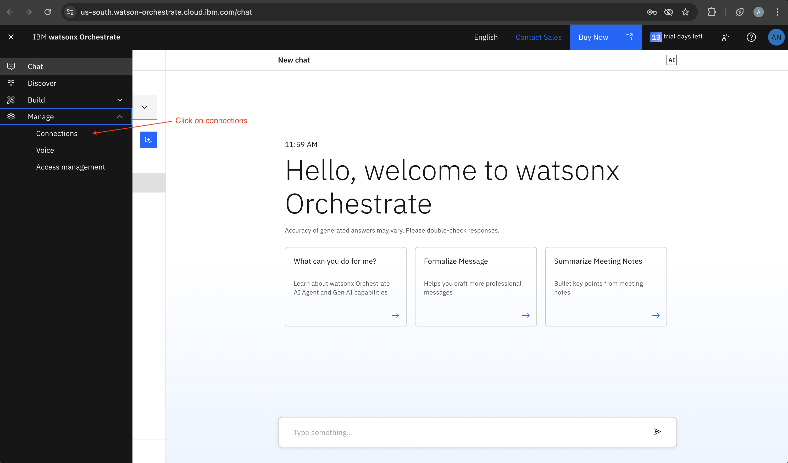
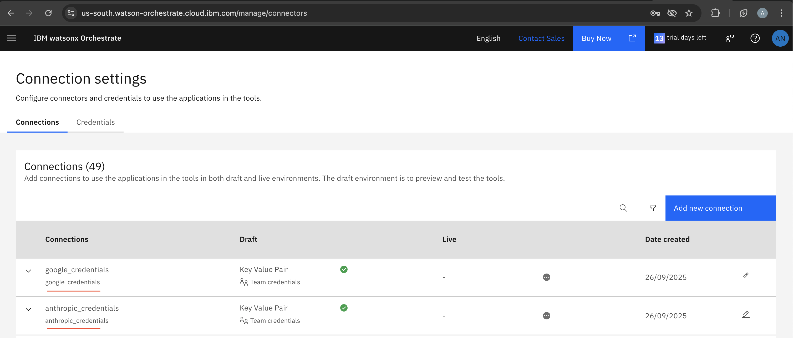
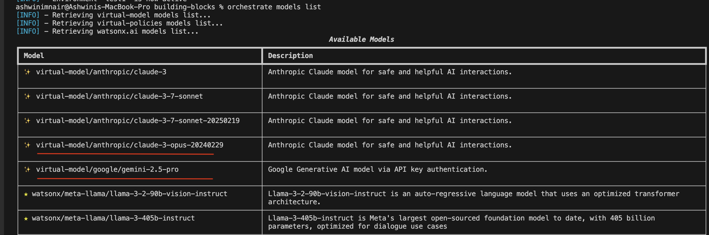
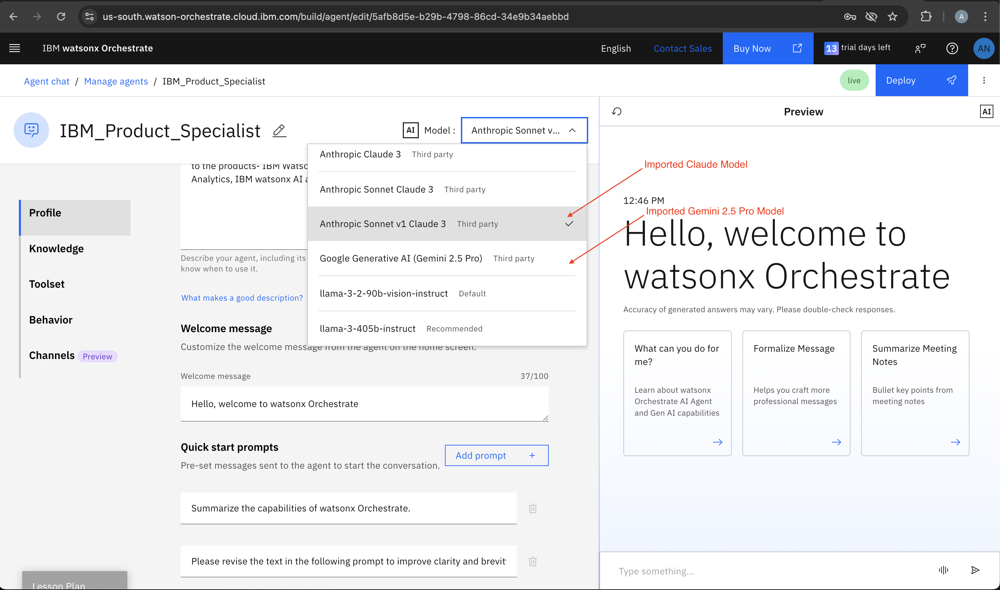

# IBM WatsonX Orchestrate AI Gateway: Integrating Third-Party LLMs

IBM WatsonX Orchestrate provides powerful capabilities for integrating third-party Large Language Models (LLMs) through its **AI Gateway** system. This enables organizations to leverage a wide range of AI models from leading providers while maintaining the orchestration and management capabilities of the WatsonX platform.

## IBM's AI Gateway Capabilities

The AI Gateway system in WatsonX Orchestrate offers:

- **Multi-Provider Support**: Integration with 10+ leading AI providers including OpenAI, Azure OpenAI, AWS Bedrock, Anthropic, Google, watsonx.ai, Mistral, OpenRouter, and Ollama
- **Secure Credential Management**: API keys and sensitive configuration stored securely in connections
- **Advanced Routing Policies**: Load balancing, fallback mechanisms, and retry strategies across multiple models
- **Flexible Configuration**: Custom endpoints, timeouts, and provider-specific settings
- **Enterprise-Grade Security**: Secure handling of API credentials and model configurations

For comprehensive documentation on all supported providers and advanced features, see the [IBM WatsonX Orchestrate AI Gateway Documentation](https://developer.watson-orchestrate.ibm.com/llm/managing_llm#supported-providers).


## Third-Party LLM Integration

In this lab, we will integrate the below models to IBM watsonx orchestrate.

1. Integrate OpenAI Models
2. Integrate Anthropic claude Models
3. Integrate Google Gemini Models


## Prerequisites

- Python 3.x
- Access to IBM watsonx Orchestrate SaaS
- The Watsonx Orchestrate ADK / CLI installed and configured
- Model Name and API Key for the third‑party model (OpenAI Models, Anthropic Claude, Google Gemini)

## 1. Integrating OpenAI Models

This guide demonstrates how to integrate OpenAI models into WatsonX Orchestrate using the AI Gateway. This example can be adapted for any of the supported providers.

### Step 1: Configure Provider Settings

Create a JSON configuration for the OpenAI provider. The `api_key` is excluded for security and will be stored separately in a connection:

```json
{
  "custom_host": "https://api.openai.com/v1",
  "request_timeout": 500
}
```

### Step 2: Secure API Key Storage

Store your OpenAI API key securely in a WatsonX Orchestrate connection:

[Generate API KEY](https://platform.openai.com/api-keys)

```bash
# Create a connection for OpenAI credentials
orchestrate connections add -a openai_creds
# Configure the connection as key-value type
orchestrate connections configure -a openai_creds --env draft -k key_value -t team
# Store the API key securely
orchestrate connections set-credentials -a openai_creds --env draft -e "api_key=your_openai_api_key"
```

**Security Note**: Replace `your_openai_api_key` with your actual OpenAI API key (format: `sk-...`). The connection system ensures credentials are stored securely and encrypted.

### Step 3: Register the OpenAI Model

Add the OpenAI model to WatsonX Orchestrate using the AI Gateway:

```bash
orchestrate models add \
  --name openai/gpt-4 \
  --app-id openai_creds \
  --provider-config '{"custom_host": "https://api.openai.com/v1", "request_timeout": 5000}' \
  --type chat
```

**Parameters Explained**:
- `--name openai/gpt-4`: Specifies the provider (`openai`) and model name (`gpt-4`)
- `--app-id openai_creds`: Links to the connection containing the API key
- `--provider-config`: JSON configuration for custom settings
- `--type chat`: Indicates this is a chat-completion model

**Alternative Models**: Replace `gpt-4` with other OpenAI models like `gpt-3.5-turbo`, `gpt-4-turbo`, etc.

### Step 4: Verify Integration

Confirm the model was successfully added to your WatsonX Orchestrate environment:

```bash
orchestrate models list
```


**Model shows up on the model drop down in the Orchestrate**


## Advanced AI Gateway Features

### Model Policies for Load Balancing and Fallback

WatsonX Orchestrate supports sophisticated model policies for enterprise scenarios:

Check this link for [model policies](https://developer.watson-orchestrate.ibm.com/llm/model_policies)

```bash
# Create a load-balancing policy between multiple models
orchestrate models policy add \
  --name balanced_gpt \
  --model openai/gpt-4 \
  --model openai/gpt-3.5-turbo \
  --strategy loadbalance \
  --retry-on-code 503 \
  --retry-attempts 3
```


## 2. Integrate Anthropic claude Models

### Step 1: Create a Connection to the Provider

You’ll want to store credentials (API key) in a `connection` object in Orchestrate. This decouples sensitive data from model config files.

Replace `YOUR_API_KEY` with the Anthropic Claude API key. [Generate API Key](https://console.anthropic.com/login?returnTo=%2F%3F)

```bash
# Create a connection for ANthropic Claude credentials
orchestrate connections add -a anthropic_credentials
# Configure the connection as key-value type
orchestrate connections configure -a anthropic_credentials --env draft -k key_value -t team
# Store the API key securely
orchestrate connections set-credentials -a anthropic_credentials --env draft -e "api_key=YOUR_API_KEY"
```

### Step 2: Write a Model Specification (YAML / JSON)

Define a spec file describing the model, the provider, and how to connect to it. This will include:

- spec_version: e.g. “v1” This field defines the specification version for the agent configuration.
- kind: usually "model", This field indicates that the agent is a native agent and defined directly in watsonx Orchestrate.
- name: <provider>/<model_id> This field is the name of the agent in the watsonx Orchestrate UI when the agent is imported via the CLI.
- display_name, description (optional but helpful)
- model_type: e.g. chat, completion, embedding, etc.
- provider_config: A JSON object with provider‑specific configuration (version, region, endpoints, model id, etc.)

Configuration for Anthropic Claude Model (config/anthropic-claude.yaml):

```bash
  spec_version: v1
  kind: model
  name: anthropic/claude-3-7-sonnet-20250219
  display_name: Anthropic Sonnet v1 Claude 3
  description: |
    Anthropic Claude model for safe and helpful AI interactions.
  tags:
    - anthropic
    - claude
  model_type: chat
  provider_config:
    anthropic_version: 2023-06-01
```
Note: Different providers require different fields in provider_config.


### Step 3: Import / Register the Model via CLI
Once your connection is in place and your spec file is ready, you import the model:

```bash
orchestrate models import --file config/anthropic-claude.yaml --app-id anthropic_credentials
``` 
- --app-id refers to the connection you created earlier
- This will register the model with Orchestrate, making it available for agents. 

## 3. Integrate Google Gemini Models

### Step 1: Create a Connection to the Provider

You’ll want to store credentials (API key) in a `connection` object in Orchestrate. This decouples sensitive data from model config files.

Replace `YOUR_API_KEY` with the Google Gemini Model API key. [Generate API KEY](https://aistudio.google.com/prompts/new_chat?_gl=1*17y8d80*_up*MQ..&gclid=Cj0KCQjw3OjGBhDYARIsADd-uX61bJSPJ_f8IiVY2F6ae6s6occfL5vm1_GNdxaCYV9P2NxaeW7grIgaArsdEALw_wcB&gclsrc=aw.ds&gbraid=0AAAAACn9t653VlgXXB6C-zGOMJYAsodXe)

```bash
# Create a connection for ANthropic Claude credentials
orchestrate connections add -a gemini_credentials
# Configure the connection as key-value type
orchestrate connections configure -a gemini_credentials --env draft -k key_value -t team
# Store the API key securely
orchestrate connections set-credentials -a gemini_credentials --env draft -e "api_key=YOUR_API_KEY"
```

### Step 2: Write a Model Specification (YAML / JSON)

Define a spec file describing the model, the provider, and how to connect to it. This will include:

- spec_version: e.g. “v1” This field defines the specification version for the agent configuration.
- kind: usually "model", This field indicates that the agent is a native agent and defined directly in watsonx Orchestrate.
- name: <provider>/<model_id> This field is the name of the agent in the watsonx Orchestrate UI when the agent is imported via the CLI.
- display_name, description (optional but helpful)
- model_type: e.g. chat, completion, embedding, etc.
- provider_config: A JSON object with provider‑specific configuration (version, region, endpoints, model id, etc.)


Configuration for Googles's Gemini Model (google-gemini.yaml):

```bash
  spec_version: v1
  kind: model
  name: google/gemini-2.5-pro
  display_name: Google Generative AI (Gemini 2.5 Pro)
  description: |
    Google Generative AI model via API key authentication.
  tags:
    - google
    - genai
  model_type: chat
  provider_config: {}
```
Note: Different providers require different fields in provider_config.


### Step 3: Import / Register the Model via CLI
Once your connection is in place and your spec file is ready, you import the model:

```bash
orchestrate models import --file config/google-gemini.yaml --app-id gemini_credentials
```

- --app-id refers to the connection you created earlier
- This will register the model with Orchestrate, making it available for agents. 

## Validate the imported models

Navigate to connections from the UI's Agent Manager



List of imported models



## List all the imported models

```bash
orchestrate models list
```
List of imported models in CLI



### Test the imported in watsonx orchestrate UI

- Test the agent’s behavior, verifying that requests are routed to the external model
- Monitor logs, API responses, latency, error rates
- If needed, update the model spec (or connection) and re-import / re-add
- Adjust model policies if you combine multiple models




## Benefits of IBM WatsonX Orchestrate AI Gateway

1. **Unified Management**: Manage multiple AI providers from a single platform
2. **Enterprise Security**: Secure credential management and access controls
3. **Scalability**: Load balancing and failover capabilities across models
4. **Flexibility**: Support for custom endpoints and provider-specific features
5. **Integration**: Seamless integration with WatsonX Orchestrate agents and tools

## Next Steps

- Explore [all supported providers](https://developer.watson-orchestrate.ibm.com/llm/managing_llm#supported-providers) in the official documentation
- Learn about [model policies](https://developer.watson-orchestrate.ibm.com/llm/managing_llm#configuring-model-policies) for advanced routing
- Discover [connection management](https://developer.watson-orchestrate.ibm.com/connections/overview) for secure credential handling
- Build agents that leverage multiple AI providers through the AI Gateway

This integration capability demonstrates IBM's commitment to providing flexible, enterprise-grade AI orchestration that works with the tools and models your organization already uses.
