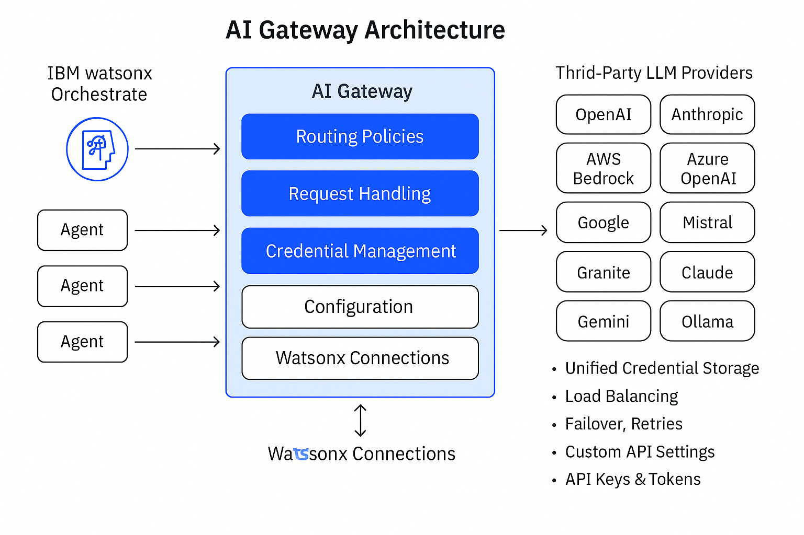

# 🤖 IBM Watsonx Orchestrate AI Gateway: Extending Agents with Third-Party LLMs

IBM **Watsonx Orchestrate** is a flexible, enterprise-ready framework to build, deploy, and manage AI agents.  
One of its most powerful capabilities is the **AI Gateway**, which enables organizations to seamlessly connect third-party Large Language Models (LLMs) with IBM’s ecosystem.

By using the AI Gateway, you can unify multiple LLM providers like **OpenAI**, **Anthropic**, **Google Gemini**, **AWS Bedrock**, **Azure OpenAI**, **Mistral**, **Ollama**, and **IBM watsonx.ai**—through a single orchestration layer.  
This provides flexibility, consistency, and governance for enterprises adopting multi-model AI strategies.

---

## 📑 Table of Contents

1. [Overview](#overview)
2. [Architecture](#architecture)
3. [Features](#features)
4. [Technology Stack](#technology-stack)
5. [Prerequisites](#prerequisites)
6. [Project Structure](#project-structure)
7. [Developer Guide](#developer-guide)
8. [Examples](#examples)
9. [Business Value](#business-value)
10. [Use Cases](#use-cases)
11. [Benefits](#benefits)
12. [Contributing](#contributing)
13. [License](#license)

---

## 🧠 Overview

The **AI Gateway** is a bridge between **IBM watsonx Orchestrate** and external LLM providers.  
It allows developers to integrate, manage, and switch between multiple language models without hardcoding provider-specific logic.

It provides:
- Unified access to multiple LLMs
- Enterprise-grade governance and security
- Centralized management and policy control
- A consistent development experience for AI agents

---

## 🏗️ Architecture

The AI Gateway acts as a **middleware orchestration layer** between IBM watsonx Orchestrate and third-party LLMs.

**Architecture Flow:**



**Key Layers:**
- **Integration Layer** – connects to external LLMs via APIs
- **Policy Layer** – defines routing, load balancing, and fallback
- **Governance Layer** – ensures compliance and credential security

---

## ✨ Features

- **Multi-Provider Integration** – Connect to OpenAI, Anthropic, Google Gemini, AWS Bedrock, Azure OpenAI, Mistral, Ollama, and watsonx.ai.
- **Unified Credential Management** – Securely manage credentials using Watsonx Orchestrate Connections.
- **Model-Agnostic Integration** – Register models from multiple providers under one interface.
- **Routing & Failover Policies** – Define model selection strategies for performance and reliability.
- **Enterprise Security** – Encryption, RBAC, and centralized governance.
- **Provider Flexibility** – Add or update models dynamically as APIs evolve.

[Learn more about supported providers →](https://developer.watson-orchestrate.ibm.com/llm/managing_llm#supported-providers)

---

## 🧰 Technology Stack

| Component | Technology | Purpose |
|------------|-------------|----------|
| **Core Platform** | IBM Watsonx Orchestrate | Orchestration and Agent Framework |
| **Integration Layer** | AI Gateway | Middleware for multi-provider LLM access |
| **Supported Providers** | OpenAI, Anthropic, Google, Azure, Bedrock, Mistral, Ollama, watsonx.ai | LLM sources |
| **Configuration** | YAML / JSON Model Specs | Define models and connection details |
| **Authentication** | API Keys via Orchestrate Connections | Secure credential management |
| **CLI Tools** | Watsonx Orchestrate CLI / ADK | Model registration and management |

---

## ⚙️ Prerequisites

Before integrating models via AI Gateway, ensure:
- You have access to **[Watsonx Orchestrate SaaS](https://cloud.ibm.com/catalog/services/watsonx-orchestrate)**.
- Installed **Python 3.x** and **Watsonx Orchestrate ADK/CLI**:
  ```bash
  pip install ibm-watsonx-orchestrate
  orchestrate --version
  ```
- Valid API keys for each LLM provider (OpenAI, Anthropic, Gemini, etc.)
- Permissions to add connections in Watsonx Orchestrate.

---

## 🗂️ Project Structure

```
ai-gateway/
│
├── config/
│   ├── openai-gpt.yaml
│   ├── anthropic-claude.yaml
│   ├── google-gemini.yaml
│
├── assets/
│   ├── architecture-diagram.png
│   ├── ui-screenshots/
│
└── README.md
```

---

## 👩‍💻 Developer Guide

This guide covers integrations for **OpenAI**, **Anthropic Claude**, and **Google Gemini** (same steps apply for other supported providers).

---

### 🔹 1. Integrating OpenAI Models

#### Step 1: Create OpenAI Connection
[Generate API Key →](https://platform.openai.com/api-keys)
```bash
orchestrate connections add -a openai_creds
orchestrate connections set-credentials -a openai_creds --env draft -e "api_key=YOUR_API_KEY"
```

#### Step 2: Define Model Specification
`config/openai-gpt.yaml`
```yaml
spec_version: v1
kind: model
name: openai/gpt-oss-20b
display_name: GPT-OSS-20b
description: OpenAI's model for agentic reasoning and creativity.
tags: [openai, gpt]
model_type: chat
```

#### Step 3: Register Model
```bash
orchestrate models import --file config/openai-gpt.yaml --app-id openai_creds
```

---

### 🔹 2. Integrating Anthropic Claude Models

#### Step 1: Create Connection
[Generate API Key →](https://console.anthropic.com/login)
```bash
orchestrate connections add -a anthropic_creds
orchestrate connections set-credentials -a anthropic_creds --env draft -e "api_key=YOUR_API_KEY"
```

#### Step 2: Define Model Specification
`config/anthropic-claude.yaml`
```yaml
spec_version: v1
kind: model
name: anthropic/claude-3-7-sonnet
display_name: Anthropic Claude 3.7 Sonnet
tags: [anthropic, claude]
model_type: chat
```

#### Step 3: Import Model
```bash
orchestrate models import --file config/anthropic-claude.yaml --app-id anthropic_creds
```

---

### 🔹 3. Integrating Google Gemini Models

#### Step 1: Create Connection
[Generate Gemini API Key →](https://aistudio.google.com/)
```bash
orchestrate connections add -a gemini_creds
orchestrate connections set-credentials -a gemini_creds --env draft -e "api_key=YOUR_API_KEY"
```

#### Step 2: Define Model Specification
`config/google-gemini.yaml`
```yaml
spec_version: v1
kind: model
name: google/gemini-2.5-pro
display_name: Google Gemini 2.5 Pro
model_type: chat
```

#### Step 3: Register Model
```bash
orchestrate models import --file config/google-gemini.yaml --app-id gemini_creds

Navigate to connections from the UI's Agent Manager


List of imported models


```
---
## Validate the Integration

- **List all models**  
```bash
orchestrate models list
```

List of imported models in CLI


Test the imported in watsonx orchestrate UI
1. Test the agent’s behavior, verifying that requests are routed to the external model
2. Monitor logs, API responses, latency, error rates
3. If needed, update the model spec (or connection) and re-import / re-add
4. Adjust model policies if you combine multiple models


- **Check in Watsonx Orchestrate UI**  
Models appear in the **Model Manager** dropdown.  
Agents can now be assigned third-party LLMs directly.  

---

## 🧩 Examples

| Example | Description |
|----------|--------------|
| `OpenAI + Anthropic` | GPT-4 primary, Claude fallback |
| `Gemini + watsonx.ai` | Hybrid agent using IBM and Google models |
| `Bedrock + Granite` | Enterprise-secure orchestration with AWS and IBM |

---

## 💼 Business Value

- **Future-Proof AI Strategy:** Integrate any LLM without vendor lock-in.  
- **Cost Optimization:** Route tasks to the most efficient model dynamically.  
- **Performance & Reliability:** Ensure continuity with automatic model fallback.  
- **Trust & Governance:** Maintain auditability and compliance across all providers.  
- **Faster Innovation:** Developers focus on workflows, not wiring APIs.

---

## 🔹 Technical Value

1. Multi-Provider Support
- Connect once, and access LLMs from OpenAI, Anthropic, Ollama, AWS Bedrock, Google Gemini, IBM watsonx.ai, and more.
- No need to hardcode integrations for each provider.

2. Centralized Model Management
- Register, configure, and assign models from a single gateway.
- Agents just “use” a model; they don’t care whether it’s OpenAI GPT-4, Claude, or Granite.

3. Secure Credential Handling
- API keys and tokens are stored in watsonx connections, encrypted and managed securely.
- Developers don’t need to embed credentials in code.

4. Advanced Routing & Policies
- Define load balancing, fallback, and retry rules across models.
- Example: If GPT-4 times out, auto-route to Claude Sonnet or Granite.

5. Flexibility in Configuration
- Supports custom endpoints, timeouts, and provider-specific parameters.
- Makes it easy to adapt to evolving APIs.

---

## Advanced AI Gateway Features

- **Load Balancing & Fallback**  
```bash
orchestrate models policy add \
  --name balanced_gpt \
  --model openai/gpt-4 \
  --model openai/gpt-3.5-turbo \
  --strategy loadbalance \
  --retry-on-code 503 \
  --retry-attempts 3
```

- **Provider-Specific Options**  
  - Azure OpenAI → requires deployment ID, API version  
  - AWS Bedrock → supports IAM roles & regional endpoints  
  - watsonx.ai → integrates via project/space IDs  

[Read: Advanced model policies →](https://developer.watson-orchestrate.ibm.com/llm/model_policies)  

---

## 🌍 Use Cases

- **Contact Center Agents** – blend Claude (safe) and GPT-4 (creative) responses.  
- **Knowledge Assistants** – use Gemini for reasoning and OpenAI for summarization.  
- **Regulated Industries** – mix watsonx.ai for compliance with external models for insights.  
- **Multi-Agent Systems** – orchestrate IBM Granite + Bedrock + OpenAI in one workflow.  

---

## 🚀 Benefits

| Category | Description |
|-----------|-------------|
| **Flexibility** | Bring your own LLMs from any provider. |
| **Security** | Credentials stored and managed in IBM’s secure vault. |
| **Scalability** | Add or switch models with zero downtime. |
| **Resilience** | Load balancing and failover keep agents operational. |
| **Unified Management** | Centralized control of model governance and usage. |

---

## 🤝 Contributing

Contributions are welcome!  
To enhance or extend this building block:
1. Fork this repo  
2. Create a feature branch  
3. Add documentation for your update  
4. Submit a Pull Request  

---

## ⚖️ License

This project is licensed under the **Apache 2.0 License**.  
See the [LICENSE](./LICENSE) file for details.

---

**Next Steps:**
- Explore the [IBM AI Gateway Tutorial](https://developer.ibm.com/tutorials/ai-agents-llms-watsonx-orchestrate-ai-gateway/)  
- Try the [Multi-Model Orchestration Demo](https://medium.com/@IBMDeveloper/extend-your-ai-agents-with-external-llms-using-watsonx-orchestrate-and-ai-gateway-1cfaa9c0e304)  
- Build and register your own LLMs with **Watsonx Orchestrate ADK**.
