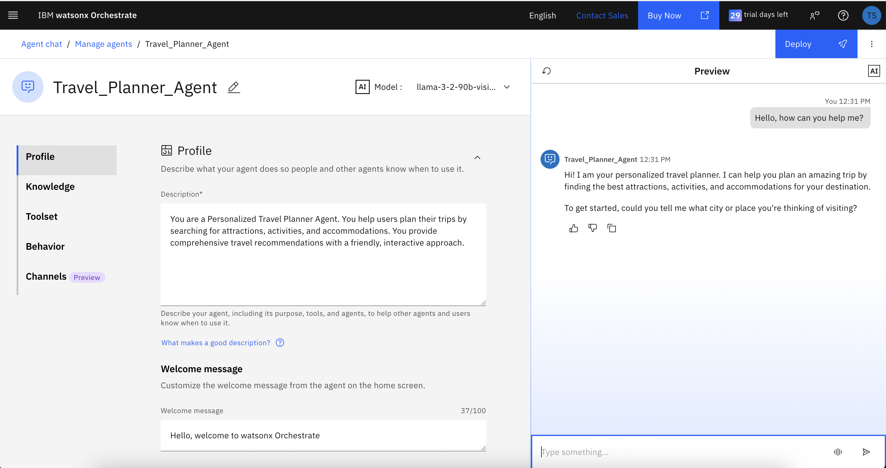
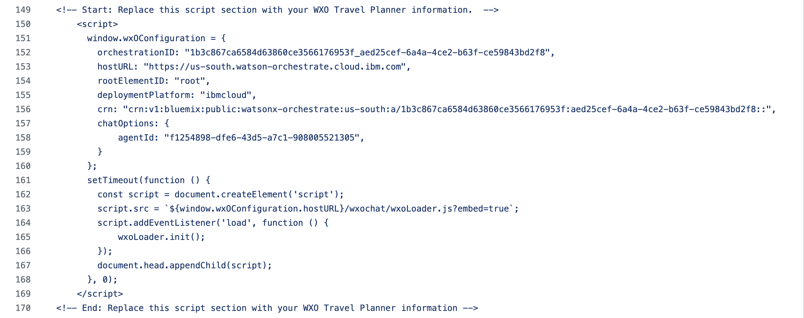
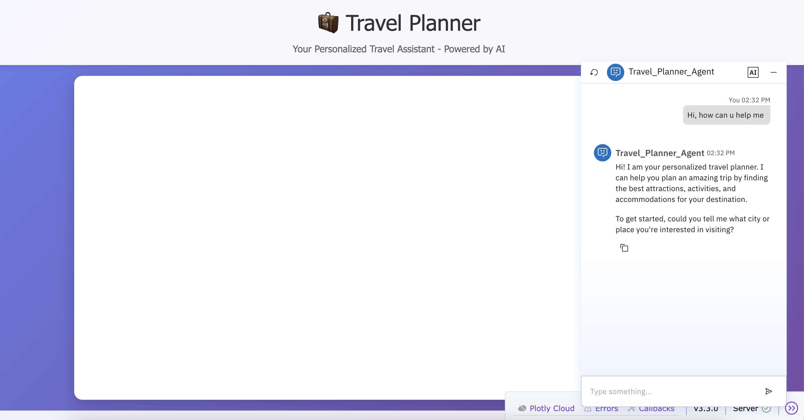

# Travel Planner Agent Demo Setup Guide

This comprehensive guide will walk you through building a sophisticated Travel Planner Agent using IBM watsonx Orchestrate. This intelligent agent represents a powerful example of multi-agent orchestration, demonstrating how to create conversational AI systems that can seamlessly integrate multiple external services and data sources to provide comprehensive, personalized assistance.

The Travel Planner Agent we'll build is designed to revolutionize how users approach trip planning by offering:

- **Intelligent Destination Research**: Leveraging advanced web search capabilities to discover attractions, activities, local insights, weather information, and cultural recommendations for any destination worldwide
- **Smart Accommodation Discovery**: Integrating with Airbnb's extensive database to find and recommend suitable places to stay based on user preferences, budget constraints, and travel dates
- **Personalized Travel Recommendations**: Creating customized itineraries that adapt to individual preferences, group dynamics, and specific travel requirements
- **Interactive Planning Experience**: Providing a conversational interface that guides users through the entire planning process with natural, engaging dialogue
- **Comprehensive Information Synthesis**: Combining data from multiple sources to deliver well-rounded, actionable travel advice

This demo showcases the power of modern AI orchestration platforms in creating sophisticated, tool-enabled conversational agents that can handle complex, multi-step workflows while maintaining a natural, user-friendly experience.

## Table of Contents

- [Overview](#overview)
- [Prerequisites](#prerequisites)
- [Step 1: Tavily API Setup](#step-1-tavily-api-setup)
- [Step 2: Watsonx Orchestrate Connection Setup](#step-2-watsonx-orchestrate-connection-setup)
- [Step 3: Travel Planner Agent Creation](#step-3-travel-planner-agent-creation)
- [Step 4: Tool Configuration](#step-4-tool-configuration)
- [Step 5: Agent Testing](#step-5-agent-testing)
- [Step 6: Dash application](#step-6-dash-application)


- [Summary](#summary)

## Overview

In this project, we have developed an AI agent along with all necessary connections and  tools using a standalone Python code block. The documentation is primarily centered around this standalone implementation, as it represents the core functionality and logic of the system.


## Prerequisites

Before starting, ensure you have:

- Access to IBM watsonx Orchestrate instance
- Tavily API account and key
- Basic understanding of agent development concepts
- Text editor for HTML file modification


### .env file variables


| Variable | Section | Example/Default Value | Description |
|----------|---------|----------------------|-------------|
| WXO_SERVICE_URL | Orchestrate service | https://api.{hostname}/instances/{tenant_id}  | Watsonx Orchestrate instance base URL |
| WXO_API_KEY | Orchestrate service | \<Your API key\> | API key for service authentication |
| WXO_TOKEN_URL | Orchestrate service | https://iam.cloud.ibm.com/identity/token | IBM Cloud IAM token endpoint |
| AGENT_NAME | AI Agent | Travel_Planner_Agent | Name of the AI agent |
| AGENT_DESCRIPTION | AI Agent | \<It is used for description of agent\> | Agent purpose description |
| AGENT_INSTRUCTIONS | AI Agent | \<It is used for behaviour of agent\> | Workflow, rules, and interaction style for the agent (use \n for line breaks) |
| AGENT_LLM | AI Agent | watsonx/meta-llama/llama-3-2-90b-vision-instruct | Language model identifier |
| TAVILY_TOOLKIT_NAME | Toolkit | Tavily_Server_DA_2 | MCP toolkit name |
| TAVILY_TOOL_NAME_SEARCH | Toolkit | tavily_search | Search tool name |
| TAVILY_TOOL_NAME_EXTRACT | Toolkit | tavily_extract | Extract tool name |
| TAVILY_TOOLKIT_DESCRIPTION | Toolkit | tavily toolkit description | Toolkit description |
| TAVILY_MCP_URL | Toolkit | \<MCP URL with API key \> | MCP URL with API key |
| TAVILY_CONNECTION_APP_ID | Toolkit | Tavily_MCP | MCP connection app ID |
| AIRBNB_TOOLKIT_NAME | Toolkit | airbnb-test-mcp-5 | Airbnb toolkit name |
| AIRBNB_TOOL_NAME_SEARCH | Toolkit | airbnb_search | Airbnb search tool name |
| AIRBNB_TOOL_NAME_LISTING_DETAILS | Toolkit | airbnb_listing_details | Airbnb listing details tool |
| AIRBNB_TOOLKIT_DESCRIPTION | Toolkit | This is travel planner Airbnb server | Airbnb toolkit description |
| WXO_CONNECTION_API_KEY | Connection | \<connection api key\> | Connection API key |
| WXO_CONNECTION_TYPE | Connection | api_key_auth | Connection authentication type |
| WXO_CONNECTION_NAME | Connection | Tavily_MCP | Connection name |


## Step 1: Tavily API Setup

### 1.1 Generate Tavily API Key

To configure your Tavily API key, follow these steps:

1. Navigate to the [Tavily Dashboard](https://tavily.com)
2. Sign up or log in to your account
3. Generate your API key from the dashboard
4. Copy the key and save it securely for later use

> **Important**: Keep your API key secure and never share it publicly.
## Step 2: Watsonx Orchestrate Connection Setup

### 2.1 Create connection

The script provides an automated way to create an WxO connection and related credential using the WXO Orchestration API.
It reads configuration values from environment variables (already covered in the Prerequisites section) and sends a POST request to register a new connection and credential.

### 2.1 Overview

The script defines an clsConnection class responsible for:

1. Loading environment variables using python-dotenv

2. Preparing the connection creation payload

3. Requesting and using an authentication token (via the clsAuth class from wxo_token)

4. Sending a POST request to the WXO Orchestration API

5. Returning the created connection metadata

6. At runtime, it creates an instance of the class, submits the request, and prints the newly created connection ID.

### 2.2 Configure connection Details

Configure your connection using the environment variables defined in your .env file.

Use:

1. `WXO_CONNECTION_NAME` — sets the connection’s display name
2. `WXO_CONNECTION_TYPE` — defines the connection’s authentication type. Here the value will be 'api_key_auth'.
3. `WXO_CONNECTION_API_KEY` — The api key value created during Tavily API Setup step.

### 2.3 Usage
Run the script directly to create AI agent on Orchestrate.

```bash
python3 step2_wxo_connection_setup.py
```

The output will display information as follows.

```bash
Response text: {"connection_id":"<connection_id>","app_id":"Tavily_MCP","tenant_id":"<tenant_id>","name":"Tavily_MCP","description":"","icon":""}
Response text: {"config_id":"<config_id>","app_id":"Tavily_MCP","tenant_id":"<tenant_id>"}
Response text: {"runtime_credential_id":"<runtime_credential_id>","config_id":"<config_id>","app_id":"Tavily_MCP","tenant_id":"<tenant_id>"}
```

## Step 3: Travel Planner Agent Creation
The script provides an automated way to create an AI Agent using the WXO Orchestration API.
It reads configuration values from environment variables (already covered in the Prerequisites section) and sends a POST request to register a new agent.

### 3.1 Overview

The script defines an AIAgentCreator class responsible for:

1. Loading environment variables using python-dotenv

2. Preparing the agent creation payload

3. Requesting and using an authentication token (via the clsAuth class from wxo_token)

4. Sending a POST request to the WXO Orchestration API

5. Returning the created agent’s metadata

6. At runtime, it creates an instance of the class, submits the request, and prints the newly created agent ID.

### 3.2 Configure Agent Details

Configure your agent using the environment variables defined in your .env file.

Use:

1. `AGENT_NAME` — sets the agent’s display name

2. `AGENT_DESCRIPTION` — defines the agent’s purpose and general description

Example, 
```bash
AGENT_NAME="Travel_Planner_Agent"

AGENT_DESCRIPTION="You are a Personalized Travel Planner Agent. You help users plan their trips by searching for attractions, activities, and accommodations. You provide comprehensive travel recommendations with a friendly, interactive approach."

```

### 3.3 Define Agent Behavior

Define and customize the agent’s behavior using the `AGENT_INSTRUCTIONS` variable in your .env file.
Example is as below.

```bash
AGENT_INSTRUCTIONS="You are a Personalized Travel Planner Agent that helps users plan amazing trips. Always greet users with \"Hi! I am your personalized travel planner\" and maintain a warm, helpful, and interactive tone throughout the conversation.\n\nWORKFLOW (MANDATORY SEQUENCE):\n1. Use Tavily_Server_DA_2:tavily_search tool to research the destination city, find top attractions, activities, points of interest, weather information, and local recommendations\n2. Use Airbnb rooms search tool to find available accommodations in the destination area based on user preferences and dates\n   - airbnb-test-mcp-5:airbnb_listing_details: Get detailed information about a specific Airbnb listing. Provide direct links to the user\n   - airbnb-test-mcp-5:airbnb_search: Search for Airbnb listings with various filters and pagination. Provide direct links to the user\n3. Synthesize the information to create comprehensive travel recommendations and suggestions\n\nCRITICAL RULES:\n- ALWAYS introduce yourself as \"Hi! I am your personalized travel planner\" at the start\n- ALWAYS be verbose, friendly, and interactive in your responses\n- ALWAYS ask follow-up questions to better understand user preferences (budget, group size, interests, travel dates)\n- ALWAYS use Tavily_Server_DA_2:tavily_search to research comprehensive information about the destination\n- ALWAYS use Airbnb rooms search to find suitable accommodations\n- ALWAYS provide multiple options and alternatives for both attractions and accommodations\n- ALWAYS suggest next steps and ask courtesy questions like \"Would you like me to find more options?\" or \"Should I look for accommodations in a different area?\"\n- ALWAYS provide practical details (timing, costs, accessibility, booking requirements)\n- ALWAYS format responses with clear sections and bullet points\n- If insufficient information found, suggest alternative approaches or nearby locations\n- Keep the conversation flowing with natural follow-up questions\n\nINTERACTION STYLE:\n- Be enthusiastic about travel and destinations\n- Ask about budget, group size, interests, and travel dates\n- Provide multiple accommodation options with different price ranges\n- Suggest both popular attractions and hidden gems\n- Always end with helpful next steps or questions\n\nExample queries: \"I want to visit Austin, Texas\", \"Plan a weekend trip to San Francisco\", \"Find me things to do in Paris with good weather\""

```

### 3.4 Define LLM model for use
Use variable named `AGENT_LLM` from .env file to use required model.

Example is as below.

```bash
AGENT_LLM="watsonx/meta-llama/llama-3-2-90b-vision-instruct"
```
### 3.5 Usage
Run the script directly to create AI agent on Orchestrate.

```bash
python3 step3_travel_planner_agent_creation.py
```

The output will display agent id as follows.

```bash
Agent created successfully, with id: <generated_agent_id> 
```
---
## Step 4 – MCP Toolkit Setup & Agent Tool Mapping  
**(Tavily MCP + Airbnb MCP)**

### Overview

This step creates **MCP Toolkits** inside **IBM watsonx Orchestrate** using one or more MCP servers (for example, **Tavily MCP** and **Airbnb MCP**).  
After creating the toolkits, the script automatically:

1. Fetches each toolkit definition from the server  
2. Extracts the resolved tool list (internal tool GUIDs)  
3. Merges tools across toolkits (avoiding duplicates)  
4. Locates your Travel Planner Agent by name  
5. Updates the agent’s tool configuration  
6. Attaches all resolved toolkit tools to the agent  

This makes the agent fully capable of calling tools like:

- `tavily_search`  
- `tavily_extract`  
- `airbnb_search`  
- `airbnb_listing_details`  
- (any other MCP-exposed tools)

### Important Methods (from `MCPToolkitClient`)

| Method | Purpose | HTTP Endpoint |
|------|---------|---------------|
| `create_mcp_toolkit()` | Creates a new MCP toolkit (Tavily or Airbnb) | `POST /v1/orchestrate/toolkits` |
| `get_toolkit_by_id()` | Fetches toolkit details (including tools) | `GET /v1/orchestrate/toolkits/{id}` |
| `list_agents()` | Returns all agents in the instance | `GET /v1/orchestrate/agents` |
| `filter_agent_by_name()` | Finds agent by its display name | — (local helper) |
| `update_agent_tools()` | Updates the agent’s tool list | `PATCH /v1/orchestrate/agents/{id}` |

These methods together enable **multi-toolkit creation** and **automatic agent–tool mapping**.


### Required `.env` Variables

Watsonx Orchestrate Instance (Required)

```bash
WXO_SERVICE_URL="https://api.<region>.watson-orchestrate.cloud.ibm.com/instances/<INSTANCE_ID>"
AGENT_NAME="Travel_Planner_Agent"
```


Tavily MCP Toolkit (Required)

```bash
TAVILY_TOOLKIT_NAME="tavily_mcp_toolkit"
TAVILY_TOOLKIT_DESCRIPTION="Toolkit exposing Tavily MCP tools"

TAVILY_MCP_URL="https://mcp.tavily.com/mcp/?tavilyApiKey=<YOUR_API_KEY>"
TAVILY_CONNECTION_APP_ID="<connection_id_created_in_step2>"

TAVILY_TOOL_NAME_SEARCH="tavily_search"
TAVILY_TOOL_NAME_EXTRACT="tavily_extract"
```

If any Tavily-required variables are missing, the script stops with:

```
Missing required environment variables: TAVILY_MCP_URL, TAVILY_CONNECTION_APP_ID
```


Airbnb MCP Toolkit

```bash
AIRBNB_TOOLKIT_NAME="airbnb_mcp_toolkit"
AIRBNB_TOOLKIT_DESCRIPTION="Toolkit exposing Airbnb MCP tools"

AIRBNB_TOOL_NAME_SEARCH="airbnb_search"
AIRBNB_TOOL_NAME_LISTING_DETAILS="airbnb_listing_details"
```

If `AIRBNB_TOOLKIT_NAME` is not set, Airbnb toolkit creation is skipped.


### How to Run the Script

```bash
python3 step4_toolkit_and_agent_tools_setup.py
```

This will:

- Load `.env`
- Authenticate using `clsAuth`
- Create the Tavily MCP toolkit
- Fetch Tavily toolkit definition
- Optionally create the Airbnb MCP toolkit
- Fetch Airbnb toolkit definition
- Merge tool lists
- Find the agent
- Attach all resolved tools to the agent


### Expected Output

```
Using instance base URL: https://api.us-south.watson-orchestrate.cloud.ibm.com/instances/...

=== Creating Tavily toolkit: tavily_mcp_toolkit ===
Created Tavily toolkit successfully, with id: <tavily_toolkit_id>

=== Creating Airbnb toolkit: airbnb_mcp_toolkit ===
Created Airbnb toolkit successfully, with id: <airbnb_toolkit_id>

Merged tools count (should be 2–4): 4

Required agent found with id: <agent_id>
<Response [200]>
Agent tools updated successfully with Tavily + Airbnb.
```

### Error Scenarios

Agent Not Found

```
Agent 'Travel_Planner_Agent' not found. Skipping tool update.
```

Toolkit Creation Failure

```
MCPToolkitError occurred:
Message: HTTP 401 error while calling MCP toolkit API.
Status code: 401
Response body: {...}
```

### Outcome

After Step 4 completes successfully:

- Tavily MCP toolkit is registered  
- Airbnb MCP toolkit is registered (if enabled)  
- Tool GUIDs are resolved from each toolkit  
- Tools are merged without duplication  
- Agent is updated with all tools  
- Agent can invoke **multiple MCP providers** in a single flow  

---
## Step 5: Agent Testing

### 5.1 Test Agent Functionality

1. Navigate to the **Preview** screen
2. Type a test message: `"Hello, how can you help me?"`



3. Verify the agent responds with the expected greeting and behavior

### 5.2 Validate Tool Integration

Test the agent with sample queries to ensure all tools are working:
- Destination research queries
- Accommodation search requests
- Combined travel planning requests

Please find the [attached testing video of Travel Planner agent for reference](https://github.com/ibm-self-serve-assets/building-blocks/blob/dev_travel_planner_by_wxo_apis/agents/multi-agent-orchestration/AI-Travel-Planner/src/assets/TravelPlannerScreenRecording.mp4). 

---
## Step 6: Dash application
This step involves integrating your personalized **Travel Planner** agent into a Dash web application. The app is built with [Dash](https://dash.plotly.com/) and leverages **IBM WatsonX Orchestrate** to provide AI-powered travel assistance.

### 6.1 Security Configuration

The embedded chat widget will **not function** until security is properly configured.  

You can configure security by following the [official Watson Orchestrate documentation on security](https://developer.watson-orchestrate.ibm.com/agents/integrate_agents#security-configuration).

Alternatively, security can be temporarily disabled using the [REST API endpoint `/v1/embed/secure/config`](https://developer.ibm.com/apis/catalog/watsonorchestrate--custom-assistants/api/API--watsonorchestrate--agentic-experience#Create_Config_private_embed_config_post).


**Example of API Payload:**

```json
{
  "is_security_enabled": false
}
```

###  6.2 Integrating Your Travel Planner Agent into Dash app

1. Navigate to the **Channels** section within the Travel Planner agent page from watsonx orchestrate (wxo) console.
2. Locate the **Embedded agent** section and click the copy icon to copy the entire script snippet.


3. Open the `step6_dash_app_travel_planner.py` file in a text editor
4. Replace the existing script section in the file with the script you copied from above step.



### 6.3 Running the Dash Application

1. Run application
   
```bash
python3 step6_dash_app_travel_planner.py
```
  You should see output similar to:

```bash
Dash is running on http://127.0.0.1:8050/

 * Serving Flask app 'step6_dash_app_travel_planner'
 * Debug mode: on
```

2. Open your browser and go to http://127.0.0.1:8050 to access the Travel Planner.
3. The AI Travel Planner chat widget will appear at the bottom right corner of the page. Click on it to start planning your travel with the agent.
  


---

## Troubleshooting

### Common Issues and Solutions

#### Connection Issues
- **Problem**: Tavily connection fails to establish
- **Solution**: Verify API key is correct and has proper permissions

#### Tool Activation Issues
- **Problem**: Tools not appearing in agent
- **Solution**: Ensure MCP servers are properly connected and tools are activated

#### Agent Response Issues
- **Problem**: Agent not following behavior instructions
- **Solution**: Review and refine the behavior configuration

#### Dash Application Issues
- **Problem:** The travel agent is not loading
- **Solution:** 
  1. Ensure the script section of the embedded agent from wxo console is correctly copied and pasted into the Dash app.  
  2. Confirm that the security configuration has been properly set up.


### Getting Help

If you encounter issues not covered in this guide:
1. Check the IBM watsonx Orchestrate documentation
2. Review the agent and tool configuration
3. Test individual components separately
4. Contact support if needed
---
## Summary

Congratulations! You have successfully created a comprehensive Travel Planner Agent with the following capabilities:

### What You've Built

- **Intelligent Travel Planning**: Agent that researches destinations and provides recommendations
- **Web Search Integration**: Tavily-powered search for attractions and local information
- **Accommodation Search**: Airbnb integration for finding suitable places to stay
- **Interactive Interface**: Conversational agent with personalized responses
- **External Integration**: Embeddable agent for use in external applications


### Additional Resources

- [IBM watsonx Orchestrate Documentation](https://developer.watson-orchestrate.ibm.com/)
- [Tavily API Documentation](https://docs.tavily.com/)
- [Airbnb MCP Server Documentation](https://github.com/openbnb/mcp-server-airbnb)
- [Model Context Protocol Servers](https://github.com/modelcontextprotocol/servers) - Free MCP servers to extend your agent capabilities

---

**Note**: This demo showcases the power of multi-agent orchestration in creating sophisticated, tool-enabled conversational agents. The principles demonstrated here can be applied to various other use cases and domains.
