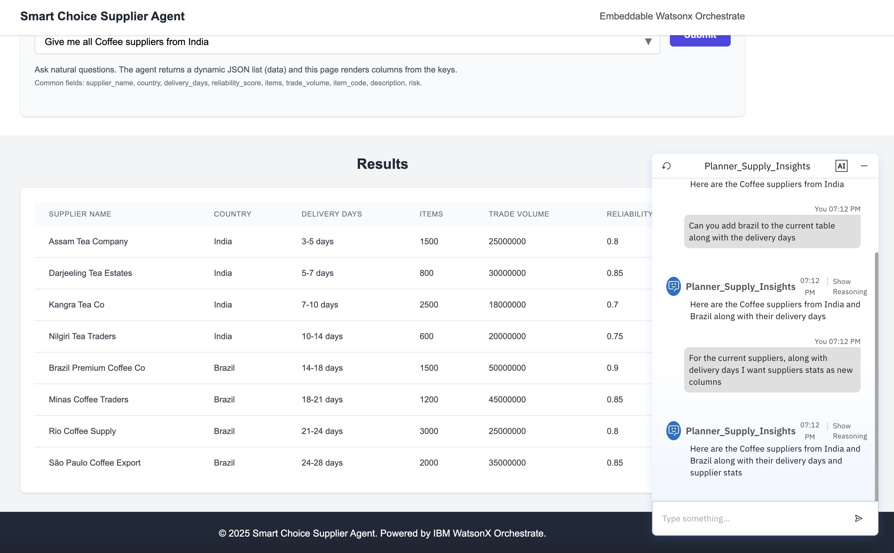

# Smart Choice Supplier Agent – Planner Stack

## Overview

This repository hosts the **Smart Choice Supplier Agent** orchestration stack, built on Watsonx Orchestrate planner-style agents. It aggregates supplier performance, logistics, country risk, and item catalog data into structured JSON responses that power the embedded dashboards.

## Repository Layout

- `agents/` – planner YAMLs  
  - `Supplier_Performance_Agent.yaml`  
  - `Product_Supplier_Info_Agent.yaml`  
  - `Item_Code_Catalog_Agent.yaml`  
  - `Country_Risk_Agent.yaml`  
  - `Planner_Supply_Insights.yaml` (main orchestrator)  
- `tools/` – Python tools exposed to the planner (`filter_data.py`, `get_supplier_*`, `get_country_risk_levels.py`, `get_item_code_catalog.py`, `requirements.txt`)  
- `tools/data/` – sample JSON datasets used by the tools  
- `supply_insights_dashboard_v2.html` – baseline HTML dashboard (dropdown + manual chat launcher)  
- `supply_insights_dashboard_v3.html` – dashboard with dynamic Chart.js visualization  
- `planner_import.sh` – command script to import all tools and agents

## Agents Architecture


## Agents & Behaviors

### Supplier_Performance_Agent_planner
- Role: Returns supplier reliability metrics and trade statistics.
- Domain focus: reliability statistics, trade volume, items handled
- Tools used: `get_supplier_risk_data`, `get_supplier_trade_stats`
- Structured output columns: `supplier_name`, `reliability_score`, `items`, `trade_volume`

### Product_Supplier_Info_Agent_planner
- Role: Provides supplier names, countries, and delivery days.
- Domain focus: supplier geography and delivery details
- Tools used: `get_supplier_names`, `get_supplier_countries`, `get_supplier_delivery_days`
- Structured output columns: `supplier_name`, `country`, `delivery_days`

### Country_Risk_Agent_planner
- Role: Retrieves country risk levels and contributing risk factors.
- Domain focus: national risk assessments
- Tool used: `get_country_risk_levels`
- Structured output columns: `country`, `risk_level`, `risk_factors`

### Item_Code_Catalog_Agent_planner
- Role: Lists item codes and their catalog descriptions.
- Domain focus: item codes and descriptions
- Tool used: `get_item_code_catalog`
- Structured output columns: `item_code`, `description`

### Planner_Supply_Insights (Main Planner)
- Role: Orchestrates all domain planners and applies filtering via planner guidelines.
- Orchestrates all domain planners; enforces structured output `{"data": [...], "message": "..."}`  
- Implements routing guidelines and filtering logic  
- Uses `filter_data` tool for follow-up refinements (delivery days, risk level, reliability, etc.)

## Python Tools

### `filter_data.py`
Filters a JSON array of objects by field, value, and operator.
- Parameters:
  - `data`: list/string containing JSON array
  - `field`: field name to compare
  - `operator`: `below`, `above`, `equals`, `not_equals`, `contains`, `greater_than_or_equal`, `less_than_or_equal`
  - `value`: comparison value
- Returns filtered JSON array as string.

### `format_supply_insights_results.py`
Join tool (optional) that consolidates planner task outputs into a uniform payload; helpful for legacy flows.

## Importing Tools & Agents

Run the following from repo root (CLI authenticated with Watsonx Orchestrate):

```bash
orchestrate tools import -k python -f tools/get_country_risk_levels.py -r tools/requirements.txt -p tools/
orchestrate tools import -k python -f tools/get_item_code_catalog.py -r tools/requirements.txt -p tools/
orchestrate tools import -k python -f tools/get_supplier_countries.py -r tools/requirements.txt -p tools/
orchestrate tools import -k python -f tools/get_supplier_delivery_days.py -r tools/requirements.txt -p tools/
orchestrate tools import -k python -f tools/get_supplier_names.py -r tools/requirements.txt -p tools/
orchestrate tools import -k python -f tools/get_supplier_risk_data.py -r tools/requirements.txt -p tools/
orchestrate tools import -k python -f tools/get_supplier_trade_stats.py -r tools/requirements.txt -p tools/
orchestrate tools import -k python -f tools/filter_data.py -r tools/requirements.txt -p tools/

orchestrate agents import -f agents/Supplier_Performance_Agent.yaml
orchestrate agents import -f agents/Product_Supplier_Info_Agent.yaml
orchestrate agents import -f agents/Item_Code_Catalog_Agent.yaml
orchestrate agents import -f agents/Country_Risk_Agent.yaml
orchestrate agents import -f agents/Planner_Supply_Insights.yaml
```

or simply:

```bash
./planner_import.sh
```

## Web UI Dashboards

### supply_insights_dashboard_v2.html
- Prompt combo box with curated suggestions and free typing
- Submit button sends prompt to embedded Watsonx chat via `send()`
- Chat launcher icon at bottom-right (manual open)
- Message content from planner output replaces raw JSON in chat window
- Table renders `data` array (keys become columns)

### supply_insights_dashboard_v3.html
- Includes all v2 features
- Adds dynamic bar chart (Chart.js):
  - Detects first string column as labels
  - Detects first numeric column as values
  - Hides chart when numeric fields not present
- Useful for quick visual comparison (delivery days, reliability, trade volume, etc.)

Embed instructions:
- Update `agentId`, `orchestrationID`, and any required config in `<script>` block
- Open HTML in browser (local or hosted)
- Use the prompt form or chat launcher to drive the planner

## Demo Narrative

**Goal:** Identify the best coffee supplier across India and Brazil using the planner + UI.

**Prompt sequence (enter in order):**
1. `Give me Coffee suppliers in India`
2. `Can you add brazil to the current table along with the delivery days`
3. `For the current suppliers, along with delivery days I want suppliers stats as new columns`
4. `From the current list can you please pick best suppliers one from each country`
5. `For this suppliers data can you please add country risk level and risk factors as new column`




---

## Demo Video

### Smart Choice Supplier Agent Demo

[](https://github.com/ibm-self-serve-assets/building-blocks/raw/main/agents/multi-agent-orchestration/Smart-Choice-Supplier/demo/Smart_Choice_Supplier_Agent.mp4)

After running the sequence, capture screenshots and a demo video for presentation.

## Notes / Future Enhancements
- Additional charts (pie, stacked bar) or user-selected fields
- Improved filtering controls (UI dropdowns hooked to `filter_data`)
