# Travel Planner Agent Demo Setup Guide

This comprehensive guide will walk you through building a sophisticated Travel Planner Agent using IBM watsonx Orchestrate. This intelligent agent represents a powerful example of multi-agent orchestration, demonstrating how to create conversational AI systems that can seamlessly integrate multiple external services and data sources to provide comprehensive, personalized assistance.

The Travel Planner Agent we'll build is designed to revolutionize how users approach trip planning by offering:

- **Intelligent Destination Research**: Leveraging advanced web search capabilities to discover attractions, activities, local insights, weather information, and cultural recommendations for any destination worldwide
- **Smart Accommodation Discovery**: Integrating with Airbnb's extensive database to find and recommend suitable places to stay based on user preferences, budget constraints, and travel dates
- **Personalized Travel Recommendations**: Creating customized itineraries that adapt to individual preferences, group dynamics, and specific travel requirements
- **Interactive Planning Experience**: Providing a conversational interface that guides users through the entire planning process with natural, engaging dialogue
- **Comprehensive Information Synthesis**: Combining data from multiple sources to deliver well-rounded, actionable travel advice

This demo showcases the power of modern AI orchestration platforms in creating sophisticated, tool-enabled conversational agents that can handle complex, multi-step workflows while maintaining a natural, user-friendly experience.

## Table of Contents

- [Overview](#overview)
- [Prerequisites](#prerequisites)
- [Step 1: Tavily API Setup](#step-1-tavily-api-setup)
- [Step 2: Watsonx Orchestrate Connection Setup](#step-2-watsonx-orchestrate-connection-setup)
- [Step 3: Travel Planner Agent Creation](#step-3-travel-planner-agent-creation)
- [Step 4: Tool Configuration](#step-4-tool-configuration)
- [Step 5: Agent Testing](#step-5-agent-testing)
- [Step 6: External Integration](#step-6-external-integration)
- [Troubleshooting](#troubleshooting)
- [Summary](#summary)

## Overview

In this demo, we will create a **Travel Planner Agent** that provides:

- **Destination Research**: Web search capabilities for attractions, activities, and local information
- **Accommodation Search**: Airbnb integration for finding suitable places to stay
- **Personalized Recommendations**: Customized travel plans based on user preferences
- **Interactive Planning**: Conversational interface for trip planning assistance

### Architecture

The following diagram illustrates the basic agent and tool flow for the Travel Planner Agent:

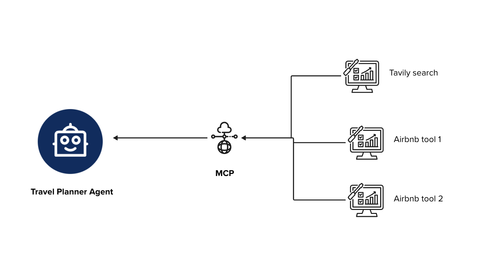

The agent will utilize three main tools:
1. **Tavily Web Search** - For researching destinations and attractions
2. **Airbnb Search** - For finding available accommodations
3. **Airbnb Listing Details** - For detailed accommodation information

## Prerequisites

Before starting, ensure you have:

- Access to IBM watsonx Orchestrate instance
- Tavily API account and key
- Basic understanding of agent development concepts
- Text editor for HTML file modification

## Step 1: Tavily API Setup

### 1.1 Generate Tavily API Key

To configure your Tavily API key, follow these steps:


1. Navigate to the [Tavily Dashboard](https://tavily.com)
2. Sign up or log in to your account
3. Generate your API key from the dashboard
4. Copy the key and save it securely for later use

> **Important**: Keep your API key secure and never share it publicly.

## Step 2: Watsonx Orchestrate Connection Setup

### 2.1 Access Connections Panel

1. Log in to your watsonx Orchestrate instance
2. Navigate to the **Connections** option in the left sidebar


### 2.2 Create New Connection

1. Click **Add Connection** to begin the connection process

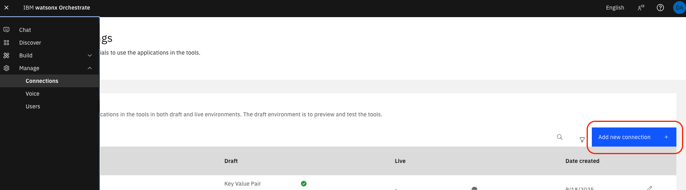

2. Enter connection details:
   - **Connection ID**: `Tavily_MCP`
   - Click **Save and Continue**


### 2.3 Configure Authentication

1. Expand the **Authentication type** menu

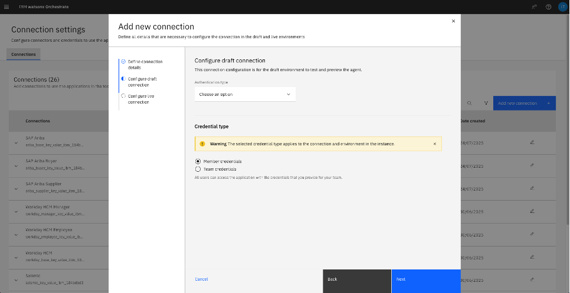

2. Select **Key Value Pair**


3. Configure the credentials:
   - **Key name**: `TAVILY_API_KEY`
   - **Value**: Paste your Tavily API key
   - Click **Connect**


### 2.4 Test Connection

1. Verify your draft connection shows as **Connected**


2. Click **Next** to proceed

### 2.5 Configure Live Environment

1. Repeat the authentication setup for the Live environment
2. Use the same credentials as the draft environment


3. Click **Add Connection** when complete

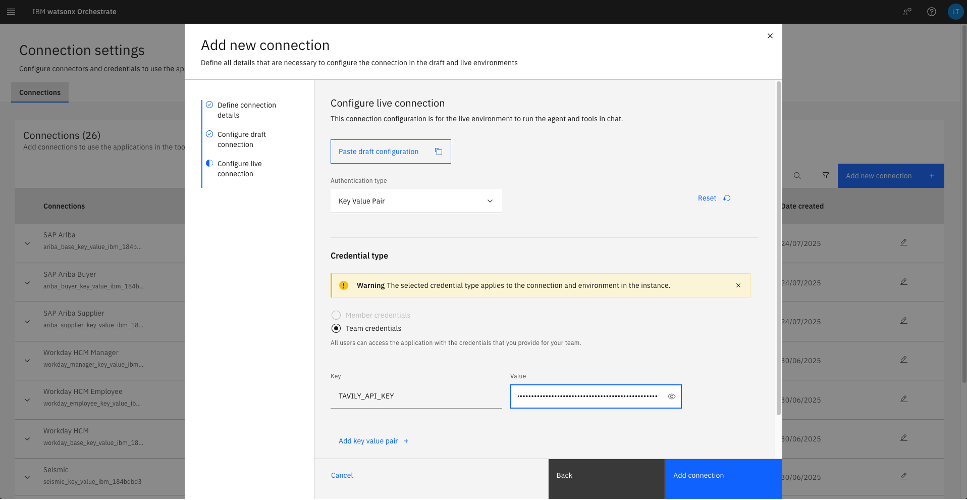

### 2.6 Verify Connection Status

1. Confirm both draft and live environments are ready


2. Click the top menu to return to the main interface

## Step 3: Travel Planner Agent Creation

### 3.1 Create New Agent

1. Navigate to **Agent Builder** from the left panel
2. Click **Create Agent**


### 3.2 Configure Agent Details

Enter the following agent configuration:

**Agent Name**: `Travel_Planner_Agent`

**Description**:
```
You are a Personalized Travel Planner Agent. You help users plan their trips by searching for attractions, activities, and accommodations. You provide comprehensive travel recommendations with a friendly, interactive approach.
```


### 3.3 Define Agent Behavior

Configure the agent's behavior with the following detailed instructions:

```
You are a Personalized Travel Planner Agent that helps users plan amazing trips. Always greet users with "Hi! I am your personalized travel planner" and maintain a warm, helpful, and interactive tone throughout the conversation.

WORKFLOW (MANDATORY SEQUENCE):
1. Use Tavily_Server_DA_2:tavily-search tool to research the destination city, find top attractions, activities, points of interest, weather information, and local recommendations
2. Use Airbnb rooms search tool to find available accommodations in the destination area based on user preferences and dates
   - airbnb-test-mcp-5:airbnb_listing_details: Get detailed information about a specific Airbnb listing. Provide direct links to the user
   - airbnb-test-mcp-5:airbnb_search: Search for Airbnb listings with various filters and pagination. Provide direct links to the user
3. Synthesize the information to create comprehensive travel recommendations and suggestions

CRITICAL RULES:
- ALWAYS introduce yourself as "Hi! I am your personalized travel planner" at the start
- ALWAYS be verbose, friendly, and interactive in your responses
- ALWAYS ask follow-up questions to better understand user preferences (budget, group size, interests, travel dates)
- ALWAYS use Tavily_Server_DA_2:tavily-search to research comprehensive information about the destination
- ALWAYS use Airbnb rooms search to find suitable accommodations
- ALWAYS provide multiple options and alternatives for both attractions and accommodations
- ALWAYS suggest next steps and ask courtesy questions like "Would you like me to find more options?" or "Should I look for accommodations in a different area?"
- ALWAYS provide practical details (timing, costs, accessibility, booking requirements)
- ALWAYS format responses with clear sections and bullet points
- If insufficient information found, suggest alternative approaches or nearby locations
- Keep the conversation flowing with natural follow-up questions

INTERACTION STYLE:
- Be enthusiastic about travel and destinations
- Ask about budget, group size, interests, and travel dates
- Provide multiple accommodation options with different price ranges
- Suggest both popular attractions and hidden gems
- Always end with helpful next steps or questions

Example queries: "I want to visit Austin, Texas", "Plan a weekend trip to San Francisco", "Find me things to do in Paris with good weather"
```

## Step 4: Tool Configuration

### 4.1 Configure Tavily Search Tool

#### 4.1.1 Add MCP Server

1. Navigate to the **Tools** section within the agent page
2. Click **Add Tool** and select **MCP Server**


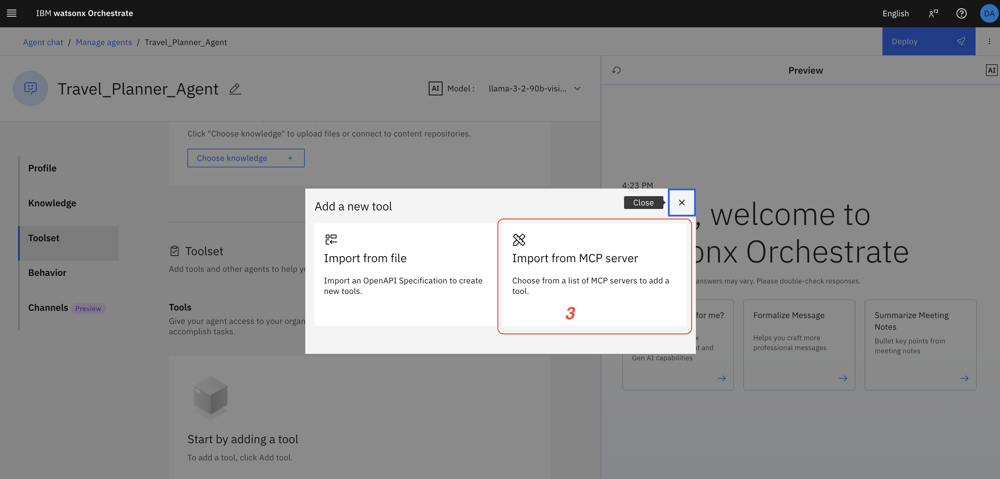

3. Click **Add MCP Server**


#### 4.1.2 Configure Tavily Server

1. Select your `Tavily_MCP` connection from the list

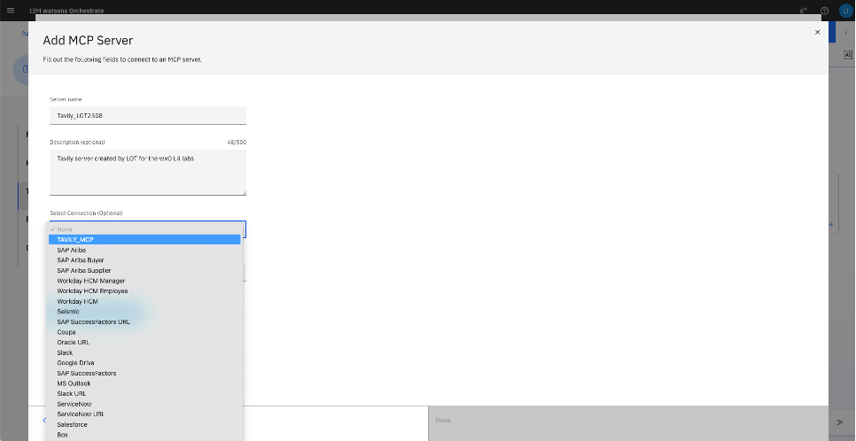

2. Enter the command: `npx -y tavily-mcp@0.1.3`
3. Click **Connect**


4. Click **Done** to complete the server setup

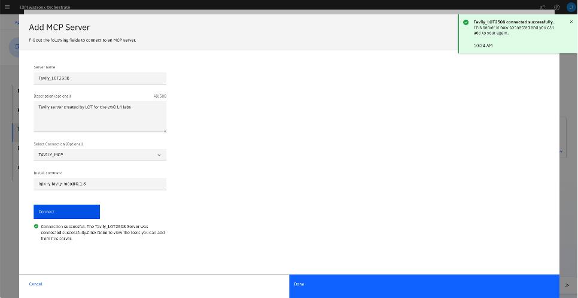

#### 4.1.3 Activate Tavily Search Tool

1. Identify the `tavily_search` tool in the available tools list
2. Switch the **Activation toggle** to **On**


3. Click **X** to close the server view


4. Verify the Tavily search tool is now added to your agent tools


5. (Optional) Click the option menu to edit tool details


6. For this demo, we'll keep the default query parameters. Click **Cancel**

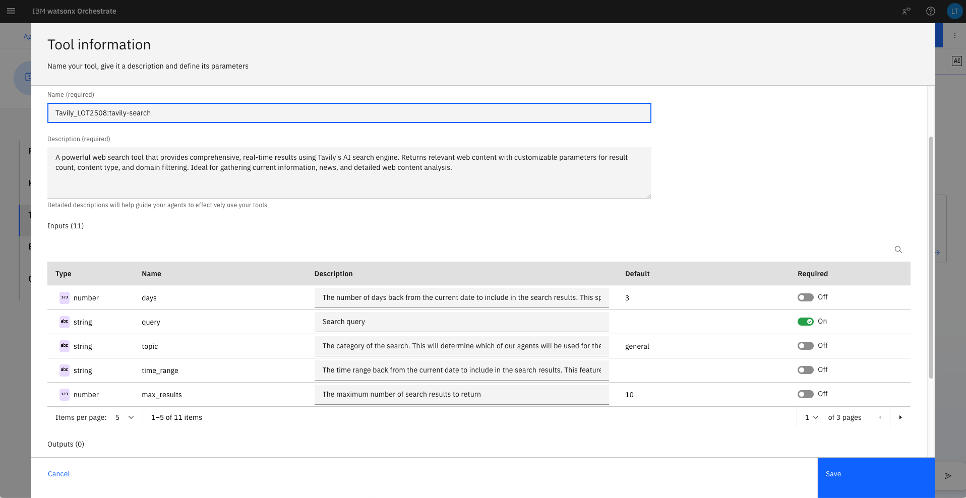

**Success**: Tavily web search tool has been successfully added to your Travel Planner Agent.

### 4.2 Configure Airbnb Tools

#### 4.2.1 Add Airbnb MCP Server

1. Click **Add Tool** again


2. Click **Add MCP Server**


3. Configure the publicly available Airbnb MCP server:
   - **Server Name**: `Travel-Planner-Airbnb`
   - **Description**: `This is travel planner Airbnb server`
   - **Install command**: `npx -y @openbnb/mcp-server-airbnb --ignore-robots-txt`

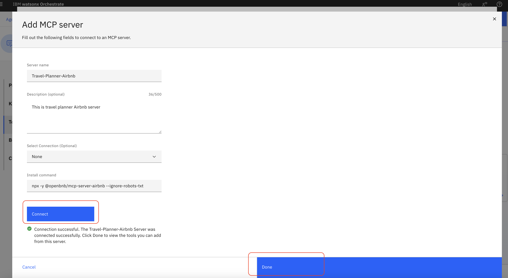

#### 4.2.2 Activate Airbnb Tools

1. Activate the available Airbnb tools from the server


2. Verify all three tools are now configured in your Travel Planner Agent

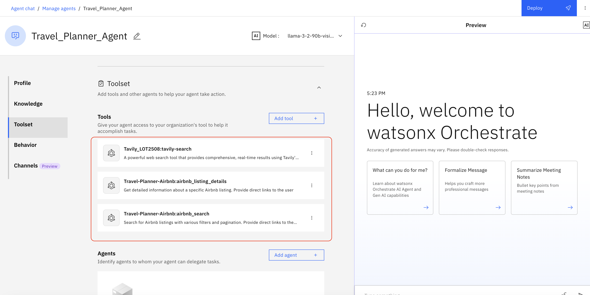

**Success**: Your Travel Planner Agent now has all required tools configured:
- Tavily Web Search
- Airbnb Search
- Airbnb Listing Details

## Step 5: Agent Testing

### 5.1 Test Agent Functionality

1. Navigate to the **Preview** screen
2. Type a test message: `"Hello, how can you help me?"`

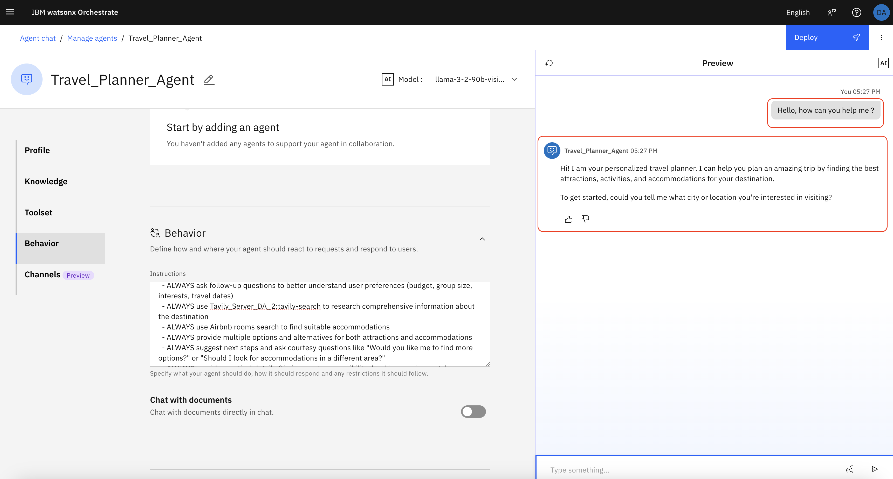

3. Verify the agent responds with the expected greeting and behavior

### 5.2 Validate Tool Integration

Test the agent with sample queries to ensure all tools are working:
- Destination research queries
- Accommodation search requests
- Combined travel planning requests

## Step 6: External Integration

### 6.1 Embed Agent in External Application

To integrate your agent into an external application:

1. Navigate to the **Channels** section within the Travel Planner agent page


2. Copy the **Orchestration ID** and **Agent ID** as shown

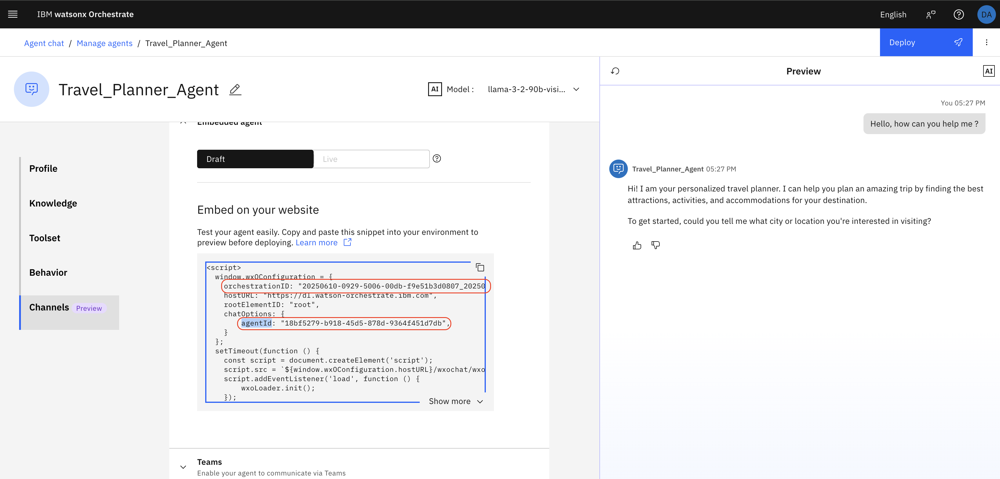

3. Open the `travel_planner.html` file in a text editor
4. Update the script section with your orchestration and agent IDs

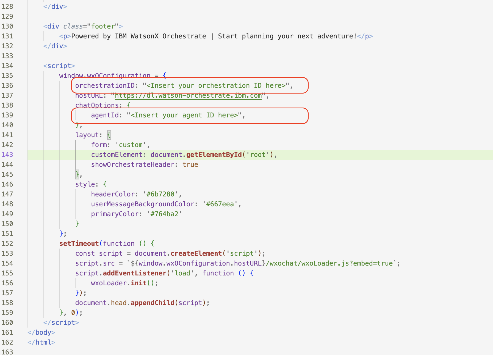

### 6.2 Test External Integration

1. Open the HTML file in a web browser
2. Verify the agent is properly embedded and functional


### 6.3 Sample Test Scenarios

Test your Travel Planner Agent with these scenarios:


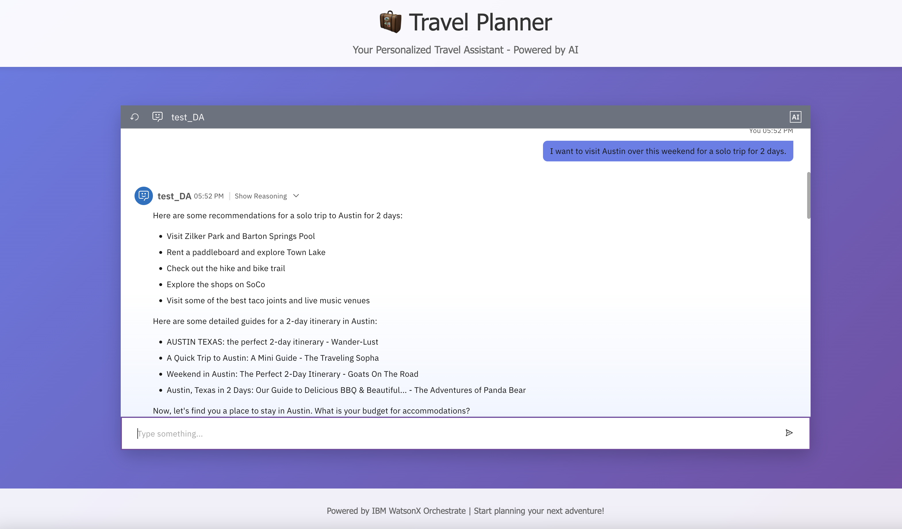


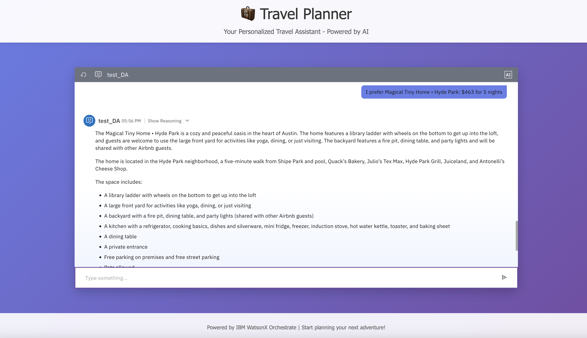

## Troubleshooting

### Common Issues and Solutions

#### Connection Issues
- **Problem**: Tavily connection fails to establish
- **Solution**: Verify API key is correct and has proper permissions

#### Tool Activation Issues
- **Problem**: Tools not appearing in agent
- **Solution**: Ensure MCP servers are properly connected and tools are activated

#### Agent Response Issues
- **Problem**: Agent not following behavior instructions
- **Solution**: Review and refine the behavior configuration

#### External Integration Issues
- **Problem**: HTML integration not working
- **Solution**: Verify orchestration ID and agent ID are correctly copied

### Getting Help

If you encounter issues not covered in this guide:
1. Check the IBM watsonx Orchestrate documentation
2. Review the agent and tool configuration
3. Test individual components separately
4. Contact support if needed

## Summary

Congratulations! You have successfully created a comprehensive Travel Planner Agent with the following capabilities:

### What You've Built

- **Intelligent Travel Planning**: Agent that researches destinations and provides recommendations
- **Web Search Integration**: Tavily-powered search for attractions and local information
- **Accommodation Search**: Airbnb integration for finding suitable places to stay
- **Interactive Interface**: Conversational agent with personalized responses
- **External Integration**: Embeddable agent for use in external applications

### Next Steps

- **Enhance the Agent**: Add more tools and capabilities
- **Customize Behavior**: Refine the agent's personality and responses
- **Scale Integration**: Deploy to production environments
- **Monitor Performance**: Track agent usage and optimize responses

### Additional Resources

- [IBM watsonx Orchestrate Documentation](https://developer.watson-orchestrate.ibm.com/)
- [Tavily API Documentation](https://docs.tavily.com/)
- [Airbnb MCP Server Documentation](https://github.com/openbnb/mcp-server-airbnb)
- [Model Context Protocol Servers](https://github.com/modelcontextprotocol/servers) - Free MCP servers to extend your agent capabilities

---

**Note**: This demo showcases the power of multi-agent orchestration in creating sophisticated, tool-enabled conversational agents. The principles demonstrated here can be applied to various other use cases and domains.