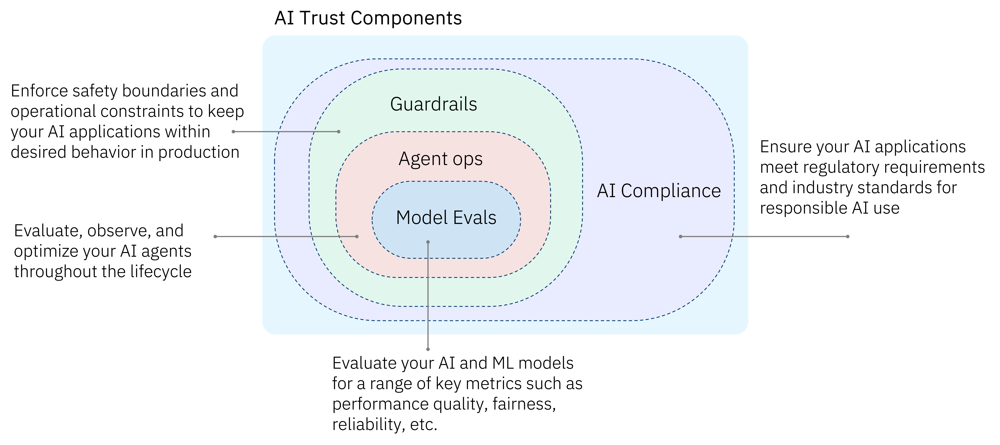

# IBM Building Blocks for AI Trust

Welcome to the **AI Trust** building blocks.  
This resource helps you get started on designing, building, and deploying AI systems that are reliable, transparent, secure, and compliant. These capabilities are powered by **IBM watsonx governance** and **IBM watsonx orchestrate**.

Building trust in AI requires a holistic approach across the full AI lifecycle — from model evaluation and agent operations to real-time safeguards and regulatory compliance. This repository provides frameworks, best practices, and tools to ensure your AI solutions are trustworthy and enterprise-ready.

---

## 📂 Repository Structure  

The content is organized into 4 main categories:  

### 1. **[Model Evaluation](model-evaluation/)**  
Evaluate your AI and ML models for a range of key metrics such as performance quality, fairness, reliability, and more.

### 2. **[Agent Ops](agent-ops/)**  
Evaluate, observe, and optimize your AI agents throughout the lifecycle.

### 3. **[Real-Time Guardrails](real-time-guardrails/)**  
Enforce safety boundaries and operational constraints to keep your AI applications within desired behavior in production.

### 4. **[AI Compliance](ai-compliance/)**  
Ensure your AI applications meet regulatory requirements and industry standards for responsible AI use.

---

## 🚀 Getting Started  
1. Browse the category that best fits your needs — model evaluation, agent ops, guardrails, or compliance.  
2. Explore the included resources, frameworks, and examples.  
3. Apply these practices to build AI solutions that your customers and stakeholders can trust.  

---

## 🤝 Contributing  
We welcome contributions! Please submit issues, suggest improvements, or open pull requests to expand the resources and keep this repository valuable for all partners.
