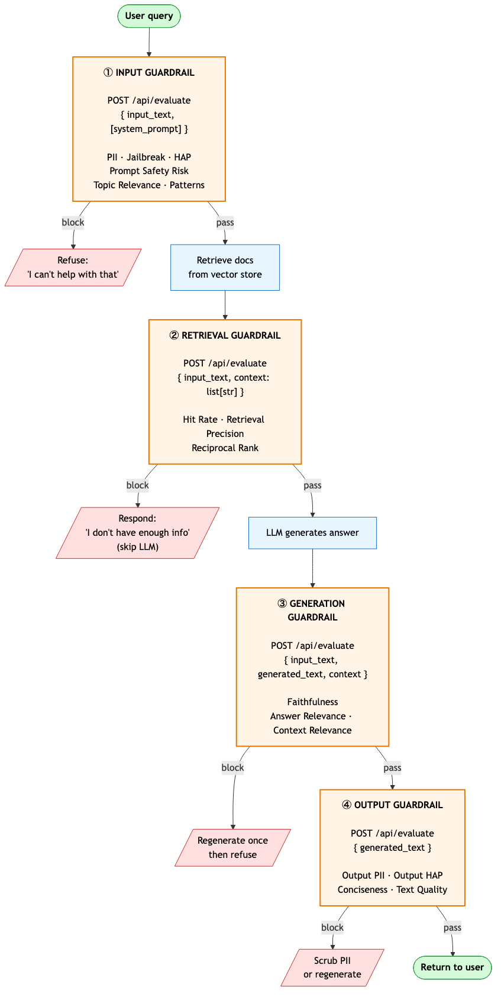

# real-time-guardrails

Real-time AI guardrails powered by IBM watsonx.governance, packaged as a Python library, REST API, and MCP server.

Ships **28 reference-free, real-time evaluation metrics** across 7 categories — safety, RAG generation, RAG retrieval, output quality, topic alignment, pattern matching, and tool-call validation.

## Why this SDK exists

This SDK is a thin, opinionated wrapper over [`ibm-watsonx-gov`](https://pypi.org/project/ibm-watsonx-gov/). It adds production patterns that partners would otherwise build themselves — a 3-state **Pass / Flag / Block** action model, an `AuditLogger` for compliance trails, a 5-layer threshold-override system (per-call → constructor → YAML → env var → default), a `GuardrailedAgent` class wrapping the 4-choke-point flow (input → retrieval → generation → output), and three interfaces (library, REST, MCP) over a single shared core.

The relationship is intentionally transparent: you can drop down to `ibm-watsonx-gov` directly at any point if you need a metric or capability we don't expose. The two SDKs coexist cleanly in the same process, and our public API uses the gov SDK's types where possible. We're an accelerator, not a replacement.

## Install

```bash
pip install real-time-guardrails              # library only
pip install real-time-guardrails[rest]        # + REST server
pip install real-time-guardrails[mcp]         # + MCP server
pip install real-time-guardrails[rest,mcp]    # all interfaces
```

## IBM Cloud services required

The package is a client library over IBM Cloud services. Running it requires **one** mandatory service (watsonx.governance) and **one optional** service (watsonx.ai) that gates 3 of the 28 metrics.

### Required: **watsonx.governance** service instance

Provides access to the **Granite Guardian** model that powers 22 of the 28 metrics — every safety, RAG, topic-alignment, and pattern check, plus the syntactic tool-call metric. Without this, the package won't initialize.

| Metrics this unlocks | Count |
|---|---|
| Safety (HAP, PII, Harm, SocialBias, Jailbreak, Violence, Profanity, Unethical, SexualContent, Evasiveness, HarmEngagement, PromptSafetyRisk) | 12 |
| RAG generation (AnswerRelevance, ContextRelevance, Faithfulness) | 3 |
| RAG retrieval — derived from ContextRelevance (RetrievalPrecision, HitRate, ReciprocalRank) | 3 |
| Topic alignment (TopicRelevance) | 1 |
| Tool-call (ToolCallAccuracy with granite_guardian method) | 1 |
| Quality — deterministic / local-Python (TextGradeLevel, TextReadingEase, UnsuccessfulRequests) | 3 |
| Pattern (KeywordDetection, RegexDetection) | 2 |

Pricing: subscription/seat-based. Granite Guardian calls are **included** in the subscription — no per-call token charges. The 3 deterministic quality metrics and 2 pattern metrics make no network calls at all (pure Python).

### Optional: **watsonx.ai** project (only for LLM-as-judge metrics)

Provides access to the **Llama-3.3-70B** foundation model used as the judge for three custom LLM-as-judge metrics. Identified by a watsonx project ID (`WXG_PROJECT_ID`).

**If `WXG_PROJECT_ID` is not set, these 3 metrics are simply omitted from the registry and the remaining 25 metrics work normally.** The package logs a warning at startup so you know they're disabled. No procurement of watsonx.ai is required if you don't need them.

| Metrics this unlocks (only when WXG_PROJECT_ID is set) | What the LLM is judging |
|---|---|
| Answer Completeness (LLM Judge) | "Does the response completely address the user's question?" |
| Conciseness (LLM Judge) | "Is the response concise and to the point?" |
| Tool Call Relevance | "Is the selected tool appropriate for the user's intent?" |

Pricing: **pay-per-token** for foundation-model inference. Each LLM-judge call uses ~200–500 input tokens + ~10 output tokens. Many partners sample (e.g. 10% of traffic) to control cost.

### Summary: how many metrics you get

| Setup | Metrics available |
|---|---|
| watsonx.governance only (default for most partners) | **25 of 28** |
| watsonx.governance + watsonx.ai project | **28 of 28** |

### Network requirements

The guardrails service makes outbound HTTPS calls to:

- the watsonx.governance service endpoint for your instance (always)
- `*.ml.cloud.ibm.com` — watsonx.ai foundation model endpoint (only when LLM-judge metrics are invoked)

Air-gapped / no-egress deployments are not supported today.

### What to ask your IBM rep

If your partner doesn't already have these:

1. **Required**: A **watsonx.governance** subscription (any tier; enables Granite Guardian access) and an **IBM Cloud account + API key** with permissions.
2. **Optional**: A **watsonx.ai** project with access to `meta-llama/llama-3-3-70b-instruct` (or another judge model overridable via `WXG_JUDGE_MODEL_ID`) — only if they want the 3 LLM-as-judge metrics.

## Credentials

```bash
# Required — fails fast with ConfigError if missing
export WATSONX_APIKEY=...              # IBM Cloud API key
export WXG_SERVICE_INSTANCE_ID=...     # watsonx.governance service instance ID

# Optional — only needed for the 3 LLM-as-judge metrics. If unset, those
# metrics are silently dropped from the registry (25 of 28 metrics still work).
export WXG_PROJECT_ID=...              # watsonx project ID

# Optional region/model overrides
export WATSONX_URL=...                 # default: https://us-south.ml.cloud.ibm.com
export WXG_JUDGE_MODEL_ID=...          # default: llama-3-3-70b-instruct
```

Or copy [.env.example](.env.example) to `.env` and fill in. When `WXG_PROJECT_ID` is unset, the evaluator logs a warning at startup naming the disabled metrics so you have visibility into what's available.

### Finding each value in IBM Cloud

| Env var | Where to find it |
|---|---|
| `WATSONX_APIKEY` | IBM Cloud console → **Manage** → **Access (IAM)** → **API keys** → **Create**. Give it permissions on both watsonx.governance and (if you'll use LLM-judge metrics) watsonx.ai. |
| `WXG_SERVICE_INSTANCE_ID` | IBM Cloud console → **Resource list** → click your watsonx.governance instance → copy the **GUID** field on the instance page. |
| `WXG_PROJECT_ID` | watsonx.ai console (`https://dataplatform.cloud.ibm.com`) → open your project → **Manage** tab → **General** → copy **Project ID**. |
| `WATSONX_URL` | Match the region of your watsonx instances. Common values: `https://us-south.ml.cloud.ibm.com`, `https://eu-de.ml.cloud.ibm.com`, `https://eu-gb.ml.cloud.ibm.com`, `https://jp-tok.ml.cloud.ibm.com`, `https://au-syd.ml.cloud.ibm.com`. |
| `WXG_JUDGE_MODEL_ID` | watsonx.ai console → your project → **Models** → use any model ID available in your project (e.g. `meta-llama/llama-3-3-70b-instruct`, `ibm/granite-3-8b-instruct`). Only relevant if you're using LLM-judge metrics. |

### Quick sanity check

After setting env vars and `pip install -e ".[all]"`:

```bash
python -c "
from real_time_guardrails import GuardrailsEvaluator
ev = GuardrailsEvaluator()
print('metrics available:', ev.list_metrics()['total'])
r = ev.evaluate(input_text='My SSN is 123-45-6789', metrics=['PII Detection'])['PII Detection']
print(f'PII Detection: score={r.score} action={r.action} threshold={r.threshold}')
"
```

Expected output:
```
metrics available: 28      # or 25 if WXG_PROJECT_ID isn't set
PII Detection: score=0.97  action=Block  threshold=0.65
```

Common errors and what they mean:

| Error | Likely cause |
|---|---|
| `ConfigError: Missing required environment variable(s): WATSONX_APIKEY` | env var not exported in current shell |
| `EvaluatorInitError: Failed to initialize ibm_watsonx_gov MetricsEvaluator: ...` | API key invalid or lacks permissions, or service instance ID wrong |
| Network timeout / DNS error | `WATSONX_URL` doesn't match the region of your watsonx instance |
| `UnknownMetricError: 'Conciseness (LLM Judge)'` when you requested an LLM-judge metric | `WXG_PROJECT_ID` not set — that metric is disabled |

## Three ways to use

### 1. Library

```python
from real_time_guardrails import GuardrailsEvaluator

ev = GuardrailsEvaluator()

# Safety on input
result = ev.evaluate(input_text="My SSN is 123-45-6789",
                     metrics=["PII Detection", "Jailbreak Detection"])
for name, r in result.results.items():
    print(name, r.score, r.action)

# RAG retrieval quality
ev.evaluate(input_text="What is RAG?",
            context=["doc 1...", "doc 2...", "doc 3..."],
            metrics=["Retrieval Precision", "Hit Rate", "Reciprocal Rank"])

# Auto-select — run every metric whose required fields are satisfied
ev.evaluate(input_text="...")
```

### 2. REST API

```bash
real-time-guardrails serve --port 8090
```

```bash
curl -X POST http://localhost:8090/api/evaluate \
  -H 'Content-Type: application/json' \
  -d '{"input_text":"My SSN is 123-45-6789","metrics":["PII Detection"]}'
```

### 3. MCP server

```bash
real-time-guardrails mcp
```

Add the server to your MCP client's configuration. MCP (Model Context Protocol) clients are host applications — chat tools, IDE extensions, agent frameworks — that can discover and invoke tools exposed by MCP servers like this one. Configuration format varies; consult your client's documentation for the exact file path and schema. The block to add:

```json
{
  "mcpServers": {
    "real-time-guardrails": {
      "command": "real-time-guardrails",
      "args": ["mcp"],
      "env": {
        "WATSONX_APIKEY": "...",
        "WXG_SERVICE_INSTANCE_ID": "...",
        "WXG_PROJECT_ID": "..."
      }
    }
  }
}
```

## Integrating with your RAG agent

The package's job is to score whatever your agent already has at four natural points in the request/response lifecycle. Your job is to decide when to call and what to do on `Block`.

### Pick your integration pattern

| Pattern | When to use | How it talks to the guardrails |
|---|---|---|
| **Library (in-process)** | Your agent is a Python service and you can `pip install` into it | `from real_time_guardrails import GuardrailsEvaluator` — direct function calls, no network hop |
| **REST API** | Agent is deployed elsewhere (any language) | `POST /api/evaluate` over HTTP — works for Node, Go, Java, anything |
| **MCP** | Agent is built on MCP and uses tools | Register `real-time-guardrails` as an MCP server; the agent calls tools |

For a deployed RAG agent, **REST is almost always the right answer.** Deploy `real-time-guardrails serve` somewhere reachable (Code Engine, k8s, EC2, same VPC as your agent), and have your agent POST to `/api/evaluate` at the four choke points below.

### The 4 choke points



| # | When to call | Required fields | What you're checking | On Block |
|---|---|---|---|---|
| ① | **Before retrieval** | `input_text` (+ `system_prompt`) | PII, jailbreak, hate/abuse, prompt injection, off-topic, custom keywords/regex | Refuse with a canned message |
| ② | **After retrieval, before generation** | `input_text`, `context: list[str]` | Did the retriever return relevant docs? Where in the ranking is the first good one? | Respond "no info"; skip LLM call |
| ③ | **After generation** | `input_text`, `generated_text`, `context` | Is the answer grounded in the context (faithfulness)? Does it actually address the question? | Regenerate once, then fall back to refusal |
| ④ | **Before returning to user** | `generated_text` | Did the LLM leak PII/HAP in the response? Is it concise / readable? | Scrub PII or regenerate |

### Field mapping (your variables → guardrails kwargs)

| Your RAG agent variable | Guardrails arg | Used at choke point |
|---|---|---|
| user's query | `input_text` | ①, ②, ③ |
| retrieved docs (list of strings) | `context` (as `list[str]`) | ②, ③ |
| LLM's answer | `generated_text` | ③, ④ |
| system prompt | `system_prompt` | ① (PromptSafetyRisk, TopicRelevance) |
| LLM's tool calls | `tool_calls` + `available_tools` | ① (only if your agent uses tools) |
| keyword/regex policy | `params` | ① (KeywordDetection, RegexDetection) |

### Python — REST client

```python
import requests

GUARD = "http://your-guardrails-host:8090"

class GuardrailBlock(Exception):
    def __init__(self, stage, metrics, full):
        self.stage, self.metrics, self.full = stage, metrics, full
        super().__init__(f"[{stage}] blocked by: {', '.join(metrics)}")

def check(payload, stage):
    r = requests.post(f"{GUARD}/api/evaluate", json=payload, timeout=30)
    r.raise_for_status()
    blocked = [
        name for name, info in r.json()["results"].items()
        if info["action"] == "Block"
    ]
    if blocked:
        raise GuardrailBlock(stage, blocked, r.json())
    return r.json()

def rag_agent(user_query: str) -> str:
    # ① INPUT — auto-select runs every input-safety metric whose fields are satisfied
    check({"input_text": user_query}, stage="input")

    # ② RETRIEVAL
    docs = vector_store.retrieve(user_query, k=5)  # → list[str]
    check({
        "input_text": user_query,
        "context": docs,
        "categories": ["rag_retrieval"],
    }, stage="retrieval")

    # ③ GENERATION
    best_context = "\n\n".join(docs[:3])
    answer = llm.generate(user_query, context=best_context)
    check({
        "input_text": user_query,
        "generated_text": answer,
        "context": best_context,
        "categories": ["rag_generation"],
    }, stage="generation")

    # ④ OUTPUT — safety + quality on the response
    check({
        "generated_text": answer,
        "metrics": ["PII Detection", "HAP (Hate, Abuse, Profanity)",
                    "Conciseness (LLM Judge)"],
    }, stage="output")

    return answer
```

### Python — in-process library

If your agent is already in Python, skip HTTP entirely:

```python
from real_time_guardrails import GuardrailsEvaluator

ev = GuardrailsEvaluator()  # built once at startup; reads env vars

def check(stage, **fields):
    bundle = ev.evaluate(**fields)
    blocked = [r.metric for r in bundle.failed()]
    if blocked:
        raise GuardrailBlock(stage, blocked, bundle)

def rag_agent(user_query):
    check("input", input_text=user_query)
    docs = vector_store.retrieve(user_query, k=5)
    check("retrieval", input_text=user_query, context=docs, categories=["rag_retrieval"])
    answer = llm.generate(user_query, "\n\n".join(docs[:3]))
    check("generation", input_text=user_query, generated_text=answer,
          context="\n\n".join(docs[:3]), categories=["rag_generation"])
    check("output", generated_text=answer,
          metrics=["PII Detection", "HAP (Hate, Abuse, Profanity)"])
    return answer
```

### Node.js / TypeScript — REST client

```javascript
const GUARD = "http://your-guardrails-host:8090";

async function check(payload, stage) {
  const r = await fetch(`${GUARD}/api/evaluate`, {
    method: "POST",
    headers: { "Content-Type": "application/json" },
    body: JSON.stringify(payload),
  });
  const data = await r.json();
  const blocked = Object.entries(data.results)
    .filter(([_, info]) => info.action === "Block")
    .map(([name]) => name);
  if (blocked.length) {
    const err = new Error(`[${stage}] blocked by: ${blocked.join(", ")}`);
    err.stage = stage; err.metrics = blocked; err.full = data;
    throw err;
  }
  return data;
}

async function ragAgent(userQuery) {
  await check({ input_text: userQuery }, "input");

  const docs = await vectorStore.retrieve(userQuery, 5);
  await check(
    { input_text: userQuery, context: docs, categories: ["rag_retrieval"] },
    "retrieval"
  );

  const ctx = docs.slice(0, 3).join("\n\n");
  const answer = await llm.generate(userQuery, ctx);
  await check(
    { input_text: userQuery, generated_text: answer, context: ctx,
      categories: ["rag_generation"] },
    "generation"
  );

  await check(
    { generated_text: answer,
      metrics: ["PII Detection", "HAP (Hate, Abuse, Profanity)"] },
    "output"
  );

  return answer;
}
```

### One-class pipeline (recommended starting template)

`examples/full_pipeline.py` ships a `GuardrailedAgent` class that wraps all 4 choke points + audit logging behind a single `process_request(...)` call. Drop in your real retriever + LLM callbacks and you're done:

```python
from real_time_guardrails import GuardrailsEvaluator, AuditLogger
from examples.full_pipeline import GuardrailedAgent

ev = GuardrailsEvaluator()
audit = AuditLogger(path="audit.jsonl")
agent = GuardrailedAgent(
    ev,
    audit=audit,
    retrieve_callback=my_vector_store.retrieve,    # your retriever
    model_callback=my_llm.generate,                # your LLM client
)

result = agent.process_request("user query", request_id="req-42")
print(result.overall_action, result.final_response)
```

The class enforces the right per-stage metric set, picks the right fallback message on Block, and writes every decision to the audit log. Copy it into your codebase and modify as needed.

### Fallback messages

When a metric returns `Block`, the result carries a user-facing `fallback_message` so partners don't have to invent one. Category defaults are sensible out of the box:

```python
bundle = ev.evaluate(input_text="My SSN is 123-45-6789", metrics=["PII Detection"])
r = bundle["PII Detection"]
if r.action == "Block":
    return r.fallback_message
    # → "Your request couldn't be processed. Please rephrase your question."
```

Override per metric (per call):

```python
ev.evaluate(
    input_text="...",
    metrics=["PII Detection"],
    fallback_messages={"PII Detection": "We can't process content with personal data."},
)
```

Defaults per category live in `core/metrics.py:CATEGORY_FALLBACK_MESSAGES` — partners can monkey-patch the dict if they want a global rewrite without per-call overrides.

### Audit logging

`AuditLogger` writes a JSONL trail of every guardrail decision — required for compliance use cases.

```python
from real_time_guardrails import AuditLogger

# Default: write to a file
audit = AuditLogger(path="/var/log/guardrails/audit.jsonl")
audit.record(bundle, input_payload={"input_text": "..."}, request_id="req-42")
audit.close()

# Or: pluggable sink for Splunk/ELK/stdout
audit = AuditLogger(sink=lambda rec: splunk_client.send(rec))

# Or: hash-only mode for regimes that forbid persisting user content
audit = AuditLogger(path="...", include_inputs=False)
```

One record per `.record()` call, with stable input hash, per-metric scores + actions, overall action (`Block` > `Flag` > `Pass`), and lists of blocked/flagged metric names. Each line is one JSON object — `jq` and `grep` friendly.

### Practical tips

- **Latency profile.** Granite Guardian safety/RAG metrics take ~200–800 ms each. LLM-as-judge metrics (Conciseness, Answer Completeness) call Llama-3.3-70B and take 1–3 s. Gate cheap metrics first — only run LLM-judge checks after safety passes.
- **Parallelize where you can.** Stage ① (input safety) and Stage ② (retrieval) are independent — fire retrieval while the input guardrail is in-flight, then await both before generation:
  ```python
  input_check_task = asyncio.create_task(async_check({"input_text": q}, "input"))
  docs = await vector_store.retrieve(q)
  await input_check_task  # raises if blocked
  ```
- **What to do on Block.** Don't just propagate the error — make the agent's response sensible:
  - Input block → refuse with `"I can't help with that"` (don't leak which metric tripped)
  - Retrieval block (HitRate=0) → `"I don't have enough information about that"`
  - Generation block → regenerate once with a different prompt, then fall back to refusal
  - Output block → scrub the offending span (PII detection returns the matched text) or regenerate
- **Selecting metrics.** Use `categories=[...]` when you want "all the safety metrics applicable to what I sent" — the package skips any metric whose required fields you didn't supply. Use `metrics=[...]` for a tight, deliberate subset (safest for production).
- **Per-partner thresholds.** Each tenant can have its own thresholds — pass `thresholds={...}` per request, or run multiple guardrails service instances with different `GUARDRAILS_THRESHOLD_*` env vars / YAML config files.
- **Network proximity.** Co-locate the guardrails service with your agent (same VPC / region). Latency stacks across 4 calls per request.
- **Observability.** The REST response includes `score`, `passed`, `action`, `column`, and `threshold` per metric. Log these alongside your request ID to build a guardrail-decision audit trail.

## Metric catalog (28 metrics, 7 categories)

Metrics marked ⚡ are **LLM-as-judge** — they require `WXG_PROJECT_ID` (watsonx.ai) AND they use an opinionated prompt to grade the AI's output. **You can replace, modify, or skip them.** Skip = omit `WXG_PROJECT_ID` (registry drops them; 25-metric subset still works). Modify = write your own prompt and register it (see `examples/library_custom_judge.py`). The prompts we ship for `Answer Completeness` and `Conciseness` live in [src/real_time_guardrails/core/custom_metrics.py](src/real_time_guardrails/core/custom_metrics.py) — fork them if you need different rubrics for your domain. `Tool Call Relevance` uses the gov SDK's built-in prompt.

| Category | Metrics | Required fields |
|---|---|---|
| **Safety** (12) | HAP, PII, Harm, SocialBias, Jailbreak, Violence, Profanity, Unethical, SexualContent, Evasiveness, HarmEngagement, PromptSafetyRisk | `input_text` or `generated_text`; `PromptSafetyRisk` also needs `system_prompt` |
| **RAG generation** (3) | AnswerRelevance, ContextRelevance, Faithfulness | `input_text` + `generated_text` + `context` |
| **RAG retrieval** (3) | RetrievalPrecision, HitRate, ReciprocalRank | `input_text` + `context: list[str]` (any length) |
| **Quality** (5 / 3 without ⚡) | ⚡AnswerCompleteness, ⚡Conciseness, TextGradeLevel, TextReadingEase, UnsuccessfulRequests | `generated_text` (AnswerCompleteness also needs `input_text`) |
| **Topic** (1) | TopicRelevance | `input_text` + `system_prompt` |
| **Pattern** (2) | KeywordDetection, RegexDetection | `input_text` + `params` (`{"keywords": [...]}` or `{"pattern": "..."}`) |
| **Tool-call** (2 / 1 without ⚡) | ToolCallAccuracy, ⚡ToolCallRelevance | `input_text` + `tool_calls` (ToolCallRelevance also needs `available_tools`) |

Full per-metric details (descriptions, default thresholds, expected score directions) at `GET /api/metrics`. The response's `total` field reflects what's actually available given your `WXG_PROJECT_ID` state — 28 or 25.

### Building your own LLM-as-judge metrics

If the 3 ship-built LLM-judges don't fit, define your own. The SDK supports two authoring styles — both via `LLMAsJudgeMetric`:

| Style | When to use | Helper |
|---|---|---|
| **prompt_template** | Full control over the LLM prompt | `LLMAsJudgeMetric(prompt_template=..., options={...})` directly |
| **criteria + Option** | Short rubric (Yes/No, High/Medium/Low) — SDK builds the prompt | `from real_time_guardrails.core.custom_metrics import build_criteria_judge` |

See `examples/library_custom_judge.py` for a side-by-side example of both styles running on the same data.

## Three-state action model

Every metric produces one of three actions (plus the non-actionable `---` sentinel):

| Action | Meaning | Default partner response |
|---|---|---|
| `Pass` | Score is safe — well below the flag/block thresholds | Serve the response normally |
| `Flag` | Score is borderline (between flag and block) | **Allow through but log for human review** — useful for compliance |
| `Block` | Score crosses the block threshold | Refuse the request/response; serve a fallback message |
| `---` | Metric is non-actionable (e.g. `Unsuccessful Requests`) | Report only; never blocks |

Aggregate via `bundle.overall_action()` → returns the worst action across all metrics (`Block` > `Flag` > `Pass`). Filter via `bundle.failed()` (Block) or `bundle.flagged()` (Flag).

## Default thresholds

Each metric has both a **block** threshold (severe action) and a **flag** threshold (borderline). Defaults below — override at any of 5 layers (see "Threshold overrides").

| Category | Block | Flag | Direction |
|---|---|---|---|
| Safety | **0.65** | 0.4 | High score → risky |
| RAG generation + retrieval | **0.1** | 0.3 | Low score → risky |
| Quality | **0.1** | 0.3 | Low score → risky |
| Topic | **0.1** | 0.3 | Low score → risky |
| Pattern | **0.5** | _none (binary)_ | High score → match |
| Tool-call | **0.1** | 0.3 | Low score → risky |
| Unsuccessful Requests | 0.1 | — | Never blocks (`---`) |

## Threshold overrides

Five layers, highest precedence wins:

1. **Per-call** — `ev.evaluate(..., thresholds={"PII Detection": 0.7})` (block) and `flag_thresholds={"PII Detection": 0.5}` (flag)
2. **Constructor** — `GuardrailsEvaluator(threshold_overrides={"PII Detection": 0.7})`
3. **YAML config file** — `GuardrailsEvaluator(config_path="thresholds.yaml")`
4. **Environment variables** — `GUARDRAILS_THRESHOLD_PII_DETECTION=0.7`, or category shortcuts like `GUARDRAILS_THRESHOLD_DEFAULT_SAFETY=0.6`
5. **Package defaults** (above table)

The `thresholds=` argument always controls the **block** threshold. To also tune the **flag** threshold, pass `flag_thresholds={metric: value}` per call. If you lower the block threshold past the existing flag threshold (collapsing the 3-state model into 2-state), the flag is auto-disabled for that call — pass `flag_thresholds` to set a new flag value if you want to keep the Flag state.

YAML config file shape:

```yaml
defaults:
  safety: 0.6
  rag: 0.15
  quality: 0.1
metrics:
  "PII Detection": 0.7
  "Faithfulness": 0.15
```

Unknown metric names in any override layer → warning logged, default used. Never raises.

`GET /api/metrics` returns both `default_threshold` and `effective_threshold` per metric so you can verify which value is in force.

## Selecting metrics — three ways

1. **Explicit names**: `metrics=["PII Detection", "Jailbreak Detection"]`
2. **Categories**: `categories=["safety", "pattern"]` (valid: safety, rag_generation, rag_retrieval, quality, topic, pattern, tool_call)
3. **Auto-select**: omit both — runs every metric whose `required_fields` are satisfied by the supplied data

## Development

```bash
git clone <repo>
cd real-time-guardrails
pip install -e ".[all]"
pytest -m "not integration"
pytest -m integration              # requires WATSONX_APIKEY etc.
```

See `examples/` for a quickstart, threshold-override demo, sample YAML config, sample MCP client config, and a REST client.
