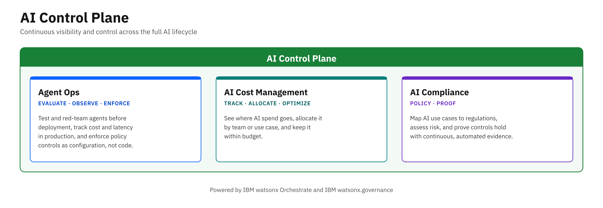

# IBM Building Blocks for AI Control Plane

Welcome to the **AI Control Plane** building blocks.

Running AI in production takes more than building agents — it takes continuous visibility and control across the full AI lifecycle: evaluating and observing agents, enforcing policies at runtime, managing cost, and proving regulatory compliance. These capabilities are powered by **IBM watsonx.governance** and **IBM watsonx Orchestrate**.

The AI Control Plane building blocks provide frameworks, production-ready code samples, and tools to help you run AI that is reliable, transparent, and compliant. Whether you're evaluating and red-teaming agents before deployment, enforcing runtime policy controls in production, tracking AI consumption and cost, or mapping AI use cases to regulations — the AI Control Plane has you covered.



---

## 🧩 Building Blocks

| Building Block | What It Does | Status |
|---|---|---|
| **[Agent Ops](agent-ops/)** | Evaluate, observe, and optimize your AI agents throughout the lifecycle — and enforce runtime policy controls (guardrails, PII filtering, rate limiting, model fallback) as configuration, not code | Available |
| **[AI Cost Management](ai-cost-management/)** | Track, allocate, and optimize the cost of AI workloads across the enterprise | Coming soon |
| **[AI Compliance](ai-compliance/)** | Ensure your AI applications meet regulatory requirements and industry standards for responsible AI use — and prove it continuously with Enforcement Tracking | Available |

<!-- Hidden for now — restore this row to the table above:
| **[Lifecycle Management](lifecycle-management/)** | Manage AI models and agents across their full lifecycle, from onboarding to retirement | Coming soon |
-->

---

## 📂 Repository Structure

```text
ai/ai-control-plane/             # AI Control Plane
├── agent-ops/                   # Agent Ops — evaluate, analyze, red-team, observe, and enforce
│   ├── assets/                  #   WXO ADK evaluation scripts + LangGraph evaluation SDK (wx_gov_agent_eval)
│   ├── bob-modes/               #   Agent Ops Bob mode
│   ├── bob-skills/              #   Agent Ops Bob skill
│   ├── model-evaluation/        #   Build-time evaluation of GenAI apps and predictive ML models (+ Bob mode/skill)
│   └── real-time-guardrails/    #   Runtime Pass/Flag/Block guardrails SDK — library, REST, MCP (+ Bob mode/skill)
├── ai-cost-management/          # AI Cost Management (coming soon)
└── ai-compliance/               # AI Compliance — use case inventory, governed tool catalog, OpenPages, Enforcement Tracking
```

### Inside Agent Ops

Agent Ops spans the whole agent lifecycle, so its assets are grouped by stage. Pick the one that matches where you are:

| Stage | Folder | What you get |
|---|---|---|
| **Build time — evaluate** | [`agent-ops/`](agent-ops/) | Quick-eval, benchmark generation, LLM-simulated-user evaluation, failure analysis, and red-teaming for watsonx Orchestrate agents; a LangGraph/LangChain evaluation SDK |
| **Build time — evaluate** | [`agent-ops/model-evaluation/`](agent-ops/model-evaluation/) | Metric-level evaluation of GenAI applications (RAG, LLM outputs, chatbot safety) and predictive ML models with watsonx.governance |
| **Runtime — enforce** | [`agent-ops/real-time-guardrails/`](agent-ops/real-time-guardrails/) | Pass/Flag/Block guardrails on input, retrieval, generation, and output for any agent framework, with audit logging |
| **Runtime — enforce** | [`agent-ops/`](agent-ops/#agent-controls--runtime-policy-enforcement) | Agent Controls — PII filters, content guardrails, secrets detection, rate limits, SQL sanitization, and model fallback attached to watsonx Orchestrate agents, tools, and models as configuration |
| **Runtime — observe** | [`agent-ops/`](agent-ops/) | Cost, latency, and token tracking per interaction with Langfuse and IBM Telemetry |

---

## 🤖 Bob Skills and Modes

| Skill / Mode | Type | Where |
|---|---|---|
| Agent Ops | Skill + Mode | [`agent-ops/bob-skills/`](agent-ops/bob-skills/), [`agent-ops/bob-modes/`](agent-ops/bob-modes/), [`ibm-bob/skills/agent-ops/`](../../ibm-bob/skills/agent-ops/) |
| Agent Controls | Skill | [Bob skills catalog on the docs site](https://ibm-self-serve-assets.github.io/building-blocks-docs/ibm-bob/skills/) |
| Model Evaluation (Build-Time GenAI Evals) | Skill + Mode | [`agent-ops/model-evaluation/gen-ai-evaluations/bob-skills/`](agent-ops/model-evaluation/gen-ai-evaluations/bob-skills/), [`agent-ops/model-evaluation/gen-ai-evaluations/bob-modes/`](agent-ops/model-evaluation/gen-ai-evaluations/bob-modes/), [`ibm-bob/skills/build-time-gen-ai-evals/`](../../ibm-bob/skills/build-time-gen-ai-evals/) |
| Real-Time Guardrails | Skill + Mode | [`agent-ops/real-time-guardrails/bob-skills/`](agent-ops/real-time-guardrails/bob-skills/), [`agent-ops/real-time-guardrails/bob-modes/`](agent-ops/real-time-guardrails/bob-modes/), [`ibm-bob/skills/real-time-guardrails/`](../../ibm-bob/skills/real-time-guardrails/) |

---

## 🚀 Getting Started

1. Choose the building block that matches your current need — Agent Ops for evaluation, observability, and runtime controls; AI Compliance for regulatory mapping and enforcement evidence.
2. Explore the `assets/` folder in each building block for ready-to-use code samples and SDKs.
3. Check `bob-modes/` and `bob-skills/` for AI-assisted workflows that let Bob drive the evaluation or integration for you.

📖 Full documentation: [AI Control Plane on the Building Blocks docs site](https://ibm-self-serve-assets.github.io/building-blocks-docs/ai-core/ai-control-plane/)

---

## 🤝 Contributing

We welcome contributions! Please submit issues, suggest improvements, or open pull requests to expand the resources and keep this repository valuable for all partners.
