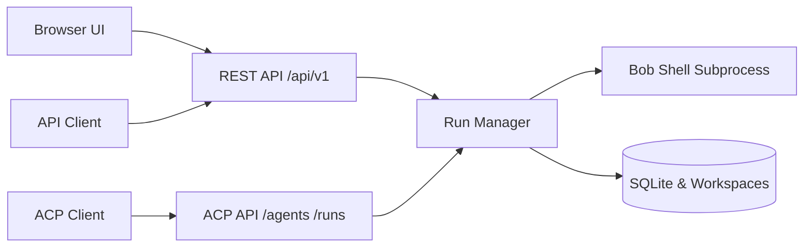

# Headless Bob

headlessbob runs IBM Bob Shell as a Node.js/TypeScript service with REST and Agent Communication Protocol (ACP) APIs and an integrated browser UI. It features native ACP support directly from IBM Bob. You can find more about ACP integration in the [IBM Bob ACP Documentation](https://bob.ibm.com/docs/shell/features/acp).

📚 **[View Full Documentation](https://ibm-self-serve-assets.github.io/building-blocks-docs/ai-core/ai-engineering/headless-bob/)** · 📦 **Runnable Asset:** [assets/headlessbob/](assets/headlessbob/README.md)

---

## Features

- **Persistent Conversations**: Thread-based conversation lifecycle with rename, search, archive, delete, and turn pagination backed by SQLite.
- **Asynchronous Execution & Streaming**: Queued runs with real-time Server-Sent Events (SSE) streaming and execution cancellation.
- **Dual Protocols**: Native text-based **ACP 0.2.0** endpoints (`/agents`, `/runs`, `/session`) alongside thread-based **REST APIs** (`/api/v1`).
- **Integrated Browser UI**: Single-page chat interface with live markdown rendering, code block copying, run JSON inspection, and workspace file browsing/downloads.
- **Usage & Cost Tracking**: Captures token counts, execution duration, tool call metrics, and session cost reporting reported by Bob Shell.
- **Security & Authorization**: Bearer-token authentication, caller-isolated workspaces, path traversal guards, and sub-process lifecycle termination.



---

## Included Assets

| Asset | Location | Description |
| --- | --- | --- |
| **headlessbob** | [assets/headlessbob/](assets/headlessbob/) | Service source, browser UI, test suite, Python client examples, Docker packaging, and OpenShift manifests |

---

## API Overview

### REST Endpoints (`/api/v1`)
All REST endpoints require `Authorization: Bearer <TOKEN>` and return structured JSON.

| Endpoint | Method | Purpose |
| --- | --- | --- |
| `/api/v1/capabilities` | `GET` | Retrieve server status, capabilities, and operational limits |
| `/api/v1/threads` | `GET`, `POST` | List, search, or create conversation threads |
| `/api/v1/threads/{id}` | `GET`, `PATCH`, `DELETE` | Inspect, rename, archive, or remove a thread |
| `/api/v1/threads/{id}/messages` | `GET`, `POST` | Post a prompt (returns run status) or list conversation turns |
| `/api/v1/runs/{id}` | `GET` | Get run execution status, results, and usage stats |
| `/api/v1/runs/{id}/events` | `GET` | Stream live run output via Server-Sent Events (SSE) |
| `/api/v1/runs/{id}/cancel` | `POST` | Cancel an active run execution |
| `/api/v1/threads/{id}/files` | `GET` | List files generated in the thread's workspace |
| `/api/v1/threads/{id}/files/{path}` | `GET` | Download a workspace file |

### ACP Endpoints (ACP 0.2.0)
Standard Agent Communication Protocol endpoints for multi-agent interoperability:

| Endpoint | Method | Purpose |
| --- | --- | --- |
| `/agents` | `GET` | Agent discovery and manifest |
| `/runs` | `POST` | Execute an ACP run (sync, async, or streamed) |
| `/runs/{run_id}` | `GET` | Get ACP run status and output |
| `/runs/{run_id}/events` | `GET` | Stream ACP run events via SSE |
| `/runs/{run_id}/cancel` | `POST` | Request cancellation of an active run |
| `/session/{session_id}` | `GET`, `DELETE` | Inspect or terminate an ACP session |

OpenAPI specifications are available at `/api/openapi.json` (REST) and `/acp/openapi.json` (ACP).

---

## Getting Started

### Prerequisites
- Node.js 22.22 or newer
- Licensed **IBM Bob Shell 2.0.1** binary available on your `PATH`
- `BOB_API_KEY` configured with valid credentials

### Local Setup
```sh
cd assets/headlessbob
npm ci
cp .env.example .env
# Edit .env to set your BOB_API_KEY and service AUTH_TOKENS
npm run build
npm start
```

Access the UI at `http://127.0.0.1:8000` and connect using your service token configured in `AUTH_TOKENS`.

Run the automated test suite:
```sh
npm run check  # TypeScript type-check and fixture/HTTP unit tests
```

---

## Container & Cloud Deployment

### Docker
Build and run as a standalone container:
```sh
docker build -t headlessbob assets/headlessbob
docker run -d -p 8000:8000 -e BOB_API_KEY="your-key" headlessbob
```

### Red Hat OpenShift
OpenShift manifests are provided in [`assets/headlessbob/openshift/`](assets/headlessbob/openshift/):
```sh
oc apply -f assets/headlessbob/openshift/build.yaml
oc apply -f assets/headlessbob/openshift/app.yaml
```

---

## SDKs & Client Examples

Ready-to-use Python client examples using Python's standard library are located in [`assets/headlessbob/examples/python/`](assets/headlessbob/examples/python/):

- [`rest.py`](assets/headlessbob/examples/python/rest.py): Demonstrates creating threads, sending tasks, streaming output, and downloading generated files via REST.
- [`acp.py`](assets/headlessbob/examples/python/acp.py): Demonstrates dispatching tasks using ACP protocol and consuming SSE events.
- [`cancel.py`](assets/headlessbob/examples/python/cancel.py): Demonstrates asynchronous cancellation of active executions.

---

## Security & Operational Model

- **Trusted Operator Execution**: Headless Bob is intended for deployment within trusted environments. Bob Shell executes code and commands on the host/container; workspace access checks prevent unauthorized caller crossover, but the service does not provide an OS sandbox between mutually untrusted actors.
- **Resource Limits**: Concurrency, maximum prompt length, output buffer sizes, and subprocess timeouts are strictly bounded and configurable via environment variables in `.env`.

---

## Related AI Engineering Building Blocks

- [Agentic SDLC](../agentic-sdlc/README.md)
- [Code Modernization](../code-modernization/README.md)
- [Integrate as Code](../integrate-as-code/README.md)
- [AI Building Blocks Overview](../../README.md)
