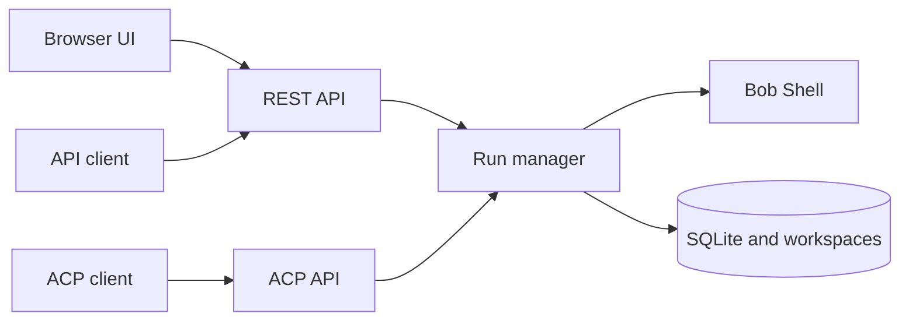

# headlessbob

headlessbob runs IBM Bob Shell as a Node.js/TypeScript service with REST and Agent Communication Protocol (ACP) APIs and a browser UI. It replaces the previous Python Bobserver implementation in this building block.

## Included asset

| Asset | Location | Description |
| --- | --- | --- |
| **headlessbob** | [assets/headlessbob/](assets/headlessbob/) | Service source, browser UI, tests, Docker packaging and OpenShift manifests |

## Features

- Persistent threads, follow-up messages, rename, search, archive and delete.
- Queued and asynchronous runs with streamed responses and cancellation.
- Markdown rendering and a right-hand workspace file panel with authenticated downloads.
- Bob-reported usage statistics stored with runs and assistant responses.
- Bearer-token authentication, caller ownership checks and SQLite persistence.
- Text-based ACP 0.2.0 endpoints with a dedicated guide and OpenAPI contract, plus the REST thread contract.



## Get started

See the [service README](assets/headlessbob/README.md) for local setup, credentials, API examples, operational limits and OpenShift deployment. Use Node.js 22.22 or newer and a licensed Bob Shell 2.0.1 installation. Credentials and the licensed Bob distribution are supplied separately.

```sh
cd ai/ai-engineering/headless-bob/assets/headlessbob
npm ci
cp .env.example .env
# Configure Bob credentials and service tokens in .env.
npm run build
npm start
```

Open `http://127.0.0.1:8000`. Run `npm run check` for the fixture-based test suite.

## Replacing Bobserver

This is a new API and storage model, not an in-place migration. Existing Bobserver clients must move to headlessbob's REST or ACP endpoints. Bobserver's MCP/OAuth integrations, guided approval workflows and legacy database are not carried over. Retain old deployment data separately if needed; the repository replacement does not migrate or delete it.

The service is intended for trusted operators. Bob can execute commands; API ownership checks do not provide an OS sandbox between mutually untrusted users. See the service README for retention and deployment details.

## API documentation

The UI **API docs** button exposes both interfaces. ACP uses root-level `/agents`, `/runs` and `/session/{session_id}` routes; REST threads use `/api/v1`. Read the [ACP guide and request examples](assets/headlessbob/public/acp.html) and [ACP OpenAPI contract](assets/headlessbob/public/acp-openapi.json). On a running service these are available at `/acp` and `/acp/openapi.json`. The REST contract is served separately at `/api/openapi.json`.

[Python samples](assets/headlessbob/examples/python/README.md) provide small standard-library clients for ACP runs and REST threads, including streaming, follow-ups, cancellation and downloads.

The HTML developer guide is served at `/docs`, with REST/ACP walkthroughs, code-copy controls and Python sample downloads. Open it from the UI’s **API docs** dialog.
