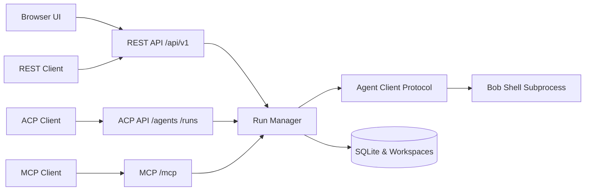

# Headless Bob

Run IBM Bob Shell tasks headlessly over HTTP — from any language, agent framework, or MCP-compatible client. headlessbob wraps Bob Shell 2.0.4 as a standalone Node.js service and exposes three interfaces on the same port, all sharing the same Agent Client Protocol connector to Bob Shell.

📚 **[View Full Documentation](https://ibm-self-serve-assets.github.io/building-blocks-docs/ai-core/ai-engineering/headless-bob/)** · 📦 **Runnable Asset:** [assets/headlessbob/](assets/headlessbob/README.md)

---

## Interfaces

| Interface | Route | Best for |
| --- | --- | --- |
| **REST threads API** | `/api/v1` | Persistent conversations, browser UI, workspace file downloads |
| **ACP 0.2.0** | `/agents`, `/runs` | Server-side agent clients and pipelines |
| **MCP** | `/mcp` | MCP-compatible clients and agent frameworks |

---

## Features

- **Persistent Conversations**: Thread-based lifecycle with rename, search, archive, delete, and turn pagination backed by SQLite.
- **Asynchronous Execution & Streaming**: Queued runs with real-time Server-Sent Events (SSE) streaming and execution cancellation.
- **MCP Support**: Streamable HTTP Model Context Protocol endpoint with four tools — `bob_create_thread`, `bob_send_message`, `bob_get_run`, and `bob_cancel_run`.
- **Integrated Browser UI**: Single-page chat interface with live markdown rendering, code block copying, run JSON inspection, and workspace file browsing/downloads.
- **Security & Authorization**: Bearer-token authentication, caller-isolated workspaces, path traversal guards, and sub-process lifecycle termination.


```mermaid
flowchart LR
    UI[Browser UI] --> REST[REST API /api/v1]
    Client[REST Client] --> REST
    Agent[ACP Client] --> ACP[ACP API /agents /runs]
    MCPClient[MCP Client] --> MCP[MCP /mcp]
    REST --> Manager[Run Manager]
    ACP --> Manager
    MCP --> Manager
    Manager --> Runtime[Agent Client Protocol]
    Runtime --> Bob[Bob Shell Subprocess]
    Manager --> Store[(SQLite & Workspaces)]
```

---

## Getting Started

### Prerequisites
- Node.js 22.22 or newer
- Licensed **IBM Bob Shell 2.0.4** binary available on your `PATH`
- `BOB_API_KEY` configured with valid credentials

### Local Setup
```sh
cd assets/headlessbob
npm ci
cp .env.example .env
# Edit .env to set your BOB_API_KEY and service AUTH_TOKENS
npm run build
npm start
```

Access the UI at `http://127.0.0.1:8000` and connect using your service token from `AUTH_TOKENS`.

---

## Python Client Examples

Ready-to-use Python examples (standard library only, except `mcp_sdk.py`) in [`assets/headlessbob/examples/python/`](assets/headlessbob/examples/python/):

| Example | What it demonstrates |
| --- | --- |
| [`rest.py`](assets/headlessbob/examples/python/rest.py) | Create threads, send tasks, stream output, download files via REST |
| [`acp.py`](assets/headlessbob/examples/python/acp.py) | Dispatch tasks via ACP and consume SSE events |
| [`cancel.py`](assets/headlessbob/examples/python/cancel.py) | Cancel an active run via REST or ACP |
| [`mcp.py`](assets/headlessbob/examples/python/mcp.py) | Drive Bob via MCP using raw HTTP (no dependencies) |
| [`mcp_sdk.py`](assets/headlessbob/examples/python/mcp_sdk.py) | Drive Bob via MCP using the official Python MCP SDK (`pip install mcp`) |

---

## Container & Cloud Deployment

### Docker
```sh
docker build -t headlessbob assets/headlessbob
docker run -d -p 8000:8000 -e BOB_API_KEY="your-key" headlessbob
```

### Red Hat OpenShift
```sh
oc apply -f assets/headlessbob/openshift/build.yaml
oc apply -f assets/headlessbob/openshift/app.yaml
```

---

## Related AI Engineering Building Blocks

- [Agentic SDLC](../agentic-sdlc/README.md)
- [Code Modernization](../code-modernization/README.md)
- [Integrate as Code](../integrate-as-code/README.md)
- [AI Building Blocks Overview](../../README.md)
