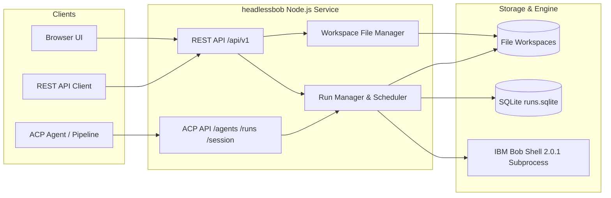

# headlessbob

A standalone TypeScript service that runs **IBM Bob Shell 2.0.1** and provides native **Agent Communication Protocol (ACP) 0.2.0** and thread-based **REST APIs** over HTTP, accompanied by a built-in browser UI. Bob is the execution engine; no VS Code, Codex runtime, or OpenAI account is involved.

For official IBM Bob protocol capabilities, see the [IBM Bob ACP Documentation](https://bob.ibm.com/docs/shell/features/acp).

---

## Architecture & Interfaces



---

## Integrated Browser UI & Thread REST API

Open your deployment URL, or `http://127.0.0.1:8000` when running locally. The root page serves an interactive conversation UI. Connect with the **service token** (the `owner` key inside `AUTH_TOKENS` in `.env`), not the Bob API key. The token is held only in browser session memory; reloading or clicking Disconnect clears it.

### UI Features
- **Conversation Management**: Create, rename, search, archive/restore, and delete threads.
- **Live Output Streaming**: Real-time message streaming with sanitized Markdown rendering (headings, tables, syntax-highlighted code blocks).
- **Execution Controls**: Real-time **Cancel run** button to terminate active or queued runs immediately.
- **Workspace File Explorer**: Right-hand panel (responsive below chat on small screens) to browse generated project files and download them with one click.
- **Run Diagnostics & Cost**: Inspect full run JSON, tool calls, execution duration, and token/cost statistics reported by Bob.
- **Integrated API Documentation**: One-click modal linking to interactive OpenAPI specifications and downloadable Python samples.

### REST Endpoints (`/api/v1`)

| REST endpoint | Method | Purpose |
| --- | --- | --- |
| `/api/v1/capabilities` | `GET` | Caller identity, readiness, features, and operational limits |
| `/api/v1/threads` | `POST` | Create a thread with `{}` or `{"title":"Project Name"}` |
| `/api/v1/threads` | `GET` | List/search threads (`q`, `archived`, `limit`, `cursor`) |
| `/api/v1/threads/{id}` | `GET` | Retrieve thread metadata and status |
| `/api/v1/threads/{id}` | `PATCH` | Update `title` and/or `archived` state |
| `/api/v1/threads/{id}` | `DELETE` | Delete thread conversation records (returns 204) |
| `/api/v1/threads/{id}/messages` | `POST` | Send `{"content":"Your prompt"}`; returns 202 with run ID and events URL |
| `/api/v1/threads/{id}/messages` | `GET` | Read conversation turns (`limit`, `before`) |
| `/api/v1/runs/{id}` | `GET` | Check run status, output, errors, and usage metrics |
| `/api/v1/runs/{id}/events` | `GET` | Live SSE stream with replay cursor support (`?after=` or `Last-Event-ID`) |
| `/api/v1/runs/{id}/cancel` | `POST` | Request cancellation of an active run |
| `/api/v1/threads/{id}/files` | `GET` | List files generated in the thread's workspace (`?path=folder`) |
| `/api/v1/threads/{id}/files/{path}` | `GET` | Download a workspace file as a binary attachment |

All REST calls use `Authorization: Bearer <TOKEN>`. Send an `Idempotency-Key` header when posting messages to safely retry without duplicate executions.

---

## Agent Communication Protocol (ACP 0.2.0)

headlessbob natively implements the text subset of **ACP 0.2.0**. ACP endpoints live at root routes (`/agents`, `/runs`, `/session`) and do not carry the `/api/v1` prefix.

### ACP Endpoints

| Endpoint | Method | Purpose |
| --- | --- | --- |
| `GET /ping`, `GET /healthz` | `GET` | Unauthenticated public liveness probes |
| `GET /readyz` | `GET` | Authenticated Bob executable/version/key readiness check |
| `GET /agents` | `GET` | Agent discovery listing available agents |
| `GET /agents/headlessbob` | `GET` | Detailed agent capability manifest |
| `POST /runs` | `POST` | Create a run in `sync`, `async`, or `stream` mode |
| `GET /runs/{run_id}` | `GET` | Poll run status, output text, and usage metrics |
| `GET /runs/{run_id}/events` | `GET` | Fetch stored ACP JSON events in execution sequence |
| `POST /runs/{run_id}/cancel` | `POST` | Cancel an in-flight ACP run (returns HTTP 202) |
| `GET /session/{session_id}` | `GET` | Retrieve session workspace ID and run history URNs |

---

## Testing ACP Endpoints (Step-by-Step)

Configure your target URL and authentication token:
```sh
BASE=http://127.0.0.1:8000
TOKEN=owner-token-from-auth-tokens
```

### 1. Agent Discovery & Manifest
```sh
# List available agents
curl -s -H "Authorization: Bearer $TOKEN" "$BASE/agents" | jq .

# Inspect the headlessbob agent manifest and capabilities
curl -s -H "Authorization: Bearer $TOKEN" "$BASE/agents/headlessbob" | jq .
```

### 2. Synchronous Run (`mode: "sync"`)
Waits for the entire task to complete before returning HTTP 200:
```sh
curl -s -H "Authorization: Bearer $TOKEN" -H "Content-Type: application/json" \
  "$BASE/runs" -d '{
    "agent_name": "headlessbob",
    "input": [{"role": "user", "parts": [{"content_type": "text/plain", "content": "Create a file named hello.txt with content Hello World"}]}],
    "mode": "sync"
  }' | jq .
```

### 3. Real-Time Streaming (`mode: "stream"`)
Streams live text chunks and lifecycle events via Server-Sent Events (SSE). Use `curl -N`:
```sh
curl -N -s -H "Authorization: Bearer $TOKEN" -H "Content-Type: application/json" \
  "$BASE/runs" -d '{
    "agent_name": "headlessbob",
    "input": [{"role": "user", "parts": [{"content_type": "text/plain", "content": "Write a Python script that computes Fibonacci numbers."}]}],
    "mode": "stream"
  }'
```

### 4. Asynchronous Run & Polling (`mode: "async"`)
Returns HTTP 202 immediately with `run_id` and `session_id`:
```sh
# Start asynchronous run
RUN_RESP=$(curl -s -H "Authorization: Bearer $TOKEN" -H "Content-Type: application/json" \
  "$BASE/runs" -d '{
    "agent_name": "headlessbob",
    "input": [{"role": "user", "parts": [{"content_type": "text/plain", "content": "Analyze project files"}]}],
    "mode": "async"
  }')
RUN_ID=$(echo $RUN_RESP | jq -r .run_id)
SESSION_ID=$(echo $RUN_RESP | jq -r .session_id)
echo "Run ID: $RUN_ID, Session ID: $SESSION_ID"

# Poll execution status
curl -s -H "Authorization: Bearer $TOKEN" "$BASE/runs/$RUN_ID" | jq .

# Fetch all recorded JSON events
curl -s -H "Authorization: Bearer $TOKEN" "$BASE/runs/$RUN_ID/events" | jq .
```

### 5. Multi-Turn Session Continuation
Pass the `session_id` returned from a prior run to continue executing in the same workspace:
```sh
curl -s -H "Authorization: Bearer $TOKEN" -H "Content-Type: application/json" \
  "$BASE/runs" -d "{
    \"agent_name\": \"headlessbob\",
    \"session_id\": \"$SESSION_ID\",
    \"input\": [{\"role\": \"user\", \"parts\": [{\"content_type\": \"text/plain\", \"content\": \"Now add unit tests for the code generated earlier.\"}]}],
    \"mode\": \"sync\"
  }" | jq .
```

### 6. Cancelling an Active Run
```sh
curl -X POST -s -H "Authorization: Bearer $TOKEN" "$BASE/runs/$RUN_ID/cancel" | jq .
```

---

## Testing with Python Samples

Pre-built Python clients using only Python's standard library are located in [`examples/python/`](examples/python/):

```sh
export HEADLESSBOB_URL="http://127.0.0.1:8000"
export HEADLESSBOB_TOKEN="owner-token-from-auth-tokens"

# 1. Run ACP Task with Live Streaming
python3 examples/python/acp.py --mode stream "Generate a quick HTTP server in Go"

# 2. Continue a previous session
python3 examples/python/acp.py --session "<SESSION_ID>" "Add a health check endpoint to that server"

# 3. Test Asynchronous Task Cancellation
python3 examples/python/cancel.py

# 4. Test REST Thread conversation and file downloads
python3 examples/python/rest.py
```

You can also use the interactive CLI test tool:
```sh
npm run client -- /agents
npm run client -- /runs examples/run.json
```

---

## Running Locally

Requires macOS/Linux, Node.js 22.22+, Bob Shell 2.0.1, and an active Bob API key.

```sh
npm ci
cp .env.example .env
# Set BOB_API_KEY and configure AUTH_TOKENS in .env
npm run build
npm start
```

### Running the Test Suite
```sh
npm run check  # TypeScript compilation, HTTP mock fixtures, contract & recovery tests
npm run smoke  # End-to-end smoke test invoking real Bob binary (consumes small credit)
```

---

## Limits, Persistence, and Trust Model

- **Storage**: SQLite stores run metadata, session ownership, task mappings, and ordered events in `DATA_DIR/runs.sqlite`. Bob workspaces are UUID directories under `DATA_DIR/workspaces`. Bob's internal history database lives under `$HOME/.bob`.
- **Concurrency & Limits**: Defaults: 2 concurrent runs, 100 queued tasks, 5-minute timeout, 20 max turns, $1 Bob cost limit, 2 MiB stdout/stderr buffers, and 10,000 events max per run.
- **Trust Boundary**: Intended for trusted operators. Bob Shell can execute arbitrary terminal commands; workspace token checks prevent caller crossover but do not provide an OS sandbox between untrusted actors.
- **Process Cleanup**: Subprocesses are spawned in their own process groups and cleaned up with `SIGTERM` followed by `SIGKILL` escalation via `KILL_GRACE_MS`.

---

## OpenShift & Container Deployment

OpenShift manifests are provided under [`openshift/`](openshift/):

```sh
# Deploy BuildConfig and ImageStream
oc apply -n binb -f openshift/build.yaml

# Build image from local archive (including vendor Bob binary)
tar -czf /tmp/headlessbob-build.tgz Dockerfile package.json package-lock.json \
  tsconfig.json src browser spec public examples scripts/container-entrypoint.sh vendor/bobshell-2.0.1.tgz
oc start-build headlessbob -n binb --from-archive=/tmp/headlessbob-build.tgz --follow

# Generate OpenShift Secrets/ConfigMap from local .env
node --env-file=.env scripts/configure-cluster.mjs
oc apply -n binb -f openshift/app.yaml
oc rollout status deployment/headlessbob -n binb
```

---

## Related Building Blocks

- [Headless Bob Building Block Overview](../../README.md)
- [Agentic SDLC](../../agentic-sdlc/README.md)
- [Code Modernization](../../code-modernization/README.md)
- [Integrate as Code](../../integrate-as-code/README.md)
