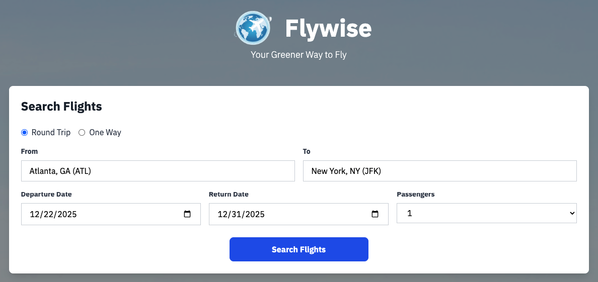
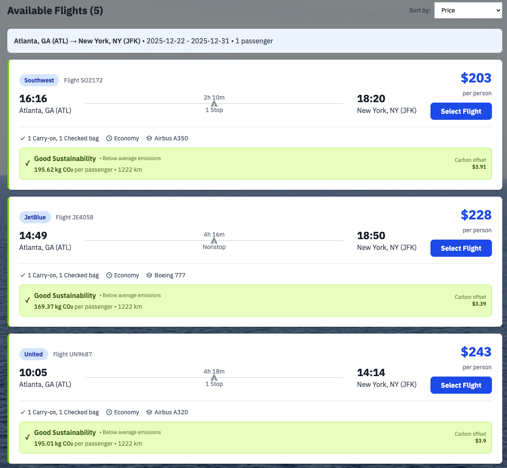

# IBM Envizi - Emissions API

IBM Envizi is a cloud-based ESG and sustainability platform that helps organizations consolidate, analyze, and report environmental, social, and governance data in one centralized, auditable system. It supports automated data ingestion from diverse sources (e.g. utility bills, sensors, supply-chain data) and normalizes over 500 data types into a finance-grade system of record. Envizi includes a greenhouse-gas (GHG) emissions-calculation engine built on the Greenhouse Gas Protocol, enabling Scope 1, 2 and 3 emissions tracking, decarbonization planning, and emissions-reporting capabilities. It also supports major ESG reporting frameworks, making it easier for companies to meet external disclosure and compliance requirements.

## Emissions API - Building Block

The Flywise app is an example to demonstrate how to embed IBM Envizi emissions API into any ISV application.

## Demo App
Flywise is a sustainability-first flight booking application that empowers travelers to make environmentally conscious decisions by integrating real-time carbon emissions data directly into the booking experience. Built using IBM Envizi's Emissions API, Flywise calculates precise CO₂ emissions for every flight using ICAO-compliant methodologies and presents this information alongside traditional metrics like price and duration. The application features intelligent airport search across 80+ US airports, color-coded sustainability ratings, and the unique ability to sort flights by lowest emissions—transforming how individuals and businesses approach travel planning. By embedding IBM Envizi's intelligence, Flywise demonstrates that sustainability data can be accurate, accessible, and actionable, helping users balance cost, convenience, and environmental impact while supporting corporate Scope 3 emissions tracking and net-zero goals.

### Search flights

Search panel to provide travel requirements.

### Search Results with carbon footprint information

## Setting up the App

Instructions to [setup](docs/API_SETUP_GUIDE.md) the app.

## Run the app

Instruction to [run](booking/README.md) the app.

## References

- **Blog Post**: https://www.ibm.com/new/announcements/introducing-the-ibm-envizi-emissions-api-simplifying-emissions-calculation
- **Preview Sign Up Link**: https://www.ibm.com/account/reg/us-en/signup?formid=urx-53999
- **Samples & Tutorials**: https://github.com/IBM/ibm-envizi-emissions-api/tree/main/notebooks/tutorials
- **API Documentation**: https://developer.ibm.com/apis/catalog/ghgemissions--ibm-envizi-emissions-api
- **Tutorials**: https://ibm.github.io/ibm-envizi-emissions-api/
- **Excel Add-in**: https://ibm.github.io/ibm-envizi-emissions-api-excel-addin/
