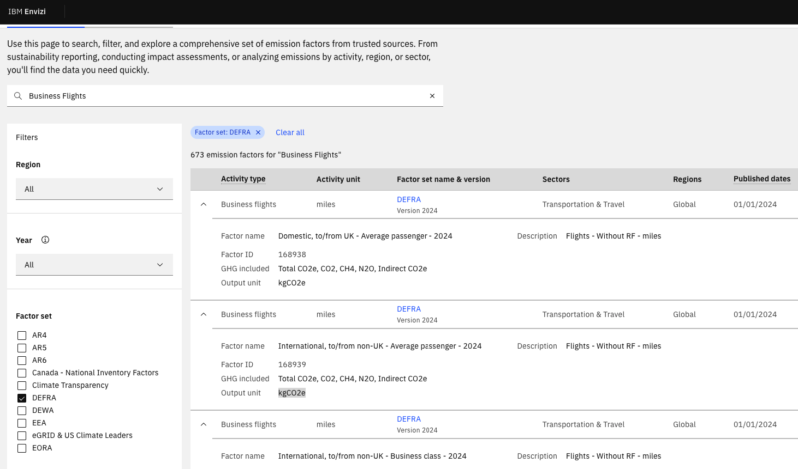

# IBM Envizi Emissions API Setup Guide

This guide will help you configure the IBM Envizi Emissions API for the Flywise flight booking application.

## Prerequisites

Before you begin, ensure you have:
1. Node.js (version 14 or higher) installed
2. Access to the IBM Envizi Emissions API

### Step 1: Sign Up for IBM Envizi API Access

1. Visit the signup page: https://www.ibm.com/account/reg/us-en/signup?formid=urx-53999
2. Complete the registration form.

### Step 2: Obtain Your API Credentials

Once approved, you'll receive:
1. **API Keys** - 
2. **API Endpoint URL** - The base URL for API requests
3. ***Update your .env file** - As shown in the app [README.ms](../booking/README.md)


## API Request Format

- **Method**: GET with query parameters
- **Headers**: `X-IBM-Client-Id` and `Authorization: Bearer`
- **Query Parameters**: `value`, `unit`, `factorId`
- **Endpoint**: `/transportation-and-distribution`

```bash
curl --location 'https://api.ibm.com/ghgemissions/run/v3/carbon/transportation-and-distribution?value=2000&unit=mi&factorId=168943' \
--header 'X-IBM-Client-Id: your-client-id' \
--header 'Authorization: Bearer your-bearer-token'
```

## API Response Format

```json
{
    "transactionId": "9e53cf60-651a-4cdf-9a5d-86d35154ba19",
    "totalCO2e": 409.28836,
    "CO2": 405.84436,
    "CH4": 0.03218,
    "N2O": 3.4118,
    "indirectCO2e": 85.26304,
    "unit": "kgCO2e",
    "description": "The Business flights emissions factor used to calculate this result was obtained from the DEFRA factor set for the area Earth year 2024."
}
```


## How the Application Works

### 1. User searches for flights
```
User enters: SFO → JFK, Economy, 1 passenger
```

### 2. Frontend calculates distance
```javascript
distance = calculateDistance('SFO', 'JFK')
// Result: ~4,100 km
```

### 3. Frontend calls proxy server
```javascript
POST http://localhost:3001/api/emissions/calculate
{
  "fromCode": "SFO",
  "toCode": "JFK",
  "flightClass": "Economy",
  "passengers": 1,
  "distance": 4100
}
```

### 4. Proxy server converts and calls Envizi API
```javascript
// Convert km to miles
distanceInMiles = 4100 * 0.621371 = 2548 mi

// Build URL
GET https://api.ibm.com/ghgemissions/run/v3/carbon/transportation-and-distribution?value=2548&unit=mi&factorId=168943

// Headers
X-IBM-Client-Id: your-client-id
Authorization: Bearer your-bearer-token
```

### 5. Envizi API returns emissions
```json
{
  "totalCO2e": 409.28836,  // kg CO2e per trip
  "CO2": 405.84436,
  "CH4": 0.03218,
  "N2O": 3.4118,
  ...
}
```

### 6. Proxy multiplies by passengers
```javascript
totalForAllPassengers = 409.28836 * 1 = 409.28836 kg CO2e
```

## Factor IDs

The `factorId` parameter determines which emission factor is used for calculations.

**Known Factor IDs:**
- `168943` - Air travel (general/economy)

**To find more factor IDs:**
- Check IBM Envizi API documentation: https://emissions.app.ibm.com/factor-catalog




