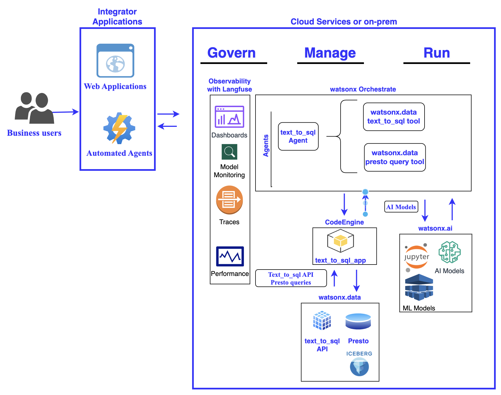

# watsonx.data Text_to_sql onboarding and applications

<!-- ABOUT THE PROJECT -->

This repository provides an oib=nboarding guide to the text_to_sql api service that is part of watsonx.data intelligence

The following steps are required to use the service:
1. Provision an instance of watsonx.data intelligence see [Setting up the IBM watsonx.data intelligence service](https://www.ibm.com/docs/en/watsonx/wdi/saas?topic=cloud-setting-up-watsonxdata-intelligence)
2. Create and onboard the watsonx.data intelligence project see [onboarding]()
3. Import data assets to the project (ex: tables within the prestoDB database) see [Adding a data asset from a connection](https://www.ibm.com/docs/en/watsonx/wdi/2.2.x?topic=catalog-adding-data-from-connection)
5. Use the text_to_sql endpoint to generate SQL statements based on the data schemas


<!-- GETTING STARTED -->

## Architecture



### Prerequisites

1. An IBM cloud account
2. A data asset to query
   1. Currently supported text2sql dialects: presto, postgresql, mssql, oracle, presto_sql, snowflake

### Provision watsonx.data Intelligence

1. Provision an instance of watsonx.data Intelligence in your cloud account: [Cloud Catalog](https://cloud.ibm.com/catalog#all_products)
   1. Current regions that support text2sql: Toronto
2. Create an IBM Cloud API Key, see [Guide](https://cloud.ibm.com/docs/account?topic=account-userapikey&interface=ui#create_user_key)
3. Create a project:
   1. Within your IBM Cloud console's resource list, open up your watsonx.data Intellgence instance
   2. Follow this [Guide](https://dataplatform.cloud.ibm.com/docs/content/wsj/getting-started/projects.html?context=wx) to create a new project
   3. Once in your project, navigate to the Manage tab -> General -> copy your Project ID for the next step

### Onboard Your Project via API

1. Use your IBM Cloud API Key to create a temporary Bearer Token:

```
curl -X POST 'https://iam.cloud.ibm.com/identity/token' -H 'Content-Type: application/x-www-form-urlencoded' -d 'grant_type=urn:ibm:params:oauth:grant-type:apikey&apikey=<YOUR_IBM_CLOUD_API_KEY>'
```

   2. Use the following request to onboard your new project for text2sql capabilities:

```
curl --location --request PUT 'https://api.ca-tor.dai.cloud.ibm.com/semantic_automation/v1/onboard_for_text_2_sql' \

--header 'accept: application/json' \
--header 'Content-Type: application/json' \
--header 'Authorization: Bearer <YOUR_BEARER_TOKEN>' \
--data '{
  "containers": [
    {
      "container_id": "<YOUR_PROJECT_ID>",
      "container_type": "project"
    }
  ]
}'
```

### Create a Data Connection and Import Data Assets

1. Navigate back to your watsonx.data Intelligence project
2. Follow this [Guide](https://dataplatform.cloud.ibm.com/docs/content/wsj/manage-data/create-conn.html?context=wx&locale=en) to add a data connection
3. Once your data connection is created, import the assets you want to query:
   1. Navigate to the assets tab within your project
   2. Click import assets
   3. Select your data connection
   4. Select the relevant tables you want to query

### Run a Text2SQL query

1. Use the following API call to query your selected assets:

```
curl --location 'https://api.ca-tor.dai.cloud.ibm.com/semantic_automation/v1/text_to_sql?container_id=<YOUR_PROJECT_ID>&container_type=project&dialect=<YOUR_DIALECT>l&model_id=meta-llama%2Fllama-3-3-70b-instruct' \
--header 'accept: application/json' \
--header 'Content-Type: application/json' \
--header 'Authorization: Bearer <YOUR_BEARER_TOKEN>' \
--data '{
"query": "<YOUR_QUERY>",
"raw_output": true
}'
```

Parameters:

1. Add your Project ID to the container_id field
2. Add your dialect, which should correspond to the type of data asset you've imported
3. Add a supported watsonx.ai model to the model_id field. The ibm/granite-3-8b-instruct model is used by default if no model_id is passed.

### How to tune query responses


### Troubleshooting

1. Onboarding/Importing error:

```
"message": "text2sql: No matches were found in metadata index for input query: <input_query>, container id: <container_id>, container type: project. Please ensure the container is onboarded with text2sql
```

Resolution: Ensure you onboard your project before importing any assets to query

## Best Practices
