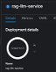
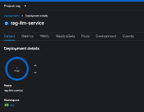

# How to Deploy this Application on OpenShift

To deploy this project on OpenShift, follow these steps:

1. Log in to your OpenShift cluster:

    ```bash
    oc login --token=YOUR_TOKEN --server=YOUR_SERVER
    ```

2. Create a new project (optional):

    ```bash
    oc new-project <project-name>

    oc project <project-name>
    ```

3. Build the application:

    ```bash
    $ oc new-build --strategy docker --binary --name=watsonx-texttosql-app

    $ oc start-build watsonx-texttosql-app  --from-dir=. --follow --wait
    ```

4. Deploy the application:

    ```bash
    $ oc new-app watsonx-texttosql-app --name=watsonx-texttosql-app
    ```

5. Expose a Secure URL for this FastAPI app:

    ```bash
    $ oc create route edge --service=watsonx-texttosql-app
    ```

    A quick sanity check with the url created from the route: `<url>/docs` will take you to the swagger ui.

1.	Update `openshift-setup/secrets.yaml` with the required values
2.	Create the secret in the project namespace
    ```bash
    oc apply -f openshift-setup/secrets.yaml
    ```
3.	Update `openshift-setup/snippet_deployment.yaml` with the secret name


4.	Open the **watsonx-texttosql-app** deployment in IBM Cloud OpenShift console and scale the Pod to 0.

    

5.	Select the YAML tab and search for the `spec: containers section`
    ```
    spec:
        containers:
            - resources: {}
              terminationMessagePath: /dev/termination-log
              name: watsonx-texttosql-app
    ```
    or
    ```
    spec:
        containers:
            - name: watsonx-texttosql-app
    ```

    Below the name, paste the content from the `openshift-setup/snippet_deployment.yaml` and save it.

     Example:
    ```
            name: watsonx-texttosql-app
            env:
                - name: RAG_APP_API_KEY
                    valueFrom:
                        secretKeyRef:
                        name: rag
                        key: RAG_APP_API_KEY
                - name: IBM_CLOUD_API_KEY
                    valueFrom:
                        secretKeyRef:
                        name: rag
                        key: IBM_CLOUD_API_KEY
                ...
    ```    
6.	Scale the pod to back to 1.

     
