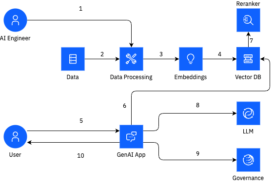

# 🧩 Ingestion Service for Vector Search in GenAI Pipelines

The **Ingestion Service API** provides a modular and extensible framework for **GenAI pipelines**, combining **Docling-based parsing and extraction** with **Milvus** as the vector database.  
It simplifies document ingestion and vector search setup with **plug-and-play components** for document loaders, embedding models, and rerankers — reducing development and testing time from weeks to hours.

---

## 📚 Table of Contents
- [Overview](#-overview)
- [Architecture](#-architecture)
- [Features](#-features)
- [Technology Stack](#-technology-stack)
- [Prerequisites](#-prerequisites)
- [Project Structure](#-project-structure)
- [Getting Started](#-getting-started)
- [Configuration](#-configuration)
- [Usage](#-usage)
- [Examples](#-examples)
- [Coming Soon](#-coming-soon)
- [Contributing](#-contributing)
- [License](#-license)
- [Team](#-team)

---

## 🧠 Overview

This service enables ingestion, embedding, and retrieval of unstructured content into Milvus for **vector-based GenAI applications**.  
It supports hybrid embeddings, multiple chunking strategies, and flexible customization across loaders, schemas, and processing modules.

---

## 🏗 Architecture

The framework integrates **Docling** for document parsing, **FastAPI** for serving endpoints, and **Milvus** for vector storage and retrieval.



**Key Components:**
- **Docling Processor** → Parses and cleans input documents (PDF, HTML, Markdown, JSON)
- **Chunking Engine** → Splits text using Docling Hybrid or Recursive Splitter
- **Embedding Module** → Generates dense or hybrid embeddings using watsonx.ai or Hugging Face
- **Milvus Integration** → Stores and indexes embeddings for high-performance vector search
- **REST API Layer** → Provides endpoints for ingestion, querying, and monitoring

---

## ✨ Features

- **Ingestion Pipeline:** Chunking, merging, and ingestion into Milvus with minimal configuration  
- **Embedding Options:** Dense, hybrid, or dual embeddings with customizable models  
- **Extensibility:** Support for multiple file types (PDF, HTML, JSON, Markdown) and loaders  
- **Governance Hooks:** Integration-ready for watsonx.governance audit and evaluation  
- **Customization:** Modular design for easy extension of chunkers, loaders, and processors  

---

## 🧩 Technology Stack

- **FastAPI + Uvicorn** — API framework for serving endpoints  
- **Docling** — Document parsing and chunking  
- **Milvus** — Vector database for similarity search  
- **IBM COS** — Cloud Object Storage integration  
- **Python 3.13+** — Development runtime  
- **dotenv** — Environment variable management  

---

## 🔧 Prerequisites

Before you start, ensure the following:

1. **watsonx.data environment** with Milvus database configured  
2. **Python 3.13+** installed locally  
3. **git** installed  
4. **Milvus credentials** from watsonx.data  
5. **IBM COS credentials** for document access (bucket must be public)

---

## 🧱 Project Structure

```bash
.
├── app/
│   ├── main.py
│   ├── routes/
│   ├── utils/
│   └── models/
├── .env
├── requirements.txt
├── README.md
└── assets/
    ├── sample-docs/
    └── examples/
```

---

## 🚀 Getting Started

### 1. Clone the Repository
```bash
git clone https://github.com/ibm-self-serve-assets/building-blocks.git
cd building-blocks/data-for-ai/vector-search/
```

### 2. Set Up a Virtual Environment
```bash
python3 -m venv virtual-env
source virtual-env/bin/activate
pip install -r requirements.txt
```

### 3. Configure Environment Variables
Copy the sample environment file and update required fields:
```bash
cp env .env
```

### 4. Update `.env` Parameters
#### Milvus Credentials
```
WXD_MILVUS_HOST=<milvus-host>
WXD_MILVUS_PORT=<milvus-port>
WXD_MILVUS_USER=ibmlhapikey
WXD_MILVUS_PASSWORD=<IBM-Cloud-API-Key>
```
#### IBM COS Credentials
```
IBM_CLOUD_API_KEY=<api-key>
COS_ENDPOINT=<cos-endpoint>
COS_SERVICE_INSTANCE_ID=<cos-instance-crn>
```
#### API Key
```
REST_API_KEY=<your-secret>
```

---

## ⚙️ Configuration

The service uses environment variables for configuration.  
Ensure `.env` is properly set before launching.

You can authenticate requests by adding this header:
```
REST_API_KEY: <your-secret>
```

---

## 🧪 Usage

### Start the Service
```bash
python3 main.py
```
or with Uvicorn CLI:
```bash
uvicorn app.main:app --host 127.0.0.1 --port 4050 --reload
```

### Access Swagger UI
Visit [http://127.0.0.1:4050/docs](http://127.0.0.1:4050/docs) to view API documentation and try endpoints.

---

## 📊 Examples

**Python Example**
```python
import json, requests

url = "http://127.0.0.1:4050/ingest-files"
payload = json.dumps({
    "bucket_name": "<cos-bucket>",
    "collection_name": "<milvus-collection>",
    "chunk_type": "DOCLING_DOCS"
})
headers = {
    "REST_API_KEY": "<your-secret>",
    "Content-Type": "application/json"
}

response = requests.post(url, headers=headers, data=payload)
print(response.text)
```

---

## 🔬 Coming Soon

- **VLM Support:** Ingestion for `.png` and `.jpg` files  
- **Advanced Docling Features:** Image annotation, table extraction  
- **Structured Error Logging:** JSON-based trace logs with timestamps  

---

## 🤝 Contributing

Contributions are welcome!  
- Fork the repo  
- Create a feature branch  
- Commit your changes  
- Submit a Pull Request  

---

## 🪪 License

Licensed under the **Apache 2.0 License**.  
See the [LICENSE](LICENSE) file for details.

---

## 👥 Team

**Created and Architected by**  
Anand Das • Anindya Neogi • Joseph Kim • Shivam Solanki
