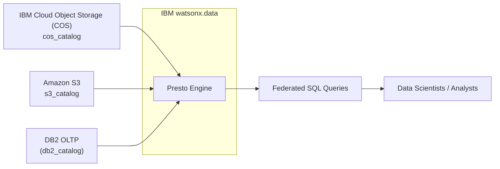

# Zero Copy Lakehouse with IBM Watsonx.data

## What is Zero Copy Lakehouse?

A Zero Copy Lakehouse is a data architecture approach where multiple analytics, AI, and ML tools can access and process the same underlying data without duplicating or moving it across systems.

Instead of copying data between warehouses, lakes, and ML pipelines, a zero-copy approach enables shared access with governance and performance optimizations.

---

## Why It Matters

Traditional setups involve ETL (Extract, Transform, Load) pipelines that duplicate data into multiple systems → leading to higher costs, governance risks, and delays.

Zero-copy lakehouse eliminates data silos by providing a single source of truth for BI, AI, ML, and analytics workloads.

---

## Benefits
- Cost Savings → No redundant storage costs.
- Faster Insights → Avoids ETL delays.
- Single Source of Truth → Reduces risk of inconsistent data.
- Flexibility → Multiple engines/tools access the same data.
- Governance → One layer controls access everywhere.

---

## IBM’s Take (watsonx.data & Zero Copy)

In the IBM watsonx.data lakehouse:

- Built on open table formats (Iceberg/Delta).
- Provides federated query capability (query S3, Db2, Cloud Object Storage, external warehouses, all in place).
- Ensures zero-copy data access → no need to ETL into another system.

---

# Watsonx.data Setup Automation

This repository provides a Python script (`watsonxdata_setup.py`) that automates the setup of **IBM watsonx.data** resources using official APIs.  
It helps you quickly register and configure:

- IBM Cloud Object Storage (COS) bucket  
- Amazon S3 bucket  
- DB2 Database connection (SaaS on IBM Cloud)  
- Presto engine catalog associations  
- Schemas for COS and S3  

The script allows seamless integration of data across COS, S3, and DB2 into watsonx.data with **zero-copy lakehouse capabilities**.

---

## Prerequisites

1. Access to:
   - IBM Cloud Account and AWS Account
   - [watsonx.data SaaS instance](https://cloud.ibm.com/docs/watsonxdata?topic=watsonxdata-tutorial_prov_lite_1 ) on IBM Cloud 
   - [DB2 Database SaaS instance](https://cloud.ibm.com/docs/db2-saas?topic=db2-saas-provisioning) on IBM Cloud  
   - [AWS S3 - Simple Cloud Storage](https://aws.amazon.com/s3/)

2. Python 3.8+ installed locally  

3. Install dependencies:
   ```bash
   pip install requests
   ```

4. Set your IBM Cloud API key in the environment:
   ```bash
   export IBM_API_KEY="your-ibm-cloud-api-key"
   ```

---

## Repository Files

- `watsonxdata_setup.py` → Python script to run setup  
- `config.json` → Configuration file with all required inputs  
- `README.md` → Documentation for setup and usage  

---

## Configuration (`config.json`)

The script reads all inputs from `config.json` so you can manage values easily without editing Python code.  

| Section / Key                  | Description                                                                 | Example Value |
|--------------------------------|-----------------------------------------------------------------------------|---------------|
| `region`                       | IBM Cloud region for watsonx.data                                           | `us-south` |
| `auth_instance_id`             | Auth Instance ID of the watsonx.data deployment                             | `crn:v1:bluemix:public:lakehouse:us-south:...` |
| **cos_config**                 | IBM COS bucket registration details                                         | |
| ├─ `bucket_display_name`       | Display name for the COS bucket                                             | `cos_bucket` |
| ├─ `bucket_type`               | Always `ibm_cos` for COS                                                    | `ibm_cos` |
| ├─ `bucket_details.bucket_name`| COS bucket name                                                             | `watsonxdata-demo` |
| ├─ `bucket_details.endpoint`   | COS endpoint                                                                | `https://s3.us-south.cloud-object-storage.appdomain.cloud` |
| ├─ `bucket_details.access_key` | COS access key                                                              | `801205f126c4487f95785101845f84b0` |
| ├─ `bucket_details.secret_key` | COS secret key                                                              | `b59da1b625cd2464a1ad87e9a972a5c...` |
| ├─ `associated_catalog.catalog_name` | Catalog name for COS                                                  | `cos_catalog` |
| **s3_config**                  | Amazon S3 bucket registration details                                       | |
| ├─ `bucket_display_name`       | Display name for the S3 bucket                                              | `amazon_S3` |
| ├─ `bucket_type`               | Always `aws_s3` for Amazon S3                                               | `aws_s3` |
| ├─ `bucket_details.bucket_name`| AWS S3 bucket name                                                          | `watsonxdata` |
| ├─ `bucket_details.endpoint`   | S3 endpoint                                                                 | `https://s3.us-east-2.amazonaws.com` |
| ├─ `bucket_details.access_key` | AWS access key                                                              | `AKIA...` |
| ├─ `bucket_details.secret_key` | AWS secret key                                                              | `nVlPTz...` |
| ├─ `associated_catalog.catalog_name` | Catalog name for S3                                                  | `s3_catalog` |
| **db2_oltp**                   | DB2 OLTP connection details                                                 | |
| ├─ `database_name`             | Database name                                                               | `bludb` |
| ├─ `hostname`                  | Hostname of DB2 OLTP                                                        | `87612426-7efe-...db2.ibmappdomain.cloud` |
| ├─ `port`                      | DB2 port                                                                    | `31687` |
| ├─ `username`                  | DB2 user                                                                    | `fcf77811` |
| ├─ `password`                  | DB2 password                                                                | `40YpMogDSOq...` |
| ├─ `display_name`              | Display name for DB2 connection                                             | `db2_oltp_database` |
| ├─ `catalog_name`              | Catalog name linked to DB2                                                  | `db2_catalog` |

---

## Architecture



---

# Zero Copy Lakehouse Demo with watsonx.data

This guide demonstrates how to load data into **Amazon S3**, **IBM Cloud Object Storage (COS)**, and **Db2** and then query them seamlessly from **watsonx.data** without duplicating the data.

---

## Step 1: Clone the Repository

```bash
git clone git@github.com:ibm-self-serve-assets/building-blocks.git
cd building-blocks/data-for-ai/zero-copy-lakehouse/data/
```

---

## Step 2: Load Data into Storage Sources

watsonx.data supports a wide variety of storage systems and databases. For details, refer to the IBM documentation:

- [Adding a storage and catalog pair](https://www.ibm.com/docs/en/watsonxdata/standard/2.0.x?topic=components-adding-storage-catalog-pair)  
- [Adding a database and catalog pair](https://www.ibm.com/docs/en/watsonxdata/standard/2.0.x?topic=components-adding-database-catalog-pair)  

For this demo, we will use **Amazon S3**, **IBM COS**, and **Db2**.

### 2.1 Load Data into Amazon S3

```bash
# Create a folder named 'account' in S3
aws s3 cp account.csv s3://<your-s3-bucket-name>/account/
```

### 2.2 Load Data into IBM COS

```bash
# Create a bucket and folder 'customer' in COS, then upload
ibmcloud cos upload --bucket <your-cos-bucket-name> --key customer/customer.csv --file customer.csv
```

### 2.3 Load Data into Db2

```sql
CREATE TABLE customer_info.customer_summary (
  customer_id VARCHAR(50),
  total_spend DECIMAL(10,2),
  last_purchase_date DATE
);

IMPORT FROM customer_summary.csv OF DEL
INSERT INTO customer_info.customer_summary;
```

---

## Step 3: Define External Tables in watsonx.data

Login to the **watsonx.data console**, go to the **Query Workspace**, and run:

### Create COS Table
```sql
create table "cos_catalog"."customer"."customer" (
  customer_id varchar,
  customer_name varchar,
  region varchar
)
with (
  format = 'CSV',
  external_location = 's3a://watsonxdata-demo/customer/'
);
```

### Create S3 Table
```sql
create table "s3_catalog"."account"."account" (
  account_id varchar,
  balance varchar,
  customer_id varchar
)
with
  (
    format = 'CSV',
    external_location = 's3a://watsonxdata/account/'
);
```

---

## Step 4: Query Across All Three Data Sources

```sql
select
  *
from
  "s3_catalog"."account"."account" a
  JOIN "cos_catalog"."customer"."customer" c ON a.customer_id = c.customer_id
  JOIN "db2_catalog"."customer_info"."customer_summary" cs ON cs.customer_id = a.customer_id;
```

This query demonstrates accessing **S3, COS, and Db2** data directly without duplication, enabling **Zero Copy Lakehouse** insights.

---

## Notes

- Keep your API keys secure and never commit them into git.  
- Ensure your S3/COS buckets and Db2 tables exist before running the demo.  
- For larger workloads, consider optimizing with Iceberg/Delta formats.

