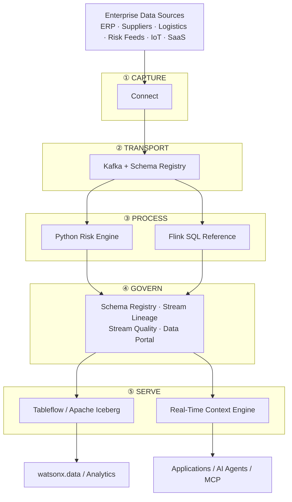

# Streamhouse

**IBM product**: IBM Confluent

Reference implementation for building and demonstrating the Streamhouse architecture — capturing, transporting, transforming, governing, and serving continuously changing enterprise data using IBM Confluent.

## What developers get

The main runnable asset is a **Supply Chain Risk Control Tower** that demonstrates:

- Kafka topics for enterprise and external events;
- JSON Schema contracts with Schema Registry;
- a Python streaming risk engine;
- reference Apache Flink SQL;
- Terraform for Confluent infrastructure;
- an IBM Carbon-based dashboard;
- integration points for IBM watsonx.ai and other IBM enterprise systems.

Apache Kafka and Apache Flink are implementation technologies within the IBM Confluent solution; the product anchor for this building block is IBM Confluent. IBM Confluent provides the core capabilities for the Streamhouse architecture: Connect, Kafka, Apache Flink, Schema Registry, Stream Lineage, Stream Quality, Data Portal, Tableflow, and Real-Time Context Engine.

## Architecture



## Included assets

| Asset | Purpose |
|---|---|
| [Supply Chain Risk Control Tower](assets/supply-chain-risk-control-tower/) | Runnable supply-chain streaming reference solution |
| [Live Context for Supply Chain Resilience](assets/live-context-for-supply-chain-resilience/) | Full-stack AI demo: real-time risk detection + watsonx Orchestrate agents + Carbon React control tower |
| [streamhouse-continuous-rag skill](bob-skills/streamhouse-continuous-rag.zip) | IBM Bob skill — FactoryPulse Continuous RAG on Confluent Cloud |
| [data-streaming-confluent skill](bob-skills/data-streaming-confluent.zip) | IBM Bob streaming skill |
| [confluent-iac-terraform skill](bob-skills/confluent-iac-terraform.zip) | IBM Bob Terraform/IaC skill |

## Quick start

The supply-chain asset supports three useful developer modes.

### 1. Browser simulation

No Kafka cluster is required:

```bash
python -m http.server 8080 --directory assets/supply-chain-risk-control-tower/code/ui
```

### 2. Python dry run

Use the asset README to create the virtual environment, then run:

```bash
cd assets/supply-chain-risk-control-tower
python -m scrc.risk_engine --dry-run
```

### 3. Full IBM Confluent deployment

The asset includes Terraform, schemas, producers, a risk engine, and UI bridge. See the [Supply Chain Risk Control Tower README](assets/supply-chain-risk-control-tower/README.md) to get started.

## What to customize for a real project

- Topic names, partitions, retention, and schema-compatibility policy
- Source/sink connectors (Connect layer)
- Risk/scoring logic
- Flink SQL transformations
- Stream Quality data contracts and schema-compatibility rules
- IAM/service-account strategy
- Tableflow/Iceberg sink configuration for lakehouse analytics
- Real-Time Context Engine endpoints for operational applications and AI agents
- Downstream application and alerting integrations

The included risk model is a demo/reference implementation, not a universal production risk model.

## IBM references

- [IBM Confluent (Streamhouse)](https://www.ibm.com/products/confluent)
- [Confluent Tableflow / Iceberg Sink integration with watsonx.data](https://www.ibm.com/docs/en/watsonxdata/saas?topic=integrations-integrating-confluent-apache-iceberg-sink-connector)
