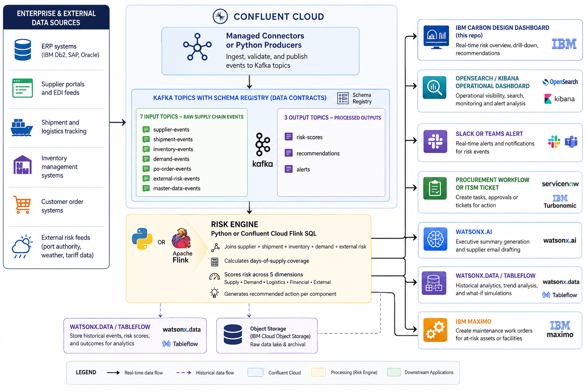

# Real-Time Supply Chain Risk Control Tower

A Confluent Cloud building block that detects, scores, and acts on supply-chain disruption risk in real time. Built for IBM partner demos, technical workshops, and proof-of-value engagements.

---

## Contents

- [When to use this asset](#when-to-use-this-asset)
- [What it demonstrates](#what-it-demonstrates)
- [Architecture](#architecture)
  - [Data flow explained](#data-flow-explained)
  - [Risk scoring model](#risk-scoring-model)
  - [Future architecture aspirations](#future-architecture-aspirations)
- [System requirements](#system-requirements)
- [Running modes](#running-modes)
- [Mode 1: Browser simulation — no installation required](#mode-1-browser-simulation)
- [Mode 2: Python dry run — no Kafka required](#mode-2-python-dry-run)
- [Mode 3: Full Confluent Cloud deployment](#mode-3-full-confluent-cloud-deployment)
  - [Step 1: Clone the repository](#step-1-clone-the-repository)
  - [Step 2: Create a Confluent Cloud API key](#step-2-create-a-confluent-cloud-api-key)
  - [Step 3: Install Python dependencies](#step-3-install-python-dependencies)
  - [Step 4: Provision Confluent Cloud infrastructure](#step-4-provision-confluent-cloud-infrastructure)
  - [Step 5: Verify the .env file](#step-5-verify-the-env-file)
  - [Step 6: Register JSON schemas](#step-6-register-json-schemas)
  - [Step 7: Start the risk engine](#step-7-start-the-risk-engine)
  - [Step 8: Produce demo events](#step-8-produce-demo-events)
  - [Step 9: Start the browser dashboard (optional)](#step-9-start-the-browser-dashboard-optional)
  - [Step 10: Tear down infrastructure](#step-10-tear-down-infrastructure)
- [Demo scenarios](#demo-scenarios)
- [Available commands](#available-commands)
- [Repository structure](#repository-structure)
- [Configuration reference](#configuration-reference)
- [Running tests](#running-tests)
- [Troubleshooting](#troubleshooting)
- [Supporting documents](#supporting-documents)
- [watsonx.ai prompt templates](#watsonxai-prompt-templates)
- [Reference assets](#reference-assets)
- [Extension specifications](#extension-specifications)
- [IBM positioning](#ibm-positioning)

---

## When to use this asset

Use this building block when you need to show an IBM partner or customer how Confluent Cloud can be used as a real-time supply chain risk detection platform.

This asset is appropriate when:

- An IBM partner needs a working, self-contained demo they can run from a laptop in a manufacturing, industrial, or distribution context without needing access to a customer ERP or supplier system.
- A pre-sales or technical team is preparing for a workshop and needs a complete business story backed by running code covering risk scoring, event streams, recommendations, and alerts.
- A customer has asked how IBM and Confluent can help reduce supply chain disruption risk and a technical proof point is needed to support the business conversation.
- A solutions architect needs a reference implementation showing how streaming joins, risk scoring, schema enforcement, and AI integration work together as an end-to-end pattern.

This asset is a starting point, not production-ready code. The risk scoring logic, topic model, schemas, and Terraform scaffold are designed to be adapted for a specific customer's systems and industry.

---

## What it demonstrates

- Confluent Cloud as a real-time event correlation backbone for supply chain signals
- A Kafka topic model covering 7 supply chain domains: supplier, component, purchase orders, shipments, inventory, customer orders, and external risk events
- JSON Schema data contracts enforced via Confluent Schema Registry
- A Python risk engine that consumes multiple event streams concurrently and publishes scored risk events, recommendations, and control tower alerts
- Reference Flink SQL that implements the same risk scoring logic as a production streaming job on Confluent Cloud
- An IBM Carbon Design dashboard with a browser-based simulation mode and a live Kafka streaming mode
- Agent prompt templates for watsonx.ai covering executive risk summary, supplier escalation email, and procurement recommendation
- Terraform infrastructure-as-code for provisioning a complete Confluent Cloud environment
- IBM integration story covering watsonx.ai, watsonx.data, IBM Db2, IBM MQ, IBM OpenSearch, IBM Maximo, IBM Instana, Terraform, and Ansible

---

## Architecture

The diagram below shows the full target architecture. The sections that follow explain what is implemented in this repository today and what is planned as a future extension.



---

### Data flow explained

#### Layer 1: Enterprise and external data sources

Supply chain events originate from six categories of systems:

| Source | Examples |
|--------|---------|
| ERP systems | IBM Db2, SAP, Oracle — supplier master data, purchase orders, inventory |
| Supplier portals and EDI feeds | Direct supplier APIs, EDI gateways |
| Shipment and logistics tracking | Carrier APIs, freight forwarder feeds, customs status |
| Inventory management systems | WMS, MES, on-hand and reserved quantity updates |
| Customer order systems | Order management platforms, demand signals |
| External risk feeds | Port authority data, weather services, tariff and geopolitical risk APIs |

In this repository, all source data is replaced by a synthetic event generator (`code/scrc/sample_data.py`) that produces realistic events for all 4 demo scenarios. The Terraform scaffold provisions the Confluent Cloud infrastructure so real managed connectors can be added when connecting to actual customer systems.

#### Layer 2: Confluent Cloud ingestion

Events are ingested into Confluent Cloud via:

- **Managed connectors** — for production deployments connecting to IBM Db2, IBM MQ, Salesforce, SAP, and other enterprise systems. Not configured in this repo as connector setup is specific to each customer environment.
- **Python producers** (`code/scrc/producer.py`) — used in this repo to publish synthetic events to all 7 input Kafka topics for demo purposes.

#### Layer 3: Kafka topics with Schema Registry data contracts

Ten Kafka topics are provisioned by Terraform (`code/terraform/main.tf`) and governed by JSON Schema files (`code/schemas/`).

**7 input topics — raw supply chain events:**

| Topic name (in code) | Domain | Schema file |
|----------------------|--------|------------|
| `supplier_profiles` | Supplier master data and reliability scores | `supplier_profiles.json` |
| `component_master` | Component definitions, criticality, lead time | `component_master.json` |
| `purchase_orders` | PO status and ETA updates | `purchase_orders.json` |
| `shipments` | Shipment tracking, carrier, delay hours, route | `shipments.json` |
| `inventory_levels` | On-hand, reserved, safety stock, daily usage | `inventory_levels.json` |
| `customer_orders` | Customer demand, priority, revenue at risk | `customer_orders.json` |
| `external_risk_events` | Port, weather, tariff, and geopolitical risk | `external_risk_events.json` |

**3 output topics — processed outputs from the risk engine:**

| Topic name (in code) | Content |
|----------------------|---------|
| `supply_chain_risk_scores` | Risk score, band, root cause, and scoring factor breakdown per component |
| `supply_chain_recommendations` | Recommended action with business impact and confidence |
| `control_tower_alerts` | Severity-graded alert (INFO / WARNING / HIGH / CRITICAL) |

Schema registration is handled by `code/scrc/register_schemas.py`. Run `python -m scrc.register_schemas --schema-dir code/schemas` to push all schemas to the Confluent Schema Registry.

#### Layer 4: Risk engine

The risk engine is the core processing layer. It is implemented in two forms:

**Python implementation (this repo) — `code/scrc/risk_engine.py`**

Subscribes to all 7 input topics using a Kafka consumer group (`scrc-risk-engine`). For each event received, it updates in-memory state and recalculates risk for every affected component. Publishes results to the 3 output topics.

**Confluent Cloud Flink SQL (reference) — `code/flink-sql/`**

Four SQL files implement the same logic as a fully managed streaming job on Confluent Cloud. This is the recommended path for production deployments where the Python engine would be replaced by Flink for scalability, exactly-once processing, and operational simplicity.

The risk engine performs four operations on every event:

1. **Join** — correlates events from all 7 input topics by component ID and route ID
2. **Days-of-supply calculation** — divides available inventory (on-hand minus reserved) by daily usage rate
3. **Risk scoring across 5 dimensions** — see the Risk scoring model section below
4. **Recommendation generation** — maps risk band and available mitigations to a specific recommended action

#### Layer 5: Downstream applications and integrations

Events from the 3 output topics are consumed by downstream systems. The table below shows what is implemented in this repo versus what is a future integration target.

| Downstream system | Status in this repo | Future extension |
|-------------------|--------------------|--------------------|
| IBM Carbon Design dashboard (`code/ui/`) | Implemented — full browser dashboard with simulation and live Kafka modes | - |
| Slack alert | Implemented — `code/scrc/slack_alerts.py` sends HIGH and CRITICAL alerts via webhook | Extend to Microsoft Teams via Adaptive Card webhook |
| watsonx.ai | Prompt templates only (`docs/agents/`) — no live API calls in this repo | Connect `WATSONX_API_KEY` and call the Prompt Lab API to generate executive summaries and supplier emails in real time |
| OpenSearch / Kibana | Configuration only — `OPENSEARCH_URL` in `.env`, index template in `docs/assets/` | Implement a Kafka consumer that writes risk score events to the OpenSearch index |
| Procurement workflow / ITSM | Not implemented | Integrate with ServiceNow or IBM Turbonomic via their REST APIs, triggered by CRITICAL-severity control tower alerts |
| watsonx.data / Tableflow | Not implemented — referenced in README and docs | Configure Confluent Tableflow to stream output topic events to an IBM Cloud Object Storage bucket as Iceberg tables |
| IBM Cloud Object Storage | Not implemented | Use as the raw data lake landing zone for all 10 Kafka topics via Confluent S3-compatible sink connector |
| IBM Maximo | Not implemented — referenced in README and docs | Create maintenance or logistics work orders via the Maximo Application Framework REST API when CRITICAL alerts are generated |
| IBM Instana | Not implemented | Add Instana monitoring agents to the Python risk engine process and Kafka consumer group for production observability |

---

### Risk scoring model

Risk score is calculated per component from five weighted dimensions:

| Dimension | Code variable | Max contribution | Description |
|-----------|--------------|-----------------|-------------|
| Supply (inventory coverage) | `inventory_risk` | 35 | Days of supply remaining versus current delay exposure |
| Logistics (shipment delay) | `shipment_delay_risk` | 30 | Hours of active shipment delay on in-transit orders |
| Supplier reliability | `supplier_risk` | 20 | Historical reliability score of the primary supplier |
| Financial (customer impact) | `customer_impact_risk` | 20 | Priority and revenue at risk of the linked customer order |
| External events | `external_event_risk` | 20 | Severity and delay impact of port, weather, or tariff events |
| Alternate supplier credit | `mitigation_credit` | -15 | Mitigation credit applied when an approved alternate supplier exists |

The maximum possible raw score before mitigation is 125. The score is clamped to a 0 to 100 range. The alternate supplier credit reduces the score by up to 15 points when an approved alternate supplier is on record for the component.

Risk bands:

| Score | Band | Alert severity |
|-------|------|----------------|
| 0 to 39 | LOW | INFO |
| 40 to 69 | MEDIUM | WARNING |
| 70 to 84 | HIGH | HIGH |
| 85 to 100 | CRITICAL | CRITICAL |

### Future architecture aspirations

The following capabilities are shown in the architecture diagram and represent the full production vision for this building block. They are not implemented in the current codebase but are designed to be added incrementally as the demo is taken further in a customer engagement.

**ServiceNow — Procurement workflow automation** — [SPEC-04](docs/specs/SPEC-04-servicenow-itsm.md)
CRITICAL-severity control tower alerts trigger automated incident creation in ServiceNow (procurement task, supplier escalation ticket). Integration point is the `control_tower_alerts` output topic.

**IBM Cloud Object Storage — Raw data lake** — [SPEC-05](docs/specs/SPEC-05-ibm-cos-data-lake.md)
A Confluent S3-compatible sink connector streams all output topics to IBM Cloud Object Storage in JSON format, creating a full historical audit trail of every supply chain event and risk decision.

**watsonx.data with Tableflow — Governed analytics** — [SPEC-06](docs/specs/SPEC-06-watsonxdata-tableflow.md)
Confluent Tableflow surfaces the raw events and risk scores as Apache Iceberg tables directly queryable by watsonx.data. This enables historical trend analysis, what-if simulations, and model training without requiring a separate ETL pipeline.

**OpenSearch operational dashboard** — [SPEC-02](docs/specs/SPEC-02-opensearch-consumer.md)
A dedicated Kafka consumer writes `supply_chain_risk_scores` and `control_tower_alerts` events to an OpenSearch index using the template in [`docs/assets/opensearch-index-template.json`](docs/assets/opensearch-index-template.json). Kibana dashboards visualise risk by supplier, region, component, and customer.

**IBM Maximo — Work order automation** — [SPEC-07](docs/specs/SPEC-07-ibm-maximo.md)
When a CRITICAL alert is generated for a component linked to a physical asset or facility, the Maximo Application Framework REST API creates a maintenance or logistics work order automatically, closing the loop between the digital risk signal and the physical operational response.

**Microsoft Teams alerts** — [SPEC-03](docs/specs/SPEC-03-teams-alerts.md)
Extend the existing Slack webhook integration ([`code/scrc/slack_alerts.py`](code/scrc/slack_alerts.py)) to also publish to a Microsoft Teams channel using an Adaptive Card webhook. Both platforms can be targeted simultaneously from the same alert handler.

**watsonx.ai live API** — [SPEC-01](docs/specs/SPEC-01-watsonx-ai-live.md)
Wire the IBM watsonx.ai REST API directly into the risk engine so every CRITICAL event automatically generates a plain-language executive summary and supplier escalation email without any manual copy-paste step.

---

## System requirements

### Required for all modes

| Tool | Minimum version | How to check |
|------|----------------|--------------|
| Git | Any | `git --version` |

### Required for Python dry run and Confluent Cloud modes

| Tool | Minimum version | How to install |
|------|----------------|----------------|
| Python | 3.12 | https://www.python.org/downloads |

### Required for Confluent Cloud mode only

| Tool | Minimum version | How to install |
|------|----------------|----------------|
| Terraform | 1.5 | https://developer.hashicorp.com/terraform/install |
| Confluent Cloud account | — | https://confluent.cloud (free trial available) |
| Confluent Cloud API key | Cloud resource management scope | See Step 2 below |

---

## Running modes

Three modes are available. Choose the one that fits your situation.

| Mode | What runs | Kafka needed | Python needed | Time to start |
|------|-----------|-------------|---------------|--------------|
| Browser simulation | In-browser JavaScript engine | No | No | Under 1 minute |
| Python dry run | Python risk engine with synthetic data | No | Yes | Under 5 minutes |
| Full Confluent Cloud | Real Kafka topics, live event stream | Yes | Yes | 15 to 30 minutes |

---

## Mode 1: Browser simulation

No installation, no accounts, no credentials. Open the dashboard directly in a browser.

```
open code/ui/index.html
```

If your browser blocks local file access, serve it with Python instead:

```
python -m http.server 8080 --directory code/ui
```

Then open http://localhost:8080 in your browser.

Select a scenario from the dropdown on the Control Tower tab and click Start Simulation. Risk scoring runs entirely in the browser using JavaScript logic that mirrors the Python engine exactly. All charts, risk cards, event stream logs, and trend data update in real time.

This is the recommended starting point for first-time demos and pre-call preparation.

---

## Mode 2: Python dry run

Runs the Python risk engine against synthetic events without connecting to Kafka. Use this to validate the environment, walk through the risk scoring logic in a terminal, or test changes to the scoring code.

### Step 1: Clone the repository

```
git clone https://github.com/ibm-self-serve-assets/building-blocks.git
cd building-blocks/data/integration/data-streaming/assets/supply-chain-risk-control-tower
```

### Step 2: Create a virtual environment

On Linux or macOS:

```
python -m venv .venv
source .venv/bin/activate
```

On Windows (Command Prompt):

```
python -m venv .venv
.venv\Scripts\activate
```

On Windows (PowerShell):

```
python -m venv .venv
.venv\Scripts\Activate.ps1
```

### Step 3: Install the package

```
pip install -e .
```

### Step 4: Run the risk engine in dry-run mode

```
python -m scrc.risk_engine --dry-run
```

Expected output: a series of Risk Score, Recommendation, and Control Tower Alert JSON blocks printed to the terminal, one set per synthetic event batch.

To run a specific scenario with more events:

```
python -m scrc.risk_engine --dry-run --scenario supplier_delay --count 10
```

Available scenarios: `supplier_delay`, `port_congestion`, `inventory_drop`, `recovery`.

You can also run the producer in dry-run mode to see the raw input events:

```
python -m scrc.producer --dry-run --scenario supplier_delay --count 5
```

---

## Mode 3: Full Confluent Cloud deployment

Provisions real infrastructure, registers schemas, produces live events to Kafka topics, runs the risk engine against those events, and optionally streams everything to the browser dashboard.

Work through each step in order. All commands are run from the project root directory.

---

### Step 1: Clone the repository

```
git clone https://github.com/ibm-self-serve-assets/building-blocks.git
cd building-blocks/data/integration/data-streaming/assets/supply-chain-risk-control-tower
```

---

### Step 2: Create a Confluent Cloud API key

This key is used by Terraform to provision the infrastructure. It is a cloud-level resource management key, not a Kafka cluster key.

1. Log in to https://confluent.cloud
2. Click your profile icon in the top right corner and select Cloud API keys
3. Click Add API key
4. Select My account
5. Select Cloud resource management as the scope
6. Click Next, give the key a name such as `scrc-terraform`, and click Create API key
7. Download or copy the key ID and secret — you will need them in Step 4

If your Confluent Cloud account already has an environment provisioned and your key does not have permission to create new environments, note the environment ID (it looks like `env-abc123`). The setup script will ask for it.

---

### Step 3: Install Python dependencies

Create and activate a virtual environment, then install the package.

On Linux or macOS:

```
python -m venv .venv
source .venv/bin/activate
pip install -e .
```

On Windows (Command Prompt):

```
python -m venv .venv
.venv\Scripts\activate
pip install -e .
```

On Windows (PowerShell):

```
python -m venv .venv
.venv\Scripts\Activate.ps1
pip install -e .
```

Verify the installation:

```
python -m scrc.risk_engine --help
```

You should see the risk engine help output with available options.

---

### Step 4: Provision Confluent Cloud infrastructure

The setup script does the following automatically:

- Prompts for your Confluent Cloud API key and secret
- Creates `code/terraform/terraform.tfvars` with your credentials
- Runs `terraform init` to download the Confluent provider
- Runs `terraform apply` to provision the environment, cluster, service account, Schema Registry API key, and all 10 Kafka topics
- Reads the Terraform outputs and writes them to `.env` at the project root
- Creates a Python virtual environment and installs dependencies (if not already done)

Run from the project root:

```
./scripts/setup.sh
```

The script will prompt you for:

- Confluent Cloud API key (the cloud resource management key from Step 2)
- Confluent Cloud API secret
- Existing environment ID (press Enter to skip if your key can create new environments)
- Cloud provider (default: AWS)
- Region (default: us-east-2)
- Environment name (default: scrc-building-block)
- Cluster name (default: scrc-demo-cluster)

To skip all interactive prompts and approve Terraform changes automatically:

```
./scripts/setup.sh --auto-approve
```

To re-run after infrastructure already exists and overwrite the `.env` file:

```
./scripts/setup.sh --auto-approve --force-env
```

What Terraform creates:

| Resource | Name | Notes |
|----------|------|-------|
| Confluent environment | scrc-building-block | Isolated demo environment |
| Kafka cluster | scrc-demo-cluster | Basic single-zone cluster |
| Service account | scrc-app | Used by producer and risk engine |
| Kafka API key | scrc-kafka-api-key | Cluster-scoped credentials |
| Schema Registry API key | scrc-schema-registry-api-key | Used for schema registration |
| Kafka topics | 10 topics | All input and output topics with 3 partitions |

At the end of the script you will see output similar to:

```
Wrote .env

  Bootstrap servers  : pkc-xxxxx.us-east-2.aws.confluent.cloud:9092
  Kafka API key      : ABCD****WXYZ
  Kafka API secret   : abcd****wxyz
  Schema Registry URL: https://psrc-xxxxx.us-east-2.aws.confluent.cloud
  SR API key         : EFGH****STUV
  SR API secret      : efgh****stuv

Setup complete. Next steps:
  source .venv/bin/activate
  bash scripts/register_schemas.sh
  python -m scrc.producer
  python -m scrc.risk_engine
  python code/ui/kafka_bridge.py
```

If you prefer to run Terraform manually without the setup script:

```
cd code/terraform
terraform init
terraform apply
```

Then copy `.env.example` to `.env` and manually populate the values using the Terraform outputs:

```
terraform output -raw bootstrap_endpoint
terraform output -raw app_kafka_api_key
terraform output -raw app_kafka_api_secret
terraform output -raw schema_registry_url
terraform output -raw schema_registry_api_key
terraform output -raw schema_registry_api_secret
```

---

### Step 5: Verify the .env file

After the setup script completes, a `.env` file exists at the project root. Open it and confirm the following variables are populated:

```
CONFLUENT_BOOTSTRAP_SERVERS=pkc-xxxxx.us-east-2.aws.confluent.cloud:9092
CONFLUENT_API_KEY=<value>
CONFLUENT_API_SECRET=<value>
SCHEMA_REGISTRY_URL=https://psrc-xxxxx.us-east-2.aws.confluent.cloud
SCHEMA_REGISTRY_API_KEY=<value>
SCHEMA_REGISTRY_API_SECRET=<value>
```

If `SCHEMA_REGISTRY_URL` is blank, the setup script printed a warning during Terraform. This can happen if Stream Governance is not enabled on the Confluent Cloud environment. Enable it in the Confluent Cloud console under your environment settings, then re-run `./scripts/setup.sh --force-env`.

The `.env` file is gitignored and must never be committed to source control.

---

### Step 6: Register JSON schemas

Push the 10 JSON Schema files to Confluent Schema Registry. This enforces data contracts on all topics.

Activate the virtual environment first if not already active:

On Linux or macOS:

```
source .venv/bin/activate
```

On Windows:

```
.venv\Scripts\activate
```

Register schemas:

```
python -m scrc.register_schemas --schema-dir code/schemas
```

Or use the helper script:

```
./scripts/register_schemas.sh
```

Expected output: one confirmation line per schema, for example:

```
Registered supplier_profiles-value: {'id': 100001}
Registered component_master-value: {'id': 100002}
...
Registered control_tower_alerts-value: {'id': 100010}
```

To preview the registration requests without sending them:

```
python -m scrc.register_schemas --schema-dir code/schemas --dry-run
```

---

### Step 7: Start the risk engine

The risk engine subscribes to all 7 input Kafka topics and publishes to the 3 output topics. Start it in its own terminal window.

Open a new terminal, activate the virtual environment, and run:

On Linux or macOS:

```
source .venv/bin/activate
python -m scrc.risk_engine
```

On Windows:

```
.venv\Scripts\activate
python -m scrc.risk_engine
```

Or use the helper script:

```
./scripts/run_risk_engine.sh
```

Expected output:

```
Subscribed to: supplier_profiles, component_master, purchase_orders, shipments,
               inventory_levels, customer_orders, external_risk_events
```

The engine now waits for events. Leave this terminal open.

---

### Step 8: Produce demo events

Open a second terminal window, activate the virtual environment, and run the producer.

On Linux or macOS:

```
source .venv/bin/activate
python -m scrc.producer --scenario supplier_delay --count 50 --interval 1
```

On Windows:

```
.venv\Scripts\activate
python -m scrc.producer --scenario supplier_delay --count 50 --interval 1
```

Or use the helper script:

```
SCENARIO=supplier_delay COUNT=50 INTERVAL=1 ./scripts/run_producer.sh
```

Options:

| Option | Default | Description |
|--------|---------|-------------|
| `--scenario` | supplier_delay | Scenario to run. See Demo scenarios section. |
| `--count` | 20 | Number of event batches to produce. Each batch is 3 to 4 events. |
| `--interval` | 1.0 | Seconds between individual events. |

Expected producer output:

```
{'topic': 'supplier_profiles', 'key': 'SUP-1007', 'value': {...}}
{'topic': 'shipments', 'key': 'SHP-33019', 'value': {...}}
...
Produced 150 events for scenario 'supplier_delay'.
```

In the risk engine terminal you will see the scored output appearing:

```
Panel: Risk Score     { "risk_id": "RISK-...", "risk_score": 75, "risk_band": "HIGH", ... }
Panel: Recommendation { "recommended_action": "Allocate current stock...", ... }
Panel: Alert          { "severity": "HIGH", "title": "HIGH supply chain risk...", ... }
```

Switch scenarios to show the full story:

```
python -m scrc.producer --scenario recovery --count 20 --interval 1
```

---

### Step 9: Start the browser dashboard (optional)

The Carbon UI connects to the risk engine and producer via a Python bridge that streams all Kafka messages to the browser using Server-Sent Events.

Open a third terminal, activate the virtual environment, and start the bridge:

On Linux or macOS:

```
source .venv/bin/activate
python code/ui/kafka_bridge.py
```

On Windows:

```
.venv\Scripts\activate
python code/ui/kafka_bridge.py
```

Expected bridge output:

```
[bridge] Project root : /path/to/supply-chain-risk-control-tower
[bridge] Python       : /path/to/.venv/bin/python
[bridge] Starting HTTP server on http://0.0.0.0:8765
[bridge] SSE events   : http://localhost:8765/events
[bridge] Kafka consumer subscribed to 10 topics
```

Open the dashboard:

```
open code/ui/index.html
```

Or serve it locally:

```
python -m http.server 8080 --directory code/ui
```

Then open http://localhost:8080 in your browser.

On the Control Tower tab, click Switch to Live Kafka in the mode bar at the top of the page. The mode bar turns teal and shows the consumer and process status once the SSE connection is established.

To launch a scenario from the browser, select the scenario from the dropdown, set the event count and interval, and click Start Simulation. The bridge will start the risk engine and producer as subprocesses and stream all Kafka messages to the dashboard in real time.

---

### Step 10: Tear down infrastructure

When the demo is complete, destroy all Confluent Cloud resources to stop billing.

```
terraform -chdir=code/terraform destroy
```

Terraform will show the resources to be destroyed and prompt for confirmation. Type `yes` to proceed.

To destroy without a prompt:

```
terraform -chdir=code/terraform destroy -auto-approve
```

The `.env` file at the project root is not deleted by Terraform. Remove it manually or keep it as a record.

---

## Demo scenarios

All scenarios use the same component (`BRG-9004` — High-load bearing assembly), the same primary supplier (`SUP-1007` — Pacific Motion Components, reliability score 74), and the same strategic customer order (`CO-10491` — NorthStar Energy Systems, 900 units, $750,000 revenue at risk). This gives the audience a single coherent story to follow.

| Scenario | Flag | What happens |
|----------|------|-------------|
| Supplier delay | `supplier_delay` | Shipment delay escalates from 12 to 96 hours across batches while on-hand inventory depletes from 760 to 260 units. Risk score rises from MEDIUM to CRITICAL. The alternate supplier (Midwest Precision Supply) provides a mitigation credit. |
| Port congestion | `port_congestion` | External route risk events on the APAC-LAX-Chicago route increase in severity from 2 to 5. Expected delay hours compound the shipment delay, pushing the external event risk component to its maximum contribution. |
| Inventory drop | `inventory_drop` | On-hand inventory falls through safety stock (600 units) and below the days-of-supply threshold relative to the active delay. The inventory risk component alone reaches 35, generating HIGH risk without requiring a large shipment delay. |
| Recovery | `recovery` | After the midpoint of the event sequence, delay hours reduce to 12 and external severity drops to 1. The alternate supplier credit remains active. Risk band returns to MEDIUM, demonstrating the system responding to improving conditions. |

Recommended demo order:

1. Start with `supplier_delay` to establish the business problem.
2. Switch to `port_congestion` to show the external risk dimension.
3. Run `recovery` to close with a positive outcome and demonstrate the system responding to improvement.

---

## Available commands

### Python module commands

These commands require the virtual environment to be active and `pip install -e .` to have been run.

| Command | Description |
|---------|-------------|
| `python -m scrc.risk_engine --dry-run` | Run risk engine with synthetic data, no Kafka |
| `python -m scrc.risk_engine --dry-run --scenario <name> --count <n>` | Specify scenario and batch count |
| `python -m scrc.risk_engine` | Run risk engine against live Kafka topics |
| `python -m scrc.producer --dry-run --scenario <name>` | Print synthetic events without sending to Kafka |
| `python -m scrc.producer --scenario <name> --count <n> --interval <s>` | Produce events to Kafka |
| `python -m scrc.register_schemas --schema-dir code/schemas` | Register schemas with Schema Registry |
| `python -m scrc.register_schemas --schema-dir code/schemas --dry-run` | Preview registration without sending |
| `python code/ui/kafka_bridge.py` | Start the Kafka-to-browser SSE bridge |

### Shell scripts

| Script | Description |
|--------|-------------|
| `./scripts/setup.sh` | Full setup: prompts for credentials, runs Terraform, writes .env, installs Python deps |
| `./scripts/setup.sh --auto-approve` | Same as above, skips all interactive prompts |
| `./scripts/setup.sh --force-env` | Same as above, overwrites existing .env without asking |
| `./scripts/run_risk_engine.sh` | Start the risk engine (activates .venv automatically) |
| `./scripts/run_producer.sh` | Start the producer with default settings |
| `./scripts/run_dry_run.sh` | Run risk engine dry-run (activates .venv automatically) |
| `./scripts/register_schemas.sh` | Register schemas with Schema Registry |
| `./scripts/run_tests.sh` | Run the risk logic unit tests (no Kafka required) |

---

## Repository structure

```
supply-chain-risk-control-tower/
|
|-- code/
|   |-- scrc/                     Python package
|   |   |-- __init__.py
|   |   |-- settings.py             Loads .env, defines KafkaSettings and topic registry
|   |   |-- models.py               RiskResult, Recommendation, Alert dataclasses
|   |   |-- kafka_utils.py          Producer config, consumer config, consume loop
|   |   |-- sample_data.py          Synthetic event generator for all 4 scenarios
|   |   |-- risk_logic.py           Risk scoring formula (also mirrored in code/ui/app.js)
|   |   |-- risk_engine.py          Kafka consumer, risk engine, output publisher
|   |   |-- producer.py             Kafka producer for synthetic demo events
|   |   |-- register_schemas.py     Registers JSON schemas with Schema Registry
|   |   `-- slack_alerts.py         Slack webhook integration for HIGH and CRITICAL alerts
|   |
|   |-- ui/                       IBM Carbon Design browser dashboard
|   |   |-- index.html              Single-page application shell with 6 tabs
|   |   |-- styles.css              IBM Carbon Gray 100 theme and component styles
|   |   |-- app.js                  Browser simulation engine and live SSE client
|   |   |-- kafka_bridge.py         Python HTTP and SSE bridge between browser and Kafka
|   |   `-- README.md               UI setup and troubleshooting guide
|   |
|   |-- flink-sql/                Reference Flink SQL for production Confluent Cloud deployment
|   |   |-- 01_enriched_supply_view.sql     Streaming join across all 5 input domains
|   |   |-- 02_external_route_risk_view.sql Aggregated route-level external risk
|   |   |-- 03_calculate_risk_scores.sql    Full scoring formula as SQL CASE expressions
|   |   |-- 04_generate_recommendations.sql Risk band to recommended action mapping
|   |
|   |-- schemas/                  JSON Schema files, one per Kafka topic (10 total)
|   |   |-- supplier_profiles.json
|   |   |-- component_master.json
|   |   |-- purchase_orders.json
|   |   |-- shipments.json
|   |   |-- inventory_levels.json
|   |   |-- customer_orders.json
|   |   |-- external_risk_events.json
|   |   |-- supply_chain_risk_scores.json
|   |   |-- supply_chain_recommendations.json
|   |   `-- control_tower_alerts.json
|   |
|   `-- terraform/                Confluent Cloud infrastructure as code
|       |-- main.tf                 Environment, cluster, service account, SR, topics
|       |-- variables.tf            All configurable input variables with defaults
|       |-- outputs.tf              Bootstrap endpoint, API keys, Schema Registry URL
|       |-- providers.tf            Confluent provider ~> 2.0, requires Terraform >= 1.5
|       |-- terraform.tfvars.example  Credential template -- copy to terraform.tfvars
|       `-- README.md
|
|-- docs/
|   |-- demo_script.md            Presenter talk track, demo commands, and sample JSON output
|   |-- security_governance.md    Security checklist for demo and production use
|   |-- workshop_guide.md         Hands-on workshop agenda, tasks, and discussion prompts
|   |-- agents/                   watsonx.ai prompt templates (copy input JSON, paste to Prompt Lab)
|   |   |-- risk_summary_prompt.md              Executive risk summary generation
|   |   |-- supplier_email_prompt.md            Supplier escalation email drafting
|   |   `-- procurement_escalation_prompt.md    Internal procurement escalation note
|   |-- assets/                   Reference data files used by integrations and specs
|   |   |-- opensearch-index-template.json      OpenSearch index mapping for risk score events
|   |   `-- sample_risk_event.json              Example CRITICAL output event from the risk engine
|   `-- specs/                    Spec-driven development documents for future integrations
|       |-- README.md                           Index and how-to for the spec set
|       |-- SPEC-01-watsonx-ai-live.md          watsonx.ai live API integration
|       |-- SPEC-02-opensearch-consumer.md      OpenSearch operational dashboard
|       |-- SPEC-03-teams-alerts.md             Microsoft Teams alerts
|       |-- SPEC-04-servicenow-itsm.md          ServiceNow procurement workflow
|       |-- SPEC-05-ibm-cos-data-lake.md        IBM Cloud Object Storage data lake
|       |-- SPEC-06-watsonxdata-tableflow.md    watsonx.data governed analytics
|       `-- SPEC-07-ibm-maximo.md               IBM Maximo work order automation
|
|-- scripts/
|   |-- setup.sh                  Full setup: Terraform + .env + Python venv
|   |-- run_producer.sh           Start the event producer (activates .venv automatically)
|   |-- run_risk_engine.sh        Start the risk engine (activates .venv automatically)
|   |-- run_dry_run.sh            Run risk engine dry-run (activates .venv automatically)
|   |-- register_schemas.sh       Register schemas with Schema Registry
|   |-- run_tests.sh              Run risk logic unit tests (no Kafka required)
|   `-- tests/
|       |-- conftest.py           Adds code/ to sys.path for test imports
|       `-- test_risk_logic.py    Unit tests: risk bands, days-of-supply, end-to-end score
|
|-- .env.example                  Credential template — copy to .env before running
|-- .env                          Generated by setup.sh — gitignored, never commit
|-- .gitignore
|-- pyproject.toml                Python package definition and entry points
`-- README.md
```

---

## Configuration reference

All runtime configuration is read from environment variables loaded from `.env`. Copy `.env.example` to `.env` and populate it before running any Python component. The setup script does this automatically when using Terraform.

| Variable | Required | Default | Description |
|----------|----------|---------|-------------|
| `CONFLUENT_BOOTSTRAP_SERVERS` | Yes (Kafka) | — | Kafka cluster bootstrap endpoint |
| `CONFLUENT_API_KEY` | Yes (Kafka) | — | Kafka cluster API key |
| `CONFLUENT_API_SECRET` | Yes (Kafka) | — | Kafka cluster API secret |
| `CONFLUENT_CLIENT_ID` | No | `supply-chain-risk-control-tower` | Client identifier shown in Confluent Cloud monitoring |
| `CONFLUENT_CONSUMER_GROUP` | No | `scrc-risk-engine` | Consumer group ID for the risk engine |
| `SCHEMA_REGISTRY_URL` | Yes (schemas) | — | Schema Registry REST endpoint |
| `SCHEMA_REGISTRY_API_KEY` | Yes (schemas) | — | Schema Registry API key |
| `SCHEMA_REGISTRY_API_SECRET` | Yes (schemas) | — | Schema Registry API secret |
| `SLACK_WEBHOOK_URL` | No | blank | Slack incoming webhook URL for HIGH and CRITICAL alerts |
| `OPENSEARCH_URL` | No | `http://localhost:9200` | OpenSearch endpoint for dashboard consumers |
| `WATSONX_API_KEY` | No | blank | IBM watsonx.ai API key |
| `WATSONX_PROJECT_ID` | No | blank | IBM watsonx.ai project ID |
| `WATSONX_URL` | No | blank | IBM watsonx.ai service URL |

---

## Running tests

The test suite covers risk band thresholds, days-of-supply calculation, and a full end-to-end scoring scenario. Tests run without a Kafka connection.

```
source .venv/bin/activate
pip install -e ".[dev]"
bash scripts/run_tests.sh
```

Or run pytest directly against the test folder:

```
pytest scripts/tests/ -v
```

---

## Troubleshooting

### setup.sh fails with "terraform: command not found"

Terraform is not installed or is not in your PATH. Download and install it from https://developer.hashicorp.com/terraform/install, then verify with `terraform -version`.

### Terraform apply fails with "Error: 403 Forbidden"

The Confluent Cloud API key entered does not have cloud resource management scope. Go to Confluent Cloud, delete the key, and create a new one with the correct scope as described in Step 2.

### Terraform apply fails with "Error: cannot create environment"

Your Confluent Cloud account does not allow environment creation. When the setup script asks for an existing environment ID, enter the ID of an existing environment from your account (format: `env-abc123`). You can find it in the Confluent Cloud console URL or under the environment settings.

### .env is missing Schema Registry values after setup.sh

Stream Governance is not enabled on the Confluent Cloud environment. Go to your environment in the Confluent Cloud console, open the Stream Governance tab, and enable it. Then re-run `./scripts/setup.sh --force-env`.

### python -m scrc.risk_engine fails with "ModuleNotFoundError: No module named 'scrc'"

The virtual environment is not active or the package is not installed. Run `source .venv/bin/activate` (Linux/macOS) or `.venv\Scripts\activate` (Windows), then `pip install -e .`.

### risk_engine exits immediately with "Confluent Kafka settings are missing"

The `.env` file either does not exist or is missing `CONFLUENT_BOOTSTRAP_SERVERS`, `CONFLUENT_API_KEY`, or `CONFLUENT_API_SECRET`. Verify the file exists at the project root and the variables are populated.

### Producer produces events but no risk scores appear in the risk engine terminal

The risk engine may have started before any reference data was available. The engine requires at least one inventory level event and one component master event before it can score a component. Produce a few more event batches or restart the producer with a higher count.

### Browser dashboard mode bar shows DISCONNECTED in red

The Kafka bridge is not running. Start it with `python code/ui/kafka_bridge.py` and leave the terminal open.

### Bridge starts but no events appear in the browser

Check that the `.env` file exists and `CONFLUENT_BOOTSTRAP_SERVERS` is set. The bridge prints `[bridge] ERROR: Kafka not configured` if credentials are missing.

### Port 8765 is already in use

Set a different port before starting the bridge:

```
BRIDGE_PORT=8766 python code/ui/kafka_bridge.py
```

---

## Supporting documents

| Document | Purpose |
|----------|---------|
| [`docs/demo_script.md`](docs/demo_script.md) | Presenter talk track — step-by-step commands, expected terminal output, and audience talking points for a live demo |
| [`docs/workshop_guide.md`](docs/workshop_guide.md) | Hands-on workshop agenda — tasks, discussion prompts, and facilitator notes for a 2–4 hour technical session |
| [`docs/security_governance.md`](docs/security_governance.md) | Security checklist — credential rotation, network controls, schema governance, and production readiness review |
| [`docs/specs/README.md`](docs/specs/README.md) | Extension specs index — what is built, what each spec covers, how to pick up and implement one |

---

## watsonx.ai prompt templates

The [`docs/agents/`](docs/agents/) folder contains three prompt templates for IBM watsonx.ai Prompt Lab. They convert raw risk engine output into plain-language content that operations and procurement leaders can act on immediately.

| File | Purpose |
|------|---------|
| [`risk_summary_prompt.md`](docs/agents/risk_summary_prompt.md) | Converts a risk event, recommendation, and alert into a structured executive summary with situation, business impact, recommended actions, owner, and confidence assessment |
| [`supplier_email_prompt.md`](docs/agents/supplier_email_prompt.md) | Drafts a professional escalation email to the affected supplier requesting updated ETAs and mitigation options |
| [`procurement_escalation_prompt.md`](docs/agents/procurement_escalation_prompt.md) | Generates an internal procurement escalation note with context, recommended response, and approval routing |

### How to use a prompt template

1. Run the risk engine or dry-run until you see a CRITICAL or HIGH risk event in the terminal output.
2. Copy the JSON output block for the relevant event (risk score, recommendation, or alert).
3. Open [IBM watsonx.ai Prompt Lab](https://dataplatform.cloud.ibm.com/wx/prompts) in your Confluent Cloud environment.
4. Paste the prompt template text from the `.md` file into the **System prompt** or **Freeform** input.
5. Replace the `{{risk_event}}`, `{{recommendation_event}}`, and `{{alert_event}}` placeholders with the copied JSON.
6. Select a foundation model (recommended: `ibm/granite-13b-instruct-v2` or `meta-llama/llama-3-1-70b-instruct`).
7. Click **Generate**.

The output is ready to send or use in a slide deck. For live API integration — where watsonx.ai is called automatically each time the risk engine emits a CRITICAL event — see [SPEC-01](docs/specs/SPEC-01-watsonx-ai-live.md).

---

## Reference assets

The [`docs/assets/`](docs/assets/) folder contains two files used as reference data across the specs and integration guides.

### `sample_risk_event.json`

[`docs/assets/sample_risk_event.json`](docs/assets/sample_risk_event.json) is a fully populated example of a CRITICAL-severity output event from the risk engine, published to the `supply_chain_risk_scores` Kafka topic. Use it to:

- Test an integration by replaying a known event without running the full stack.
- Paste into a watsonx.ai prompt template to generate a sample executive summary.
- Validate a downstream system (OpenSearch, ServiceNow, Maximo) against a representative payload before wiring up the real consumer.

```json
{
  "risk_id": "RISK-DEMO-0001",
  "component_id": "BRG-9004",
  "supplier_id": "SUP-1007",
  "risk_score": 88,
  "risk_band": "CRITICAL",
  "root_cause": "Shipment delay exceeds available inventory coverage",
  "days_of_supply": 2.2,
  "scoring_factors": { "inventory_risk": 35, "shipment_delay_risk": 30, ... }
}
```

### `opensearch-index-template.json`

[`docs/assets/opensearch-index-template.json`](docs/assets/opensearch-index-template.json) is a ready-to-apply OpenSearch index template that maps all fields from the `supply_chain_risk_scores` topic. Apply it with a single `PUT` call before starting the OpenSearch consumer described in [SPEC-02](docs/specs/SPEC-02-opensearch-consumer.md):

```bash
curl -X PUT "http://localhost:9200/_index_template/supply_chain_risk_scores" \
  -H "Content-Type: application/json" \
  -d @docs/assets/opensearch-index-template.json
```

---

## Extension specifications

The [`docs/specs/`](docs/specs/) folder contains seven spec-driven development documents. Each spec covers one integration shown in the architecture diagram that is not yet implemented in the core application. They are written for a developer who wants to pick up and implement one integration independently, without needing to read the rest of the codebase first.

| Spec | Integration | Effort |
|------|-------------|--------|
| [SPEC-01](docs/specs/SPEC-01-watsonx-ai-live.md) | watsonx.ai live API — real-time executive summaries triggered by CRITICAL events | Low |
| [SPEC-02](docs/specs/SPEC-02-opensearch-consumer.md) | OpenSearch / Kibana — operational risk dashboard consumer | Low |
| [SPEC-03](docs/specs/SPEC-03-teams-alerts.md) | Microsoft Teams — webhook alerts for HIGH and CRITICAL events | Low |
| [SPEC-04](docs/specs/SPEC-04-servicenow-itsm.md) | ServiceNow / ITSM — automated procurement incident workflow | Medium |
| [SPEC-05](docs/specs/SPEC-05-ibm-cos-data-lake.md) | IBM Cloud Object Storage — raw event data lake via Confluent S3 sink connector | Medium |
| [SPEC-06](docs/specs/SPEC-06-watsonxdata-tableflow.md) | watsonx.data / Tableflow — governed Apache Iceberg analytics | Medium |
| [SPEC-07](docs/specs/SPEC-07-ibm-maximo.md) | IBM Maximo — maintenance work order automation from CRITICAL alerts | High |

### What each spec contains

Every spec follows a consistent structure so a developer can start implementing immediately:

1. **Purpose** — what business problem this integration solves and which architecture layer it extends
2. **Input** — the Kafka topic or existing code module it reads from, including the exact message schema
3. **Output** — what the integration produces (API call, index document, webhook payload, connector config)
4. **Prerequisites** — all accounts, credentials, and tools required before writing a line of code
5. **Implementation steps** — numbered, copy-pasteable steps from zero to working integration
6. **Complete code** — full source for every new file to create and every existing file to modify
7. **New `.env` variables** — exact variable names and descriptions to add to `.env` and `.env.example`
8. **Verification** — step-by-step instructions to confirm the integration is working end to end

### How to use a spec

1. Read the **Purpose** section to confirm this is the right integration for your use case.
2. Complete all **Prerequisites** before starting — missing credentials mid-implementation is the most common blocker.
3. Follow the **Implementation steps** in order. Each step is self-contained and testable.
4. Use the **Complete code** section as the source of truth. Do not improvise around it — the code is written to integrate with the existing `code/scrc/` modules and topic schema.
5. Add the new variables from the spec to your `.env` file before running.
6. Run the **Verification** steps to confirm everything works before moving to the next spec.

---

## IBM positioning

Confluent Cloud acts as the real-time nervous system for supply chain events. Rather than waiting for batch ERP reports or end-of-day feeds, every supplier update, shipment delay, inventory change, and external risk signal is processed the moment it occurs. IBM capabilities extend this foundation into a governed, intelligent enterprise solution:

| IBM Capability | Role in this pattern |
|----------------|---------------------|
| IBM watsonx.ai | Converts risk events and recommendations into plain-language executive summaries, supplier escalation emails, and next-best-action guidance using the prompt templates in [`docs/agents/`](docs/agents/) — see [SPEC-01](docs/specs/SPEC-01-watsonx-ai-live.md) for live API integration |
| IBM watsonx.data | Provides governed analytical access to the complete event history via Confluent Tableflow lakehouse integration, enabling historical trend analysis and model training |
| IBM Db2 | Source system for supplier master data, purchase orders, and inventory records, connected to Confluent via the Db2 managed connector |
| IBM MQ | Bridge for legacy EDI and supplier message feeds that cannot publish directly to Kafka, connected via the MQ Source connector |
| IBM OpenSearch | Operational risk dashboard that consumes the three output topics and surfaces risk scores, alerts, and recommendations to operations teams |
| IBM Maximo | Receives CRITICAL-severity control tower alerts and automatically creates maintenance or logistics work orders to accelerate response |
| IBM Instana | Monitors the performance and health of the Kafka producers, consumers, and risk engine in production environments |
| IBM Terraform and Ansible | Automates the provisioning and configuration of the Confluent Cloud environment alongside other IBM infrastructure |

---

## Notes

- This asset is a starting point. Validate all Terraform, connector, and security configurations against your enterprise standards before using it in a customer environment. See [`docs/security_governance.md`](docs/security_governance.md) for the full production security checklist.
- The Python risk scoring logic in [`code/scrc/risk_logic.py`](code/scrc/risk_logic.py) is intentionally transparent and readable so it can be walked through line by line in a technical conversation.
- The Flink SQL files in [`code/flink-sql/`](code/flink-sql/) implement the same scoring logic as the Python engine and serve as a reference for deploying the risk engine as a fully managed Confluent Cloud stream processing job.
- Connector setup is intentionally not included in the Terraform scaffold because it is highly specific to each customer's source systems, networking topology, and security requirements.
- `terraform.tfvars` and `terraform.tfstate` are gitignored. If you are running this in a shared team environment, configure a Terraform remote backend to share state safely.
