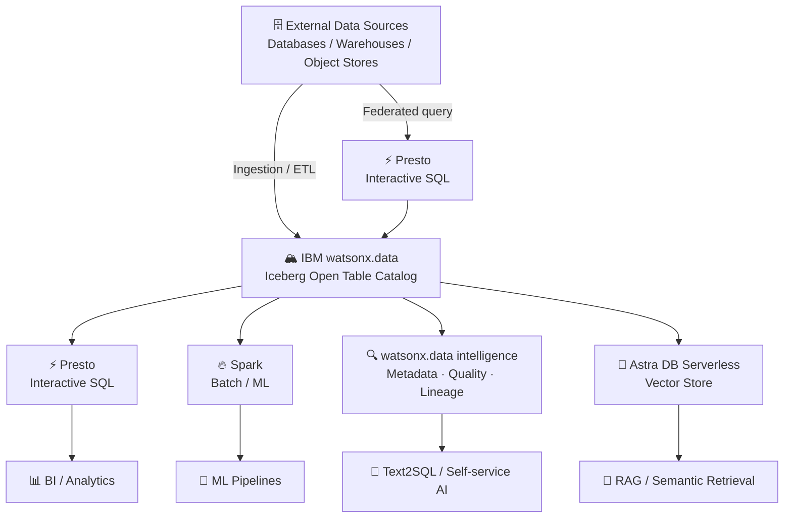

# Lakehouse

**IBM products**: IBM watsonx.data, IBM watsonx.data intelligence, IBM Data Observability by Databand, AstraDB

Reference implementations for the Lakehouse architecture -- providing fit-for-purpose execution for SQL analytics, large-scale processing, open lakehouse interoperability, metadata governance, data observability, and vector retrieval.

The core principle is to match the engine and governance tool to the workload: Presto for interactive SQL, Spark for distributed processing, Astra DB for similarity retrieval, and Apache Iceberg to keep analytic data interoperable across all of them.

## Building blocks

| Building block | Path | IBM product | What you can build |
|---|---|---|---|
| Meta Data Enrichment and Quality | [`metadata-enrichment/`](metadata-enrichment/) | IBM watsonx.data intelligence | Metadata enrichment, business glossary, quality rules, lineage |
| Data Observability | [`data-observability/`](data-observability/) | watsonx.data integration (Databand) | Pipeline health, anomaly detection, SLA monitoring, alerts |
| Zero-Copy Lakehouse | [`zero-copy-lakehouse/`](zero-copy-lakehouse/) | IBM watsonx.data (Presto, Spark, Iceberg) | Federated/lakehouse SQL, open table access, in-place queries |
| Serverless Vector | [`serverless-vector/`](serverless-vector/) | IBM watsonx.data -- Astra DB service | Vector search, semantic retrieval, AI agent memory patterns |

## Architecture

## How to use this section

Start at the building block that matches your use case.

- Need to add **business context and quality rules** to lakehouse tables? Start with [`metadata-enrichment/`](metadata-enrichment/).
- Need to **monitor pipelines and detect data quality incidents** proactively? Start with [`data-observability/`](data-observability/).
- Need to **query distributed data in place** or run SQL on open Iceberg tables? Start with [`zero-copy-lakehouse/`](zero-copy-lakehouse/).
- Need **elastic vector search** for RAG or AI agent memory? Start with [`serverless-vector/`](serverless-vector/).

## IBM references

- IBM watsonx.data: https://www.ibm.com/products/watsonx-data
- IBM watsonx.data intelligence: https://www.ibm.com/products/watsonx-data-intelligence
- IBM Data Observability by Databand: https://www.ibm.com/products/watsonx-data-integration/data-observability
- Presto on watsonx.data: https://www.ibm.com/docs/en/watsonxdata/saas?topic=overview
- Apache Spark on watsonx.data: https://www.ibm.com/docs/en/watsonxdata/saas?topic=spark-introduction-watsonxdata
- Astra DB Serverless on watsonx.data: https://www.ibm.com/docs/en/watsonxdata/saas?topic=watsonxdata-adding-astra-db-service
- watsonx.data availability matrix: https://cloud.ibm.com/docs/watsonxdata?topic=watsonxdata-feature_parity_wxd
