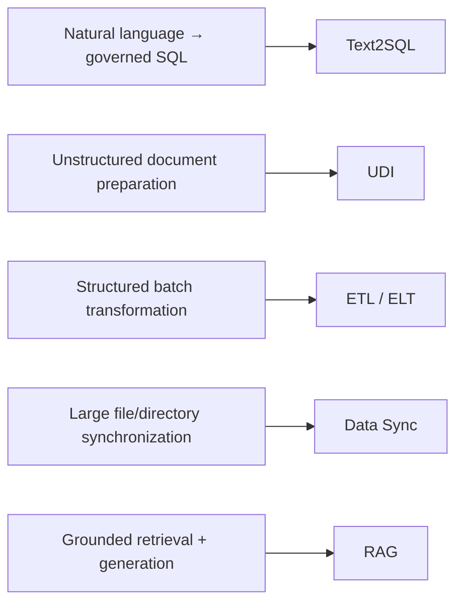

# Pipelines

Pipeline building blocks cover the developer path from **ingestion and transformation** to **retrieval and natural-language access**.

## Building blocks

| Building block | IBM product anchor | Developer use |
|---|---|---|
| [RAG](rag/) | IBM watsonx.data OpenRAG + IBM watsonx.ai | Ingest, embed, retrieve, and generate grounded answers |
| [Unstructured Data Integration](udi/) | IBM watsonx.data integration — UDI | Parse, chunk, enrich, and prepare documents |
| [Text2SQL](text2sql/) | IBM watsonx.data intelligence | Generate SQL from natural-language questions using governed metadata |
| [ETL / ELT](etl/) | IBM watsonx.data integration — DataStage | Structured batch transformation/integration |
| [Data Sync](data-sync/) | IBM Aspera Sync | High-speed file and directory synchronization |

## Choose the right building block

Structured near-real-time database replication is an IBM watsonx.data integration **Data Replication** capability, but it is not a separate building-block folder in this package.

## IBM references

- [IBM watsonx.data integration](https://www.ibm.com/products/watsonx-data-integration)
- [IBM watsonx.data intelligence](https://www.ibm.com/products/watsonx-data-intelligence)
- [IBM watsonx.ai](https://www.ibm.com/products/watsonx-ai)
- [IBM Aspera](https://www.ibm.com/products/aspera)
