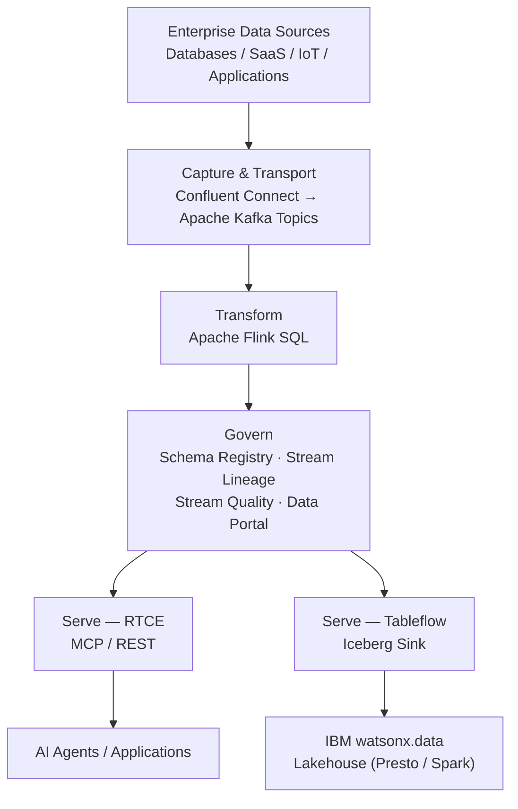

# Streamhouse

**IBM product**: IBM Confluent

Reference implementations for the Streamhouse architecture -- capturing, transporting, transforming, governing, and serving continuously changing enterprise data using IBM Confluent.

IBM delivers the complete Streamhouse architecture through IBM Confluent: Connect, Kafka, Apache Flink, Schema Registry, Stream Lineage, Stream Quality, Data Portal, Tableflow, and Real-Time Context Engine.

## Building blocks

| Building block | Path | IBM product | What you can build |
|---|---|---|---|
| Real-Time streaming | [`real-time-streaming/`](real-time-streaming/) | IBM Confluent -- Connectors and Kafka | Capture and transport enterprise event streams and CDC from databases, SaaS, and IoT |
| Transform | [`transform/`](transform/) | IBM Confluent (Flink) | Real-time stream processing, event enrichment, filtering, and windowed aggregations on data in motion |
| Govern | [`govern/`](govern/) | IBM Confluent -- Stream Governance | Enforce schema contracts, trace end-to-end stream lineage, evaluate stream quality rules, and catalog data products |
| Serve | [`serve/`](serve/) | IBM Confluent -- RTCE and Tableflow | Deliver low-latency live state to AI agents via Real-Time Context Engine (MCP/REST) and open Iceberg tables |

## Architecture

## How to use this section

Start at the building block that matches your use case. Each block is independently deployable.

- Need **event capture and transport** from source systems? Start with [`real-time-streaming/`](real-time-streaming/).
- Need **continuous SQL processing** on streams in motion? Start with [`transform/`](transform/).
- Need **schema contracts and data quality** on streams? Start with [`govern/`](govern/).
- Need to **serve live state to AI agents** or **sink to Iceberg**? Start with [`serve/`](serve/).

## IBM references

- IBM Confluent: https://www.ibm.com/products/confluent
- Confluent Tableflow / Iceberg Sink with watsonx.data: https://www.ibm.com/docs/en/watsonxdata/saas?topic=integrations-integrating-confluent-apache-iceberg-sink-connector
- IBM watsonx Orchestrate: https://www.ibm.com/products/watsonx-orchestrate
