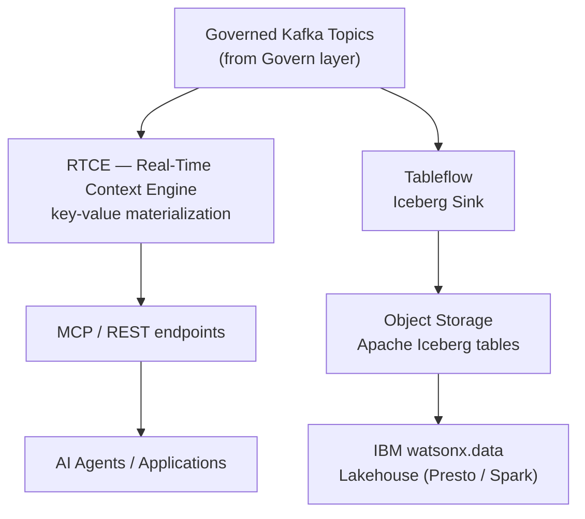
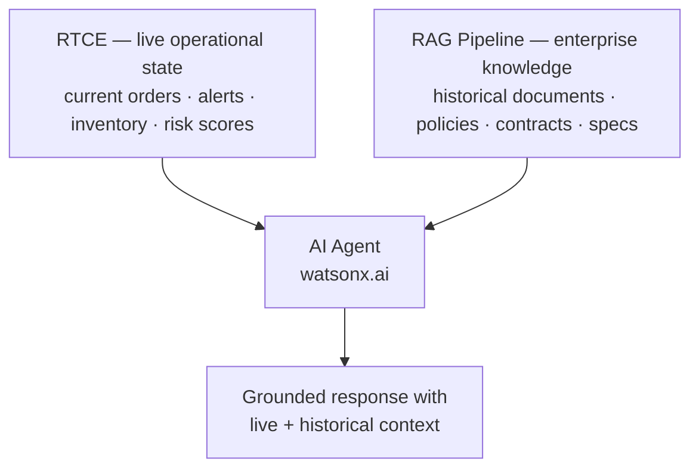

# Serve

**IBM product**: IBM Confluent -- Real-Time Context Engine (RTCE) and Tableflow

Use this building block to deliver low-latency live business state to operational AI agents via MCP/REST using the Real-Time Context Engine, and to publish governed event streams as open Apache Iceberg tables for lakehouse analytics using Tableflow.

## Architecture



## Included assets

| Path | Purpose |
|---|---|
| [`assets/live-context-for-supply-chain-resilience/`](assets/live-context-for-supply-chain-resilience/) | Full-stack AI demo -- RTCE live context + watsonx Orchestrate agents + Carbon React supply-chain control tower |
| [`assets/streamhouse-continous-rag/`](assets/streamhouse-continous-rag/) | FactoryPulse Continuous RAG demo -- Kafka/Flink RAG profiles, FastAPI backend, IBM Carbon UI, Code Engine deployment |
| [`bob-modes/`](bob-modes/) | IBM Bob Streamhouse Context Builder mode -- coming soon |
| [`bob-skills/streamhouse-continuous-rag.zip`](bob-skills/streamhouse-continuous-rag.zip) | Bob skill for Continuous RAG pipeline design combining live operational state with enterprise knowledge |

## Quick start: Live Context for Supply Chain Resilience

```bash
cd assets/live-context-for-supply-chain-resilience/backend
cp .env.example .env
# Configure IBM Confluent credentials, watsonx.ai, and watsonx Orchestrate settings.
pip install -r requirements.txt
python run.py
```

See [`assets/live-context-for-supply-chain-resilience/README.md`](assets/live-context-for-supply-chain-resilience/README.md) for the full setup including the React UI and agent configuration.

## Quick start: Streamhouse Continuous RAG

```bash
cd assets/streamhouse-continous-rag
cp .env.example .env
# Configure Confluent Cloud, watsonx.ai embedding model, and IBM COS.
pip install -r requirements.txt
python -m app.main
```

See [`assets/streamhouse-continous-rag/README.md`](assets/streamhouse-continous-rag/README.md) for Flink RAG profile setup and UI options.

## What the assets demonstrate

**Live Context for Supply Chain Resilience** covers:

- RTCE serving live supply-chain risk state to IBM watsonx Orchestrate agents via MCP;
- Python FastAPI backend consuming Confluent events and serving REST endpoints;
- Carbon React supply-chain control tower UI with live risk dashboard;
- Resilience scoring, mitigation suggestions, and agent-driven actions.

**Streamhouse Continuous RAG** covers:

- Continuous RAG knowledge ingestion from operational Kafka events;
- Kafka/Flink profiles for local deterministic demos and managed Flink AI embedding;
- FastAPI backend with live RAG freshness and evidence retrieval;
- Code Engine stateless deployment pattern.

## Continuous RAG pattern



## When to use Serve

- AI agents or applications need sub-second access to **live operational facts** via MCP or REST.
- Kafka event streams must be published as open **Apache Iceberg tables** for lakehouse analytics.
- You are building a **Continuous RAG** pattern that combines live event context with static enterprise knowledge.
- Multiple applications need a consistent, low-latency view of the current business state.

## Production notes

- RTCE materialized view schemas must align with the Kafka topic schema and downstream consumer expectations.
- Tableflow Iceberg sinks inherit topic partitioning -- design topic keys and partitions for downstream query patterns.
- Protect RTCE API endpoints with IAM or OAuth before exposing to external agents.
- Treat the supply-chain and Continuous RAG demos as reference patterns, not production-hardened deployments.
- Validate Confluent RTCE and Tableflow availability in the target IBM Confluent plan and region.

## IBM references

- IBM Confluent: https://www.ibm.com/products/confluent
- Confluent Real-Time Context Engine: https://docs.confluent.io/cloud/current/real-time-context-engine/overview.html
- Confluent Tableflow: https://docs.confluent.io/cloud/current/tableflow/overview.html
- Confluent Tableflow with IBM watsonx.data: https://www.ibm.com/docs/en/watsonxdata/saas?topic=integrations-integrating-confluent-apache-iceberg-sink-connector
- IBM watsonx Orchestrate: https://www.ibm.com/products/watsonx-orchestrate
