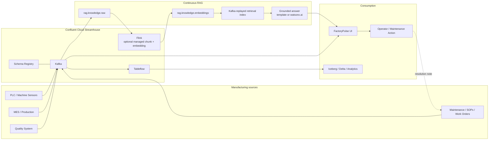

# FactoryPulse Streamhouse — Continuous RAG on Confluent Cloud

FactoryPulse is a deployable manufacturing demo that shows **Continuous RAG as a Streamhouse workload** rather than a static document-indexing demo.

The business story is simple: a CNC machine begins to degrade, production and quality risk rise, an operator asks what to inspect, and the RAG response is grounded in maintenance/SOP knowledge that is itself updating continuously. When the technician closes a work order, that resolution becomes a Kafka event and is indexed without waiting for a nightly rebuild.

The application uses a **Python 3.12 + FastAPI backend**, a dependency-free modern dark UI, Confluent Cloud Kafka, and an optional Confluent Cloud Flink AI embedding profile. It is packaged for IBM Cloud Code Engine.

## What you can demonstrate

1. **Operational streaming** — factory state and exceptions move through Confluent Cloud.
2. **Continuous knowledge ingestion** — SOPs, work orders, service bulletins, and notes are events on `rag.knowledge.raw`.
3. **Continuous RAG** — new knowledge is chunked and embedded continuously, and the retrieval index refreshes from Kafka.
4. **Grounded answers** — every answer returns the evidence chunks that supported it.
5. **Exception-to-action** — the manufacturing UI correlates machine, production, and quality signals.
6. **Learning loop** — the `Resolve + Learn` demo step streams WO-11023 into the knowledge path; a subsequent RAG question can retrieve it.
7. **Streamhouse extension** — enable Tableflow on analytical topics to expose streaming state as Iceberg/Delta tables.

## Architecture



See [docs/ARCHITECTURE.md](docs/ARCHITECTURE.md) for the detailed flow and design decisions.

## Two RAG pipeline modes

### 1. `local` — quickest demo; only Confluent Kafka credentials required

The Python service consumes `rag.knowledge.raw`, chunks documents, creates a deterministic demo embedding, and writes durable chunk records to `rag.knowledge.embeddings`. Each app instance rebuilds its read index by replaying that compacted embedding topic.

This mode is deliberately easy to run and demonstrates **continuous indexing and freshness** without requiring another AI provider. The built-in embedding is a demo fallback, not a production semantic model.

### 2. `flink` — managed embedding path in Confluent Cloud

Confluent Cloud Flink continuously uses `ML_RECURSIVE_TEXT_SPLITTER` and `AI_EMBEDDING` to create knowledge and query embeddings. The FastAPI service consumes the output topic and performs retrieval.

Use [infra/flink/continuous_rag.sql](infra/flink/continuous_rag.sql). For production-scale retrieval, move vector search into a supported external vector database using `VECTOR_SEARCH_AGG`; a template is included in [infra/flink/external_vector_search_example.sql](infra/flink/external_vector_search_example.sql).

## Directory structure

```text
factorypulse-streamhouse-rag/
├── .bob/skills/streamhouse-continuous-rag/   # IBM Bob project skill
├── app/
│   ├── main.py                               # FastAPI API + demo orchestration
│   ├── config.py                             # environment configuration
│   ├── models.py
│   ├── schemas/                              # optional Schema Registry JSON schemas
│   ├── services/                             # Kafka, RAG, vector index, watsonx generation
│   └── static/                               # modern dependency-free UI
├── demo_knowledge/                           # synthetic demo SOP/work-order documents
├── deploy/                                   # container & deployment artefacts
│   ├── Dockerfile                            # Python 3.12 container image
│   └── .dockerignore
├── docs/                                     # architecture, deployment guides, runbooks, demo script
│   ├── ARCHITECTURE.md
│   ├── DEPLOY_CODE_ENGINE.md
│   ├── DEMO_SCRIPT.md
│   └── SECURITY.md  (+ 8 more)
├── specs/                                    # formal technical specifications
│   ├── API_SPEC.md
│   ├── TECHNICAL_SPEC.md
│   └── UI_SPEC.md
├── infra/
│   ├── code-engine/deploy.sh           # FactoryPulse CE deploy script
│   └── flink/*.sql
├── scripts/
│   ├── create_topics.py
│   ├── verify_confluent.py
│   ├── seed_knowledge.py
│   └── simulate_factory.py
├── tests/
├── .env.example
└── requirements.txt
```

## Confluent Cloud credentials

For the basic demo you need the **Kafka cluster bootstrap server + Kafka API key + Kafka API secret**.

In Confluent Cloud:

1. Open your environment and Kafka cluster.
2. Open **Clients**.
3. Choose Python or create a new client.
4. Create or select a Kafka cluster API key.
5. Copy the bootstrap server, API key, and API secret. The secret cannot be retrieved again after creation, so store it securely.

Set:

```bash
CONFLUENT_BOOTSTRAP_SERVERS=pkc-xxxxx.region.provider.confluent.cloud:9092
CONFLUENT_KAFKA_API_KEY=...
CONFLUENT_KAFKA_API_SECRET=...
```

Confluent Cloud clients use TLS and SASL authentication. Official client setup: https://docs.confluent.io/cloud/current/client-apps/config-client.html

For the **Flink + Tableflow-ready profile**, also create a Schema Registry API key and configure:

```bash
CONFLUENT_SCHEMA_REGISTRY_URL=https://psrc-xxxxx.region.provider.confluent.cloud
CONFLUENT_SCHEMA_REGISTRY_API_KEY=...
CONFLUENT_SCHEMA_REGISTRY_API_SECRET=...
# SERIALIZATION_MODE is auto-detected: when SR credentials are present the app
# uses schema-registry-json automatically. Set plain-json to opt out explicitly.
# SERIALIZATION_MODE=plain-json
```

## Quick start — local workstation

Prerequisites: Python 3.12 and an existing Confluent Cloud Kafka cluster.

```bash
cp .env.example .env
# edit .env and add your Confluent credentials

python3.12 -m venv .venv
source .venv/bin/activate       # Windows PowerShell: .venv\Scripts\Activate.ps1
pip install -r requirements.txt

# Confirm the Kafka key/secret work without printing the secret
python scripts/verify_confluent.py

python scripts/create_topics.py --profile local
uvicorn app.main:app --reload --port 8080
```

Open `http://localhost:8080`.

In the UI:

1. Click **Seed knowledge**.
2. Click **Baseline**.
3. Click **Degrade**.
4. Click **Critical**.
5. Open **Continuous RAG** and ask: `Why is CNC-03 showing high vibration and what should the technician inspect first?`
6. Return to Overview and click **Resolve + Learn**.
7. Wait a few seconds for continuous indexing.
8. Ask: `What changed after WO-11023 was resolved?`

The second answer can retrieve the newly streamed resolution note without rebuilding a static index.

## Optional watsonx.ai generation

The default `LLM_PROVIDER=none` gives an extractive grounded response so the demo runs without another AI service.

To synthesize a natural answer with watsonx.ai:

```bash
LLM_PROVIDER=watsonx
WATSONX_API_KEY=...
WATSONX_PROJECT_ID=...
WATSONX_MODEL_ID=<model available in your project>
WATSONX_URL=https://us-south.ml.cloud.ibm.com
```

The implementation uses IBM Cloud IAM and `/ml/v1/text/generation`. IBM API reference: https://cloud.ibm.com/docs/apis/watsonx-ai

## Confluent Cloud Flink mode

Use this when you want the strongest Confluent-native Continuous RAG story.

1. Configure Schema Registry (the app will auto-activate schema-registry-json serialization when SR credentials are present).
2. Set `RAG_PIPELINE_MODE=flink`.
3. Create source topics only:

```bash
python scripts/create_topics.py --profile flink
```

4. Start the app once and seed/publish at least one source message so the source Schema Registry subjects exist.
5. In a Confluent Cloud Flink workspace, create a supported embedding model connection and run [infra/flink/continuous_rag.sql](infra/flink/continuous_rag.sql).
6. Restart the app with `RAG_PIPELINE_MODE=flink`.

Confluent currently supports `AI_EMBEDDING` for registered models and built-in ML text splitters. See:
- https://docs.confluent.io/cloud/current/flink/reference/functions/model-inference-functions.html
- https://docs.confluent.io/cloud/current/flink/reference/functions/ml-preprocessing-functions.html
- https://docs.confluent.io/cloud/current/ai/embeddings/embedding-action.html

## Tableflow / Streamhouse analytics

For the full Streamhouse story, enable Tableflow on topics such as:

- `factory.state`
- `factory.exceptions`
- optionally an analytical knowledge/audit topic

Tableflow materializes Kafka topics as Apache Iceberg or Delta Lake tables. With Confluent-managed storage, enabling Tableflow does not require you to provision separate object storage. Official docs: https://docs.confluent.io/cloud/current/topics/tableflow/overview.html

Do not place Tableflow in the low-latency RAG request path; use it for historical analytics, audit, model development, and cross-engine access.

## Deploy to IBM Cloud Code Engine

The container listens on port `8080`, runs as a non-root user, and is compatible with Code Engine.

```bash
ibmcloud login
ibmcloud target -r <region>
ibmcloud ce project select --name <your-project>

cp .env.example .env
# fill .env

./infra/code-engine/deploy.sh
```

The script:
- creates a Code Engine secret for Confluent/watsonx credentials,
- builds the Dockerfile from local source,
- deploys the application,
- maps the secret to environment variables.

For this demo, keep **min scale = max scale = 1**. The local read index is rebuilt from Kafka, so a multi-instance deployment is possible, but the demo is intentionally optimized for a single presentation instance.

IBM Code Engine supports local-source builds with `ibmcloud ce application create --build-source .` and environment variables from secrets. See [docs/DEPLOY_CODE_ENGINE.md](docs/DEPLOY_CODE_ENGINE.md).

## IBM Bob skill

The repository contains a project skill at:

```text
.bob/skills/streamhouse-continuous-rag/SKILL.md
```

IBM Bob discovers project skills under `.bob/skills/<skill>/SKILL.md`. Open the repository in Bob and invoke:

```text
/streamhouse-continuous-rag
```

or ask Bob to review/build a Continuous RAG Streamhouse change and allow it to activate the skill automatically.

See [docs/BOB_SKILL.md](docs/BOB_SKILL.md).

## API

FastAPI automatically exposes:

- OpenAPI UI: `/docs`
- OpenAPI JSON: `/openapi.json`

Main routes are documented in [specs/API_SPEC.md](specs/API_SPEC.md).

## Security notes

- Never commit `.env` or API secrets.
- Use resource-scoped Kafka API keys where appropriate.
- Use Code Engine secrets rather than literal secret values in deployment configuration.
- The demo UI has no end-user authentication layer. Add an identity-aware ingress or application auth before exposing it outside a controlled demo environment.
- Retrieved evidence is returned with the answer to make grounding inspectable.

See [docs/SECURITY.md](docs/SECURITY.md).

## Validation

For a development checkout:

```bash
pip install -r requirements-dev.txt
python -m compileall app scripts tests
pytest -q
bash -n infra/code-engine/deploy.sh
```

A live Confluent integration test additionally requires your own Kafka credentials; use `python scripts/verify_confluent.py` first.

## Synthetic data notice

The machine readings, work orders, SOPs, and maintenance findings in this repository are synthetic demo content. They are not real operating limits or safety instructions for any physical CNC machine.
