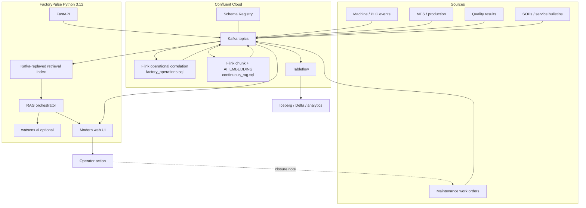
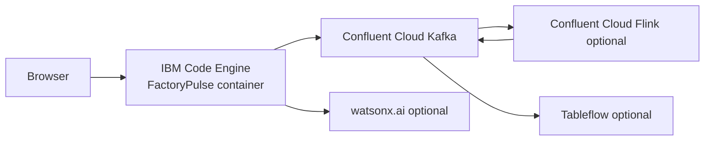

# Architecture specification

## Goal

Demonstrate that **Continuous RAG is an operational Streamhouse workload**: the same event backbone that represents the current factory state also carries new enterprise knowledge, so retrieval changes as soon as the business changes.

## Core flow

## Topic model

| Topic | Purpose | Typical producer | Typical consumer |
|---|---|---|---|
| `factory.machine.telemetry` | raw machine measurements | PLC/MQTT bridge or simulator | Flink `factory_operations.sql` Step 2 |
| `factory.production.events` | production progress / target changes | MES/CDC | Flink `factory_operations.sql` Step 4 |
| `factory.quality.events` | inspection/defect events | QMS | Flink `factory_operations.sql` Step 4 |
| `factory.maintenance.events` | maintenance status | CMMS/Maximo/CDC | Flink / audit |
| `factory.machine.metrics` | 30-s aggregated telemetry window | Flink `factory_operations.sql` Step 2 | Flink Steps 3 + 4 |
| `factory.state` | continuously derived current factory state | Flink `factory_operations.sql` Step 4 (or Python demo stub) | UI / Tableflow |
| `factory.exceptions` | correlated business exceptions | Flink `factory_operations.sql` Step 3 (or Python demo stub) | UI / alerting |
| `rag.knowledge.raw` | new/updated enterprise knowledge | work order/SOP/API | Python indexer or Flink |
| `rag.knowledge.embeddings` | durable chunk + vector records | Python indexer or Flink | retrieval index / external vector sync |
| `rag.query.requests` | interactive questions requiring managed embeddings | FastAPI | Flink |
| `rag.query.embeddings` | query vectors using same embedding model | Flink | FastAPI |

## Why Kafka is used as the durable embedding log in the demo

The demo intentionally avoids requiring a second managed vector database. Embedding records are stored on a compacted Kafka topic and every app instance can reconstruct a read-optimized in-memory index by replaying the topic.

This gives a clean demonstration of:
- durability,
- continuous updates,
- replay/rebuild,
- decoupling between indexing and retrieval,
- fresh knowledge without a scheduled re-index job.

This is **not** the recommended vector retrieval architecture for very large production corpora. For production scale, use a supported external vector store and Confluent Flink `VECTOR_SEARCH_AGG` or a dedicated retrieval service.

## Streamhouse analytical path

Tableflow materializes `factory.state` and `factory.exceptions` as Iceberg/Delta tables for historical analytics. It is the analytical path only — not in the synchronous RAG latency path (ADR-005).

| Topic | Tableflow resource | Purpose |
|---|---|---|
| `factory.state` | `factory-state-tableflow` | Machine health trends, shift comparison, ML forecasting |
| `factory.exceptions` | `factory-exceptions-tableflow` | Exception history, MTTR analysis, root-cause pattern mining |

Tableflow is opt-in: set `enable_tableflow = true` in `terraform.tfvars` and `TABLEFLOW_ENABLED=true` in the app `.env`. The `GET /api/tableflow/status` endpoint and the Settings UI card show whether it is active.

Downstream consumers (Spark, Snowflake, BigQuery, Flink batch) access the tables via the Iceberg metadata location. Schema governance is provided by Schema Registry — the same registry that governs the Kafka topics.

See `docs/TABLEFLOW_SETUP.md` for the full setup guide.

## Deployment topology

The Code Engine service is stateless from a storage perspective. The in-memory retrieval index is reconstructed from Kafka on startup.

## Scaling note

The demo deploy script defaults to one Code Engine instance. Each instance uses unique consumer groups for read models so every instance can replay the embedding log. The local indexer itself uses a shared consumer group so only one instance processes each raw knowledge event. Before scaling beyond one instance, test:
- query-embedding correlation behavior,
- startup replay time,
- memory use for vector index,
- external vector-store migration.
