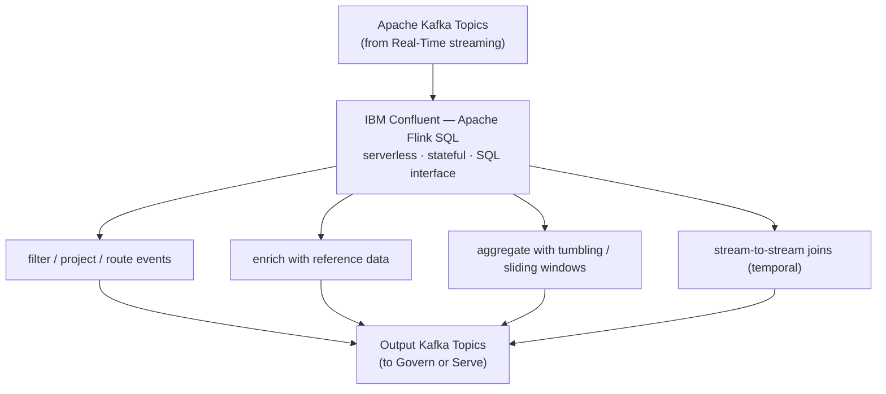

# Transform

**IBM product**: IBM Confluent (Flink)

Use this building block to execute real-time stream processing, event enrichment, filtering, and windowed aggregations on data in motion using Apache Flink SQL on IBM Confluent.

> Assets for this building block are **coming soon**. For Transform patterns today, the [`../real-time-streaming/assets/supply-chain-risk-control-tower/`](../real-time-streaming/assets/supply-chain-risk-control-tower/) asset includes reference Apache Flink SQL transformations as part of the full end-to-end streaming demo.

## Architecture



## Included assets

| Path | Purpose |
|---|---|
| [`assets/`](assets/) | Reference Flink SQL patterns -- coming soon |
| [`bob-modes/`](bob-modes/) | IBM Bob Transform mode -- coming soon |
| [`bob-skills/`](bob-skills/) | IBM Bob skill for Flink SQL authoring -- coming soon |

For Flink SQL patterns available now, see the reference SQL files in [`../real-time-streaming/assets/supply-chain-risk-control-tower/code/flink-sql/`](../real-time-streaming/assets/supply-chain-risk-control-tower/code/flink-sql/).

## Example Flink SQL pattern

```sql
-- Running 5-minute windowed risk aggregation per supplier
SELECT
    supplier_id,
    TUMBLE_START(event_time, INTERVAL '5' MINUTE) AS window_start,
    COUNT(*) AS event_count,
    AVG(risk_score) AS avg_risk_score,
    MAX(risk_score) AS max_risk_score
FROM supply_chain_events
GROUP BY supplier_id, TUMBLE(event_time, INTERVAL '5' MINUTE);
```

## When to use Transform

- Streams require continuous filtering, aggregation, or joining before serving.
- Events must be enriched with reference data (dimension tables) in real time.
- Windowed aggregations or stateful pattern detection are needed on unbounded streams.
- Output topics must contain shaped, reduced, or derived events rather than raw source events.

For batch transformations across structured data sources, use [`../../pipelines/etl/`](../../pipelines/etl/) instead.

## Production notes

- Define watermark strategies to handle late-arriving events in event-time processing.
- Size Flink compute units based on expected throughput, state size, and checkpoint frequency.
- Validate Flink SQL syntax against the target Confluent Cloud Flink runtime version.
- Use output topics with appropriate partition counts for downstream parallelism.
- Treat the supply-chain Flink SQL reference as a starting template, not a production-ready deployment.

## IBM references

- IBM Confluent: https://www.ibm.com/products/confluent
- Apache Flink on Confluent Cloud: https://docs.confluent.io/cloud/current/flink/overview.html
- Confluent Flink SQL reference: https://docs.confluent.io/cloud/current/flink/reference/statements/overview.html
