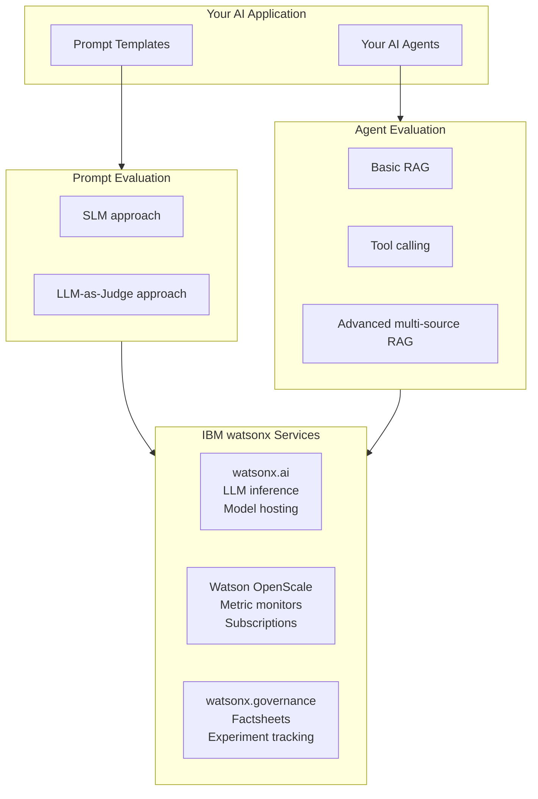
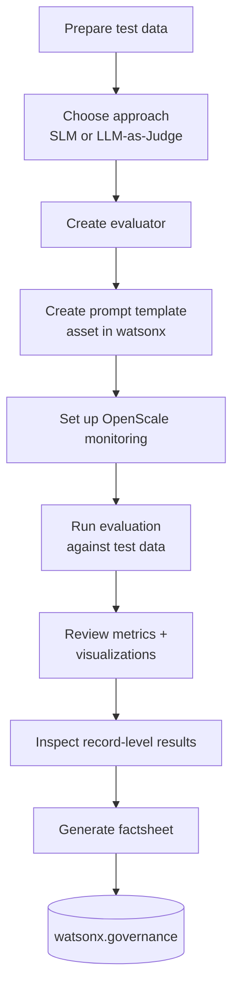
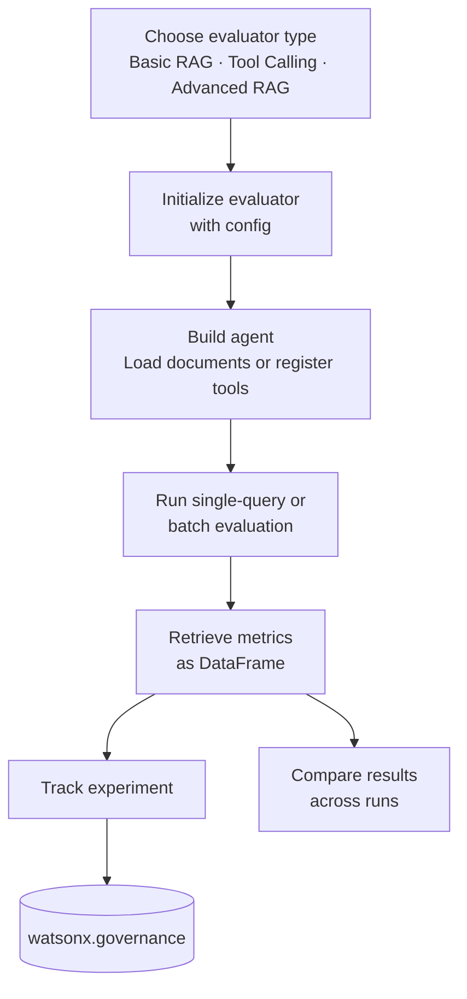

# Design-Time Evaluations

## Why This Matters for Enterprises

AI systems that perform well in experimentation can fail unpredictably once they encounter real-world inputs, edge cases, and adversarial behavior. Design-time evaluations provide a structured way to measure quality, safety, and retrieval performance **before deployment** — catching issues when they are cheap to fix rather than after they've reached production.

For enterprise teams, this is critical because:

- **Unvalidated systems fail at the edges.** LLM pipelines can hallucinate under low-confidence retrieval, leak sensitive data through prompt injection, or degrade when upstream schemas change. Design-time evaluation surfaces these failure modes before release.

- **Production failures are costly and difficult to debug.** Issues like PII leakage, unsafe outputs, or ungrounded responses become significantly harder to diagnose once embedded in live workflows. Systematic pre-deployment testing reduces operational and incident response burden.

- **Baselines are required for meaningful monitoring.** The metrics captured at design time — accuracy, groundedness, retrieval quality, latency, cost — become the reference points for detecting drift and regression in production. Without a documented baseline, runtime monitoring lacks signal.

- **Compliance requires testing.** Regulatory frameworks such as the EU AI Act and the NIST AI RMF expect evidence of structured testing. Versioned datasets, reproducible scoring, and stored evaluation artifacts provide this audit trail as a byproduct of sound engineering practice.

Design-time evaluations integrate directly with IBM watsonx.governance to provide end-to-end traceability from development through governance review.

## Architecture Overview

The design-time evaluations capability consists of two independent Python packages that share a common integration layer with IBM watsonx services.

**Prompt evaluation** supports two evaluation strategies:

- **SLM (Small Language Model)** — Leverages OpenScale's built-in smaller models for fast, cost-effective evaluation. Provides source attributions and works well for high-volume evaluation runs.
- **LLM-as-Judge** — Uses an external LLM for more nuanced analysis. Enables answer similarity scoring and more sophisticated quality judgments.

**Agent evaluation** provides three specialized evaluators depending on the agent architecture:

- **Basic RAG** — For agents with simple retrieval-augmented generation over a local vector store.
- **Tool Calling** — For agents that invoke custom tools and functions.
- **Advanced RAG** — For multi-source RAG agents with intelligent routing across local documents and web search.

Both packages produce structured metric results, support batch evaluation, and integrate with watsonx.governance for factsheet generation and experiment tracking.

## Supported Metrics Reference

### Prompt Evaluation Metrics

| Metric | Category | Description | Available In |
|--------|----------|-------------|-------------|
| **Faithfulness** | Quality | Measures whether the generated response is factually consistent with the provided context | SLM, LLM-as-Judge |
| **Answer Relevance** | Quality | Measures whether the response directly addresses the user's question | SLM, LLM-as-Judge |
| **Answer Similarity** | Quality | Measures semantic similarity between the generated response and ground truth | LLM-as-Judge only |
| **ROUGE Score** | Quality | Measures n-gram overlap between generated text and reference text | SLM, LLM-as-Judge |
| **Context Relevance** | Retrieval | Measures whether retrieved context passages are relevant to the query | SLM, LLM-as-Judge |
| **Context Precision** | Retrieval | Measures the proportion of retrieved passages that are relevant | SLM, LLM-as-Judge |
| **Hit Rate** | Retrieval | Measures whether at least one relevant passage was retrieved | SLM, LLM-as-Judge |
| **NDCG** | Retrieval | Measures ranking quality of retrieved passages (normalized discounted cumulative gain) | SLM, LLM-as-Judge |
| **Average Precision** | Retrieval | Measures precision across recall levels for retrieved passages | SLM, LLM-as-Judge |
| **PII Detection** | Safety | Detects personally identifiable information in model outputs | SLM, LLM-as-Judge |
| **HAP Detection** | Safety | Detects hate, abuse, and profanity in model outputs | SLM, LLM-as-Judge |
| **Model Health** | Performance | Tracks operational health of the model deployment | SLM, LLM-as-Judge |

### Agent Evaluation Metrics

| Metric | Category | Description | Available In |
|--------|----------|-------------|-------------|
| **Context Relevance** | Quality | Measures whether agent-retrieved context is relevant to the query | BasicRAG, AdvancedRAG |
| **Faithfulness** | Quality | Measures factual consistency of agent responses with retrieved context | BasicRAG, AdvancedRAG |
| **Answer Similarity** | Quality | Measures semantic similarity between agent response and ground truth | BasicRAG, ToolCalling, AdvancedRAG |
| **Tool Call Accuracy** | Tool | Measures whether the agent invoked the correct tools with appropriate parameters | ToolCalling only |
| **Routing Accuracy** | Tool | Measures whether the agent routed queries to the correct retrieval source | AdvancedRAG only |
| **PII Detection** | Safety | Detects personally identifiable information in agent outputs | All (when enabled) |
| **HAP Detection** | Safety | Detects hate, abuse, and profanity in agent outputs | All (when enabled) |
| **HARM Detection** | Safety | Detects harmful content in agent outputs | All (when enabled) |
| **Latency** | Performance | Tracks response time for agent interactions | All |
| **Token Usage** | Performance | Tracks token consumption per interaction | All |
| **Cost Estimation** | Performance | Estimates inference cost per interaction | All |

## End-to-End Workflow

### Prompt Template Evaluation

1. **Prepare test data.** Create a CSV file with representative inputs, retrieved contexts, generated outputs, and ground truth answers.
2. **Choose an evaluation approach.** Select SLM for fast, cost-effective evaluation or LLM-as-Judge for more nuanced analysis.
3. **Create the evaluator.** Instantiate the evaluator with your chosen configuration.
4. **Create the prompt template asset.** Register your prompt template in watsonx so it can be tracked and governed.
5. **Set up monitoring.** Configure an OpenScale subscription to collect evaluation feedback.
6. **Run evaluation.** Execute the evaluation against your test dataset and collect metric results.
7. **Review results.** Examine aggregate metrics, visualizations, and record-level detail to identify areas for improvement.
8. **Generate a factsheet.** Publish evaluation results to watsonx.governance as a governed artifact for compliance and audit readiness.

### Agent Evaluation

1. **Choose the evaluator type.** Select Basic RAG, Tool Calling, or Advanced RAG based on your agent's architecture.
2. **Initialize.** Configure the evaluator with your watsonx credentials, evaluation parameters, and (if applicable) vector store and LLM settings.
3. **Build the agent.** Load documents into the vector store (for RAG evaluators) or register tools (for the Tool Calling evaluator).
4. **Evaluate.** Run a single query for quick validation or batch evaluation for comprehensive coverage.
5. **Analyze.** Review the metrics DataFrame for quality, safety, and performance scores.
6. **Track.** Log the experiment in watsonx.governance for traceability.
7. **Iterate.** Compare results across multiple runs to measure the impact of prompt, model, or architecture changes.

For full source code, working examples, setup instructions, and configuration details, visit the [Trusted AI GitHub repository](https://github.com/ibm-self-serve-assets/building-blocks/tree/main/trusted-ai/design-time-evaluations).
