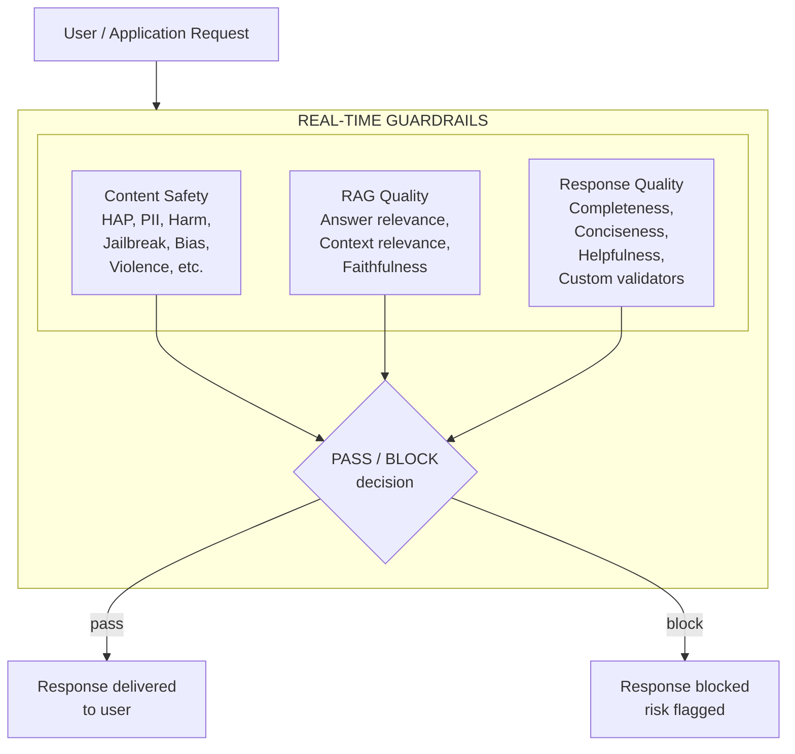
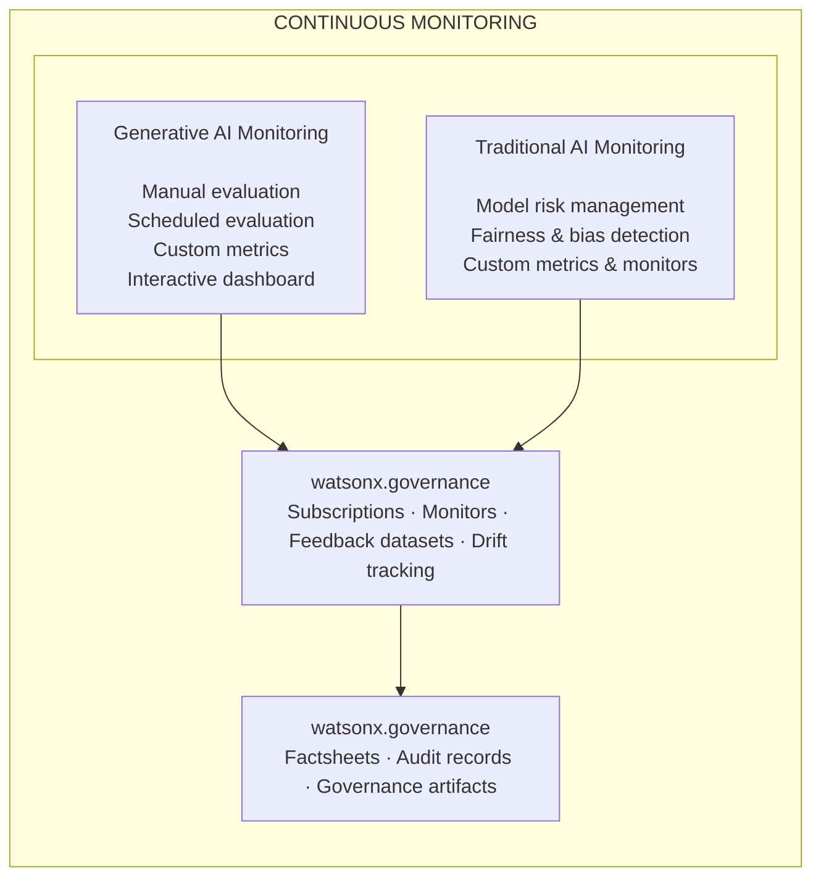
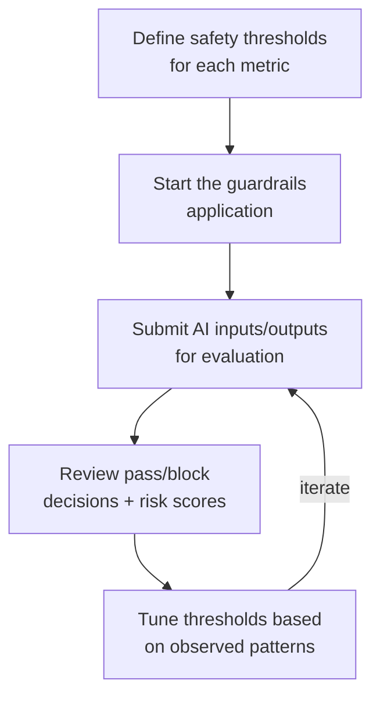
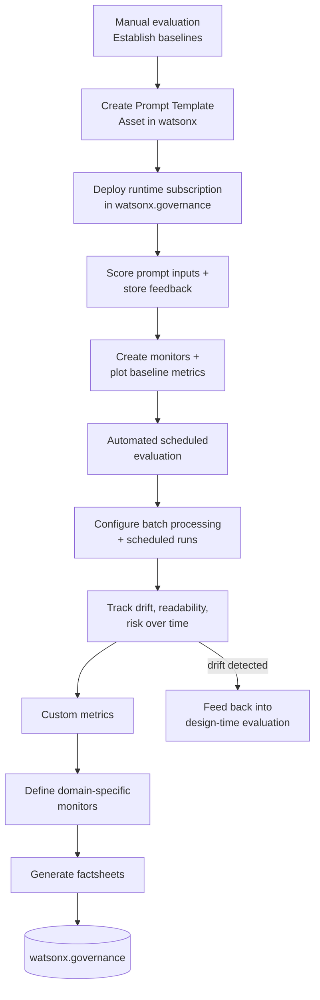

# Run-time Monitoring

## Why This Matters

An AI system that passes every evaluation at design time can still fail in production. User behavior shifts, upstream data changes, and adversarial inputs introduce conditions that pre-deployment testing cannot fully anticipate. Runtime monitoring closes this gap by providing continuous observation and real-time safeguards for AI systems operating in the real world.

For enterprise teams, this is critical because:

- **Production failures are visible and costly.** When a model generates harmful content, leaks PII, or returns irrelevant answers in front of customers, the impact is immediate — regulatory exposure, reputational damage, and loss of trust. Real-time guardrails provide the last line of defense before outputs reach users.
- **Model quality degrades gradually.** Drift in data distributions, shifts in user behavior, or changes to upstream systems can erode model performance over weeks or months. Without continuous measurement, teams discover degradation only after business metrics decline or customers complain.
- **Compliance requires ongoing evidence.** Regulatory frameworks don't just require pre-deployment testing — they expect organizations to demonstrate continuous monitoring and the ability to detect and respond to problems in production. Monitoring logs, drift alerts, and safety records serve as this operational evidence.
- **Different AI modalities need different monitoring.** Generative AI systems and traditional ML models have distinct failure modes. Generative AI can hallucinate, produce unsafe content, or drift in response quality. Traditional ML can drift in prediction accuracy, develop fairness issues, or degrade on new data distributions. Both need tailored monitoring approaches.

Runtime monitoring integrates with IBM watsonx.governance to provide production-grade observability and safeguards.

## Architecture Overview

The runtime monitoring capability provides two independent layers — real-time guardrails for immediate protection and continuous monitoring for long-term observability. Each addresses a distinct use case and can be adopted independently.

### Real-Time Guardrails

Real-time guardrails evaluate every AI input and output against configurable safety and quality thresholds before responses reach users.

### Continuous Monitoring

Continuous monitoring tracks quality, drift, and fairness metrics over time across both generative AI and traditional ML workloads.

**Real-time guardrails** operate synchronously in the request path. Every input and output is scored against configurable thresholds. Content safety metrics use upper-limit thresholds (block when exceeded), RAG metrics use lower-limit thresholds (block when quality falls below), and response quality metrics use LLM-as-Judge or custom rule-based evaluation. Responses that violate thresholds are blocked before reaching the user.

**Continuous monitoring** operates asynchronously, independent of the request path. Evaluation data is collected over time — either manually, on a schedule, or via streaming payloads — and fed into watsonx.governance for trend analysis, drift detection, and alerting. An interactive dashboard provides visualization of metrics, drift, and governance artifacts.

## Supported Metrics Reference

The metrics listed below are those demonstrated in the sample applications and notebooks included in the [Trusted AI GitHub repository](https://github.com/ibm-self-serve-assets/building-blocks/tree/main/trusted-ai/runtime-monitoring). The full set of metrics available through IBM watsonx.governance is more comprehensive — refer to the [watsonx.governance documentation](https://dataplatform.cloud.ibm.com/docs/content/wsj/model/wos-monitors-overview.html) for the complete list.

### Real-Time Guardrails Metrics

| Metric | Category | Description | Threshold Type |
|--------|----------|-------------|---------------|
| **HAP** | Content Safety | Hate, abuse, and profanity detection | Upper-limit |
| **PII** | Content Safety | Personally identifiable information detection | Upper-limit |
| **Harm** | Content Safety | General harm detection | Upper-limit |
| **Violence** | Content Safety | Violence-related content detection | Upper-limit |
| **Profanity** | Content Safety | Profanity detection | Upper-limit |
| **Social Bias** | Content Safety | Bias and stereotyping detection | Upper-limit |
| **Jailbreak** | Content Safety | Jailbreak attempt detection | Upper-limit |
| **Unethical Behavior** | Content Safety | Unethical content detection | Upper-limit |
| **Sexual Content** | Content Safety | Sexual content detection | Upper-limit |
| **Evasiveness** | Content Safety | Evasive or non-committal response detection | Upper-limit |
| **Answer Relevance** | RAG Quality | Whether the response addresses the user's question | Lower-limit |
| **Context Relevance** | RAG Quality | Whether retrieved passages are relevant to the query | Lower-limit |
| **Faithfulness** | RAG Quality | Whether the response is consistent with the provided context | Lower-limit |
| **Answer Completeness** | Response Quality | Whether the response fully addresses the question (LLM judge) | LLM-as-Judge |
| **Conciseness** | Response Quality | Whether the response avoids unnecessary verbosity (LLM judge) | LLM-as-Judge |
| **Helpfulness** | Response Quality | Whether the response is useful to the user (LLM judge) | LLM-as-Judge |
| **Action-Oriented Validator** | Response Quality | Custom rule-based check for actionable responses | Rule-based |

### Continuous Monitoring Metrics

| Metric | Category | Applies To | Description |
|--------|----------|-----------|-------------|
| **ROUGE** | Quality | Generative AI | N-gram overlap between generated and reference text |
| **Readability** | Quality | Generative AI | Text readability scores for generated outputs |
| **Drift (confidence)** | Drift | Gen AI + Traditional | Change in model confidence distributions over time |
| **Drift (prediction)** | Drift | Gen AI + Traditional | Shift in model prediction distributions |
| **Drift (metadata)** | Drift | Gen AI + Traditional | Changes in input feature distributions |
| **Model Health** | Performance | Gen AI + Traditional | Operational health of the model deployment |
| **Fairness** | Fairness | Traditional AI | Bias detection across protected attributes |
| **Indirect Bias** | Fairness | Traditional AI | Bias detected through proxy features |
| **Custom Metrics** | Custom | Gen AI + Traditional | User-defined metrics attached via watsonx.governance |

### Metrics by Use Case

| Use Case | Design-Time Baseline | Runtime Monitoring |
|----------|---------------------|-------------------|
| Text Summarization | ROUGE, SARI, readability, sentence similarity | ROUGE/SARI drift, latency, PII/HAP violations |
| Content Generation | BLEU, METEOR, fluency, novelty | BLEU degradation, safety violations, failed generations |
| Question Answering | F1, exact match, faithfulness, relevance | F1/EM decline, hallucination rate, response time |
| Entity Extraction | Precision, recall, F1, span accuracy | Accuracy drop, latency, PII leakage |
| RAG Systems | Retrieval recall@k, nDCG, faithfulness, ROUGE | Retrieval drift, faithfulness decline, failed retrievals |
| Code Generation | CodeBLEU, syntax correctness, test pass rate | Execution failures, unsafe patterns, hallucinated blocks |

## End-to-End Workflow

### Setting Up Real-Time Guardrails

1. **Set thresholds.** Define acceptable limits for each content safety, RAG quality, and response quality metric based on your risk tolerance.
2. **Launch.** Start the guardrails application and access the dashboard.
3. **Evaluate.** Submit AI system inputs and outputs through the interface. Each interaction is scored against all configured metrics.
4. **Review.** Inspect the color-coded risk dashboard. Red indicates high risk (threshold violated), green indicates acceptable output.
5. **Tune.** Adjust thresholds based on observed patterns — tighten limits where the system is too permissive, relax where it is overly conservative.

### Setting Up Continuous Monitoring

1. **Start with manual evaluation.** Create a Prompt Template Asset, deploy a runtime subscription in watsonx.governance, score inputs from sample data, and establish baseline metrics.
2. **Automate evaluation.** Configure batch processing and scheduled evaluation runs. Track ROUGE, readability, and risk metrics over time to detect drift.
3. **Add custom metrics.** Define domain-specific monitors (e.g., user feedback scores, business-specific quality checks) and attach them to your deployment.
4. **Use the dashboard.** Launch the interactive dashboard for visualization — manage prompts, run evaluations, monitor drift, and generate factsheets from a single interface.
5. **Close the loop.** When monitoring detects degradation or drift, feed that signal back into the design-time evaluation phase. Re-evaluate, update, and re-deploy with full traceability.

For full source code, notebooks, setup instructions, and configuration details, visit the [Trusted AI GitHub repository](https://github.com/ibm-self-serve-assets/building-blocks/tree/main/trusted-ai/runtime-monitoring).
