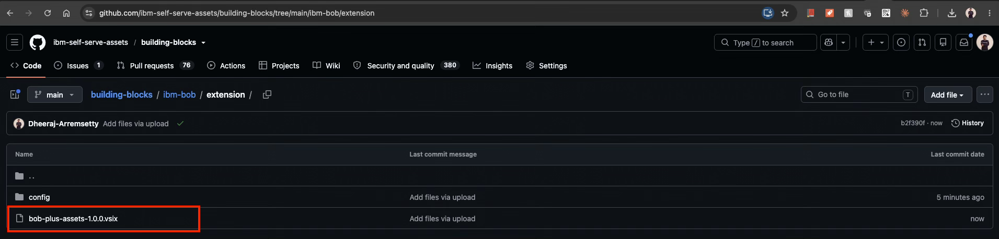
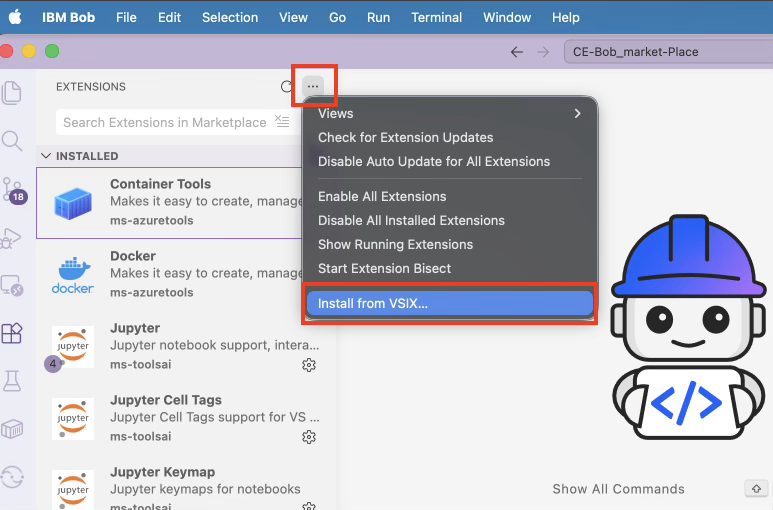
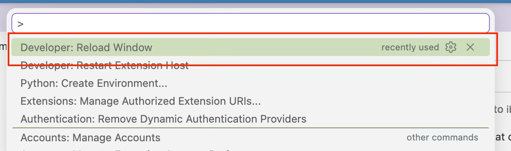
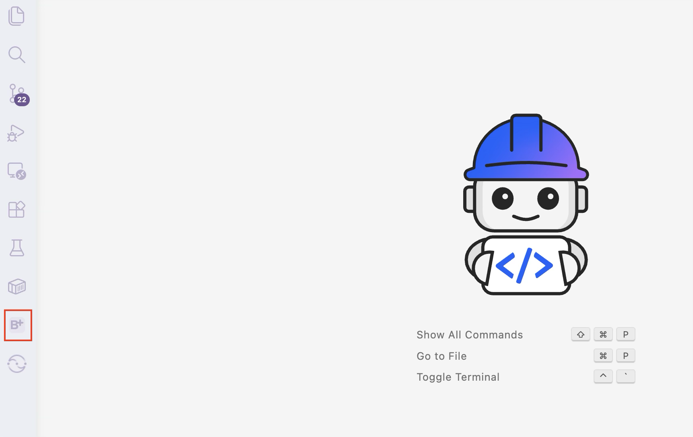
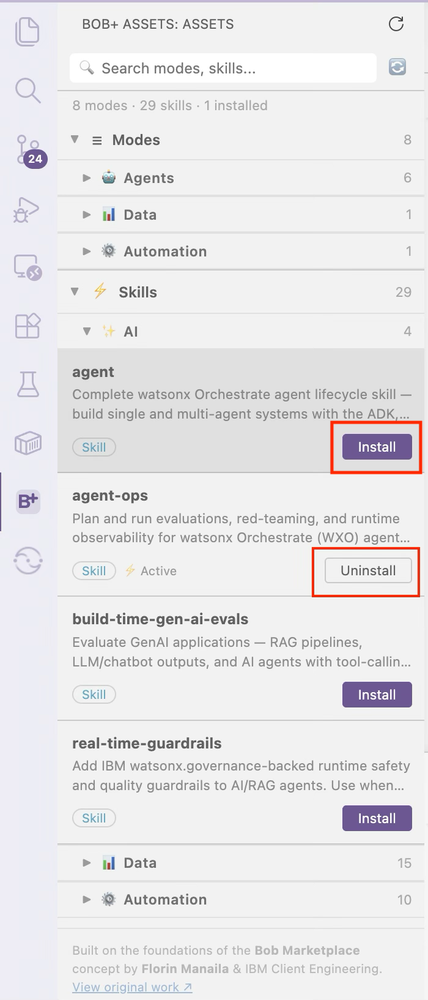

# Installing Bob+ Extension for Building Blocks

> Extend IBM Bob with curated assets to build amazing demos faster.

> 💡 **Tip:** Make sure you have a project folder open in IBM Bob before installing assets from the Marketplace.

---

## Step 1 — Download the VSIX

1. Go to the [**building-blocks extension page**](https://github.com/ibm-self-serve-assets/building-blocks/tree/main/ibm-bob/extension) on GitHub.
2. Download `bob-plus-assets-1.0.0.vsix` (the latest version listed under Assets).
3. Save the file locally — you will use it in Step 2.

---

## Step 2 — Install in Bob IDE

1. Open **IBM Bob**.
2. Open the **Extensions** panel using either option:
   - Click the **Extensions** icon in the Activity Bar, or press `Cmd+Shift+X` (Mac) / `Ctrl+Shift+X` (Windows/Linux)
   - Go to **View → Extensions** from the menu bar

   
   

3. Click the **three-dots menu** (`···`) in the top right of the Extensions panel.
4. Select **Install from VSIX…**

   

5. Choose the downloaded `.vsix` file and click **Open**.

   

6. **Reload** the window using either option:
   - Click **Reload** if a notification prompt appears, or
   - Press `Cmd+Shift+P` (Mac) / `Ctrl+Shift+P` (Windows/Linux), type **Developer: Reload Window**, and press `Enter`

   

> ℹ️ You only need to install the extension once.

---

## Step 3 — Open Bob+

1. Click the **B+** icon in the Activity Bar on the left.

   

2. Bob+ opens showing **Modes** and **Skills**, grouped by domain.

   

3. Browse the items and click **Install** on anything you want to use — see [Step 4](#step-4--install-skills-and-modes) below.

> ℹ️ No GitHub token required — uses the public GitHub API.

---

## Step 4 — Install Skills and Modes

1. Click **Install** on any Mode or Skill card.
2. A progress notification shows download status.
3. Skills land in `.bob/skills/` and modes merge into `.bob/custom_modes.yaml`.

> ℹ️ All assets are installed into your current workspace `.bob/` folder.

> 🗑️ To remove an asset, click the **Uninstall** button on its card — it will be removed from your workspace.

---

## You Are Ready to Go! ✅

Start building exceptional demos now with the Building Blocks Marketplace for IBM Bob.

> 💡 **Tip:** Use the search bar in Bob+ to find skills and modes by name or domain.

---

## Updating the Extension

When a new version of the extension is released:

1. Download the new `bob-plus-assets-x.x.x.vsix` from the [**building-blocks extension page**](https://github.com/ibm-self-serve-assets/building-blocks/tree/main/ibm-bob/extension).
2. Repeat **Step 2** — install the new `.vsix` over the existing one.
3. Reload the window when prompted.

> ℹ️ Your installed Skills and Modes in `.bob/` are not affected by extension updates.
