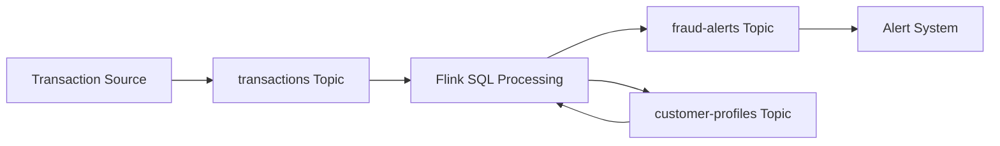

# Data Streaming Confluent Skill

A comprehensive BOB skill for creating production-ready Confluent Cloud streaming solutions with Infrastructure-as-Code, organized artifacts, and complete documentation.

## ⚠️ Important: Critical Configuration Requirements

**All generated solutions include these mandatory configurations to prevent deployment failures:**

1. **Schema Registry Timing**: 60-second wait for auto-provisioning after Kafka cluster creation
2. **API Key Environment Blocks**: All API keys include environment blocks in managed_resource

These are automatically included in all generated Terraform configurations. See SKILL.md for implementation details.

## Overview

This skill transforms business problems into **deployable streaming architectures** on Confluent Cloud, featuring:

- 🏗️ **Structured Artifact Organization** - Separate directories for code, scripts, docs, and configs
- 🎯 **Business Domain Focus** - Topics and schemas aligned with your business domain
- 🔄 **Repeatable Solutions** - Templates for common use cases (fraud detection, IoT, inventory)
- 🚀 **Production-Ready** - Terraform IaC with proper RBAC, security, and monitoring
- ✅ **End-to-End Testing** - Comprehensive validation queries and test procedures

## What This Skill Generates

When you describe a streaming use case, this skill creates a **complete solution** with:

```
your-solution/
├── terraform/              # Infrastructure as Code
│   ├── providers.tf       # Confluent provider configuration
│   ├── variables.tf       # Configurable parameters
│   ├── main.tf           # Core resources (cluster, topics, Flink)
│   ├── outputs.tf        # Credentials and endpoints
│   └── terraform.tfvars.example
├── python/                # Data producers and consumers
│   ├── producers/
│   │   └── produce_messages.py
│   ├── requirements.txt
│   ├── .env.example
│   └── sample-data/
├── flink/                 # Stream processing SQL
│   ├── tables/           # Table definitions
│   ├── jobs/             # Processing jobs
│   └── queries/          # Test queries
├── scripts/               # Automation utilities
│   ├── setup.sh          # One-command deployment
│   ├── test.sh           # Validation testing
│   └── cleanup.sh        # Resource cleanup
├── docs/                  # Comprehensive documentation
│   ├── ARCHITECTURE.md   # Solution design
│   ├── SETUP.md          # Step-by-step deployment
│   ├── TESTING.md        # Validation procedures
│   └── TROUBLESHOOTING.md
└── README.md              # Quick start guide
```

## Key Features

### 1. Business Problem Analysis
- Understands your domain and requirements
- Identifies key entities, events, and data flows
- Designs appropriate streaming patterns
- Selects optimal Confluent components

### 2. Domain-Specific Topic Design
Topics are named based on **your business entities**, not generic names:

**Fraud Detection:**
- `transactions` - Financial transactions
- `fraud-alerts` - Detected fraud cases
- `customer-profiles` - Behavior patterns

**IoT Monitoring:**
- `sensor-readings` - Device telemetry
- `device-status` - Health metrics
- `alerts` - Threshold violations

**Order Management:**
- `orders` - Customer orders
- `inventory-updates` - Stock changes
- `shipments` - Delivery tracking

### 3. Complete Infrastructure
- Confluent Cloud environment and cluster
- Properly configured Kafka topics
- Schema Registry integration
- Flink compute pools for stream processing
- Service accounts with correct RBAC
- Auto-generated API keys and credentials

### 4. Production-Ready Code
- **Terraform**: Infrastructure as Code with proper dependencies
- **Flink SQL**: Stream processing with correct syntax and patterns
- **Python**: Schema-aware producers with error handling
- **Scripts**: Automated deployment, testing, and cleanup

### 5. Comprehensive Documentation
- Architecture diagrams (Mermaid)
- Step-by-step setup instructions
- Testing procedures with validation queries
- Troubleshooting guides
- Cleanup procedures

## Use Case Templates

### Fraud Detection
**Problem:** Detect fraudulent transactions in real-time

**Solution:**
- Real-time transaction monitoring
- Velocity checks per customer
- Anomaly detection (unusual amounts/locations)
- Risk score calculation
- Automated alerting

### IoT Sensor Monitoring
**Problem:** Monitor device health and environmental conditions

**Solution:**
- Continuous sensor data ingestion
- Rolling average calculations
- Anomaly detection
- Device connectivity tracking
- Threshold-based alerting

### Order Management
**Problem:** Track orders and inventory in real-time

**Solution:**
- Real-time inventory updates
- Order fulfillment tracking
- Shipment status monitoring
- Low stock alerts
- Order analytics

### Customer Analytics
**Problem:** Analyze customer behavior in real-time

**Solution:**
- User event tracking
- Session aggregation
- Behavior pattern detection
- Customer segmentation
- Engagement metrics

## How to Use This Skill

### Step 1: Describe Your Business Problem

Simply describe what you're trying to solve:

```
"I need to detect fraudulent credit card transactions in real-time. 
We process 10,000 transactions per minute and need to flag suspicious 
patterns within seconds."
```

Or:

```
"Build an IoT monitoring system for 500 temperature sensors across 
10 warehouses. Alert when temperature exceeds thresholds and track 
device connectivity."
```

### Step 2: Review Generated Solution

The skill will generate:
- Complete Terraform infrastructure
- Flink SQL for stream processing
- Python producers with sample data
- Comprehensive documentation
- Automation scripts

### Step 3: Deploy

```bash
# One-command deployment
./scripts/setup.sh

# Or manual deployment
cd terraform
terraform init
terraform apply

cd ../python
python3 -m venv venv
source venv/bin/activate
pip install -r requirements.txt
```

### Step 4: Test

```bash
# Run test data
./scripts/test.sh

# Or manually
cd python
source venv/bin/activate
python producers/produce_messages.py
```

### Step 5: Validate

Use the provided Flink SQL queries in `docs/TESTING.md`:

```sql
-- Check raw stream
SELECT * FROM transactions LIMIT 10;

-- Check aggregated results
SELECT * FROM fraud_alerts ORDER BY alert_time DESC;

-- Check windowed aggregations
SELECT window_start, window_end, customer_id, COUNT(*) 
FROM TABLE(TUMBLE(TABLE transactions, DESCRIPTOR(transaction_time), INTERVAL '5' MINUTES))
GROUP BY window_start, window_end, customer_id;
```

### Step 6: Cleanup

```bash
./scripts/cleanup.sh
```

## Technical Highlights

### Terraform Best Practices
- ✅ Confluent provider >= 2.68.0 (Flink support)
- ✅ Correct API key associations (Kafka, Flink, Schema Registry)
- ✅ Proper role bindings (CloudClusterAdmin, FlinkDeveloper, EnvironmentAdmin)
- ✅ RBAC propagation delays
- ✅ Auto-generated .env files

### Flink SQL Best Practices
- ✅ JSON Schema format for keys and values
- ✅ DISTRIBUTED BY for partitioning
- ✅ Key columns first in schema
- ✅ Consumer isolation level set
- ✅ Proper watermark configuration
- ✅ Table-Valued Function (TVF) syntax for windows

### Python Best Practices
- ✅ Schema Registry integration
- ✅ JSON Schema serialization
- ✅ Object keys (not strings)
- ✅ Millisecond timestamps
- ✅ Delivery callbacks
- ✅ Error handling

## Example: Fraud Detection Solution

### Business Problem
Detect fraudulent credit card transactions by analyzing transaction velocity and unusual patterns.

### Generated Architecture



### Generated Topics
- `transactions` - All credit card transactions
- `fraud-alerts` - Detected fraud cases with risk scores
- `customer-profiles` - Customer behavior baselines

### Generated Processing Logic
```sql
-- Calculate transaction velocity
INSERT INTO fraud_alerts
SELECT 
  customer_id,
  transaction_time as alert_time,
  'HIGH_VELOCITY' as alert_type,
  CAST(COUNT(*) OVER (
    PARTITION BY customer_id 
    ORDER BY transaction_time 
    RANGE BETWEEN INTERVAL '5' MINUTES PRECEDING AND CURRENT ROW
  ) AS DECIMAL(5,2)) / 10.0 as risk_score
FROM transactions
WHERE COUNT(*) OVER (
  PARTITION BY customer_id 
  ORDER BY transaction_time 
  RANGE BETWEEN INTERVAL '5' MINUTES PRECEDING AND CURRENT ROW
) > 10;
```

### Generated Test Data
```json
[
  {
    "transaction_id": "TXN-001",
    "customer_id": "CUST-12345",
    "amount": 150.00,
    "merchant": "Online Store",
    "location": "US-CA",
    "transaction_time": 1704067200000
  }
]
```

## Validation Checklist

Before deployment, the skill validates:

### Infrastructure
- [ ] Terraform syntax valid
- [ ] All dependencies correct
- [ ] API keys properly associated
- [ ] Role bindings configured
- [ ] .env file generated

### Stream Processing
- [ ] Flink SQL syntax correct
- [ ] No forbidden properties
- [ ] Proper format specification
- [ ] Key columns ordered correctly
- [ ] Consumer isolation level set

### Code Quality
- [ ] Python syntax valid
- [ ] Correct serializers used
- [ ] Proper key format (object)
- [ ] Timestamps in milliseconds
- [ ] Error handling implemented

### Documentation
- [ ] Architecture diagram included
- [ ] Setup instructions complete
- [ ] Test queries provided
- [ ] Troubleshooting guide present
- [ ] Cleanup documented

## Common Pitfalls Avoided

This skill automatically avoids common mistakes:

### Terraform
- ❌ Wrong provider version
- ❌ Incorrect API key associations
- ❌ Missing RBAC delays
- ❌ Hardcoded credentials

### Flink SQL
- ❌ Forbidden connector properties
- ❌ Missing format specifications
- ❌ Wrong key column ordering
- ❌ Deprecated window syntax

### Python
- ❌ String keys instead of objects
- ❌ ISO timestamps instead of milliseconds
- ❌ Wrong serializer type
- ❌ Missing error handling

## Requirements

### Prerequisites
- Confluent Cloud account with API credentials
- Terraform >= 1.0
- Python >= 3.8
- Basic understanding of streaming concepts

### Confluent Cloud Resources
- Environment
- Basic Kafka cluster
- Schema Registry (auto-provisioned)
- Flink compute pool

## Support

### Documentation
- `docs/ARCHITECTURE.md` - Solution design and components
- `docs/SETUP.md` - Detailed deployment instructions
- `docs/TESTING.md` - Validation procedures
- `docs/TROUBLESHOOTING.md` - Common issues and solutions

### Automation Scripts
- `scripts/setup.sh` - One-command deployment
- `scripts/test.sh` - Run validation tests
- `scripts/cleanup.sh` - Remove all resources

## Success Metrics

A successful deployment includes:

✅ **Infrastructure**
- All Terraform resources created
- Proper RBAC configured
- Auto-generated credentials
- No manual configuration needed

✅ **Stream Processing**
- Tables created with correct schemas
- Jobs running successfully
- Data flowing through pipeline
- Correct results in destination

✅ **Code Quality**
- Production-ready error handling
- Proper schema serialization
- Clear, comprehensive documentation
- Organized artifact structure

✅ **User Experience**
- Reproducible from documentation
- Clear step-by-step instructions
- Working test queries
- Troubleshooting guidance
- Easy cleanup process

## Examples

### Example 1: Fraud Detection
```
User: "Create a fraud detection system for credit card transactions"

Generated:
- transactions topic with proper schema
- Flink SQL for velocity checks and anomaly detection
- fraud-alerts topic with risk scores
- Python producer with realistic transaction data
- Complete documentation and testing procedures
```

### Example 2: IoT Monitoring
```
User: "Monitor temperature sensors in warehouses and alert on thresholds"

Generated:
- sensor-readings topic with device telemetry
- Flink SQL for rolling averages and threshold detection
- alerts topic for violations
- Python producer with sensor data patterns
- Complete documentation and testing procedures
```

### Example 3: Order Management
```
User: "Track orders and inventory in real-time"

Generated:
- orders, inventory-updates, shipments topics
- Flink SQL for inventory calculations
- Python producer with order lifecycle data
- Complete documentation and testing procedures
```

## License

This skill is part of the BOB AI assistant framework.

## Version

Current version: 1.0.0

---

**Ready to build your streaming solution?** Just describe your business problem and let this skill generate a complete, production-ready Confluent Cloud architecture!