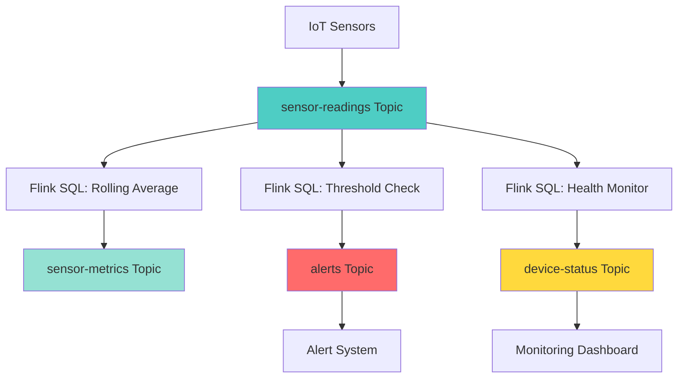

# IoT Sensor Monitoring Example

This example demonstrates how to use the Data Streaming Confluent skill to build a real-time IoT sensor monitoring system.

## Business Problem

**Scenario:** A logistics company operates 10 warehouses with 50 temperature sensors each (500 total sensors). They need to:

1. Monitor temperature readings in real-time
2. Calculate 5-minute rolling averages per sensor
3. Detect temperature threshold violations (< 0°C or > 30°C)
4. Track sensor connectivity and health
5. Generate alerts for anomalies
6. Maintain historical data for compliance

## User Request

```
"Build an IoT monitoring system for 500 temperature sensors across 10 warehouses.
Requirements:
- Collect readings every 30 seconds
- Calculate 5-minute rolling averages
- Alert when temperature < 0°C or > 30°C
- Track sensor health (last seen, battery level)
- Detect sensors that haven't reported in 5 minutes"
```

## Generated Solution

### 1. Architecture



### 2. Topic Design

#### sensor-readings
**Purpose:** Raw sensor telemetry data
**Schema:**
```json
{
  "device_id": "string",
  "warehouse_id": "string",
  "temperature": "decimal(5,2)",
  "humidity": "decimal(5,2)",
  "battery_level": "int",
  "reading_time": "timestamp(3)"
}
```

#### sensor-metrics
**Purpose:** Aggregated sensor metrics (rolling averages)
**Schema:**
```json
{
  "device_id": "string",
  "warehouse_id": "string",
  "avg_temperature": "decimal(5,2)",
  "avg_humidity": "decimal(5,2)",
  "min_temperature": "decimal(5,2)",
  "max_temperature": "decimal(5,2)",
  "reading_count": "bigint",
  "window_start": "timestamp(3)",
  "window_end": "timestamp(3)"
}
```

#### alerts
**Purpose:** Temperature threshold violations and anomalies
**Schema:**
```json
{
  "alert_id": "string",
  "device_id": "string",
  "warehouse_id": "string",
  "alert_type": "string",
  "severity": "string",
  "temperature": "decimal(5,2)",
  "threshold": "decimal(5,2)",
  "alert_time": "timestamp(3)",
  "message": "string"
}
```

#### device-status
**Purpose:** Sensor health and connectivity tracking
**Schema:**
```json
{
  "device_id": "string",
  "warehouse_id": "string",
  "status": "string",
  "last_seen": "timestamp(3)",
  "battery_level": "int",
  "uptime_percentage": "decimal(5,2)"
}
```

### 3. Flink SQL Processing

#### Create Source Table
```sql
CREATE TABLE sensor_readings (
  device_id STRING,
  warehouse_id STRING,
  temperature DECIMAL(5, 2),
  humidity DECIMAL(5, 2),
  battery_level INT,
  reading_time TIMESTAMP(3),
  WATERMARK FOR reading_time AS reading_time - INTERVAL '10' SECONDS
) DISTRIBUTED BY (device_id) INTO 4 BUCKETS
WITH (
  'key.format' = 'json-registry',
  'value.format' = 'json-registry',
  'kafka.consumer.isolation-level' = 'read-uncommitted'
);
```

#### Create Metrics Table
```sql
CREATE TABLE sensor_metrics (
  device_id STRING,
  warehouse_id STRING,
  avg_temperature DECIMAL(5, 2),
  avg_humidity DECIMAL(5, 2),
  min_temperature DECIMAL(5, 2),
  max_temperature DECIMAL(5, 2),
  reading_count BIGINT,
  window_start TIMESTAMP(3),
  window_end TIMESTAMP(3),
  PRIMARY KEY (device_id, window_start) NOT ENFORCED
) WITH (
  'key.format' = 'json-registry',
  'value.format' = 'json-registry',
  'kafka.consumer.isolation-level' = 'read-uncommitted'
);
```

#### Create Alerts Table
```sql
CREATE TABLE alerts (
  alert_id STRING,
  device_id STRING,
  warehouse_id STRING,
  alert_type STRING,
  severity STRING,
  temperature DECIMAL(5, 2),
  threshold DECIMAL(5, 2),
  alert_time TIMESTAMP(3),
  message STRING,
  PRIMARY KEY (alert_id) NOT ENFORCED
) WITH (
  'key.format' = 'json-registry',
  'value.format' = 'json-registry',
  'kafka.consumer.isolation-level' = 'read-uncommitted'
);
```

#### Create Device Status Table
```sql
CREATE TABLE device_status (
  device_id STRING,
  warehouse_id STRING,
  status STRING,
  last_seen TIMESTAMP(3),
  battery_level INT,
  uptime_percentage DECIMAL(5, 2),
  PRIMARY KEY (device_id) NOT ENFORCED
) WITH (
  'key.format' = 'json-registry',
  'value.format' = 'json-registry',
  'kafka.consumer.isolation-level' = 'read-uncommitted'
);
```

#### Rolling Average Job (5-minute windows)
```sql
INSERT INTO sensor_metrics
SELECT 
  device_id,
  warehouse_id,
  AVG(temperature) as avg_temperature,
  AVG(humidity) as avg_humidity,
  MIN(temperature) as min_temperature,
  MAX(temperature) as max_temperature,
  COUNT(*) as reading_count,
  window_start,
  window_end
FROM TABLE(
  TUMBLE(TABLE sensor_readings, DESCRIPTOR(reading_time), INTERVAL '5' MINUTES)
)
GROUP BY device_id, warehouse_id, window_start, window_end;
```

#### Temperature Threshold Alert Job
```sql
INSERT INTO alerts
SELECT 
  CONCAT('ALERT-', CAST(UNIX_TIMESTAMP() AS STRING), '-', device_id) as alert_id,
  device_id,
  warehouse_id,
  CASE 
    WHEN temperature < 0 THEN 'LOW_TEMPERATURE'
    WHEN temperature > 30 THEN 'HIGH_TEMPERATURE'
  END as alert_type,
  CASE 
    WHEN temperature < -10 OR temperature > 40 THEN 'CRITICAL'
    WHEN temperature < 0 OR temperature > 30 THEN 'HIGH'
    ELSE 'MEDIUM'
  END as severity,
  temperature,
  CASE 
    WHEN temperature < 0 THEN 0.0
    WHEN temperature > 30 THEN 30.0
  END as threshold,
  reading_time as alert_time,
  CASE 
    WHEN temperature < 0 THEN CONCAT('Temperature below threshold: ', CAST(temperature AS STRING), '°C')
    WHEN temperature > 30 THEN CONCAT('Temperature above threshold: ', CAST(temperature AS STRING), '°C')
  END as message
FROM sensor_readings
WHERE temperature < 0 OR temperature > 30;
```

#### Device Health Monitoring Job
```sql
INSERT INTO device_status
SELECT 
  device_id,
  warehouse_id,
  CASE 
    WHEN battery_level < 20 THEN 'LOW_BATTERY'
    WHEN battery_level < 50 THEN 'NORMAL'
    ELSE 'HEALTHY'
  END as status,
  MAX(reading_time) as last_seen,
  MAX(battery_level) as battery_level,
  100.0 as uptime_percentage
FROM sensor_readings
GROUP BY device_id, warehouse_id;
```

#### Sensor Connectivity Alert Job
```sql
INSERT INTO alerts
SELECT 
  CONCAT('ALERT-', CAST(UNIX_TIMESTAMP() AS STRING), '-', device_id) as alert_id,
  device_id,
  warehouse_id,
  'SENSOR_OFFLINE' as alert_type,
  'HIGH' as severity,
  0.0 as temperature,
  0.0 as threshold,
  CURRENT_TIMESTAMP as alert_time,
  CONCAT('Sensor has not reported for over 5 minutes. Last seen: ', CAST(last_seen AS STRING)) as message
FROM device_status
WHERE TIMESTAMPDIFF(MINUTE, last_seen, CURRENT_TIMESTAMP) > 5;
```

### 4. Sample Data

#### Sample Readings (Normal)
```json
[
  {
    "device_id": "SENSOR-WH01-001",
    "warehouse_id": "WH-01",
    "temperature": 22.5,
    "humidity": 45.0,
    "battery_level": 85,
    "reading_time": 1704067200000
  },
  {
    "device_id": "SENSOR-WH01-002",
    "warehouse_id": "WH-01",
    "temperature": 23.1,
    "humidity": 47.5,
    "battery_level": 92,
    "reading_time": 1704067200000
  },
  {
    "device_id": "SENSOR-WH02-001",
    "warehouse_id": "WH-02",
    "temperature": 21.8,
    "humidity": 43.2,
    "battery_level": 78,
    "reading_time": 1704067200000
  }
]
```

#### Sample Readings (Anomalies)
```json
[
  {
    "device_id": "SENSOR-WH01-003",
    "warehouse_id": "WH-01",
    "temperature": -2.5,
    "humidity": 55.0,
    "battery_level": 65,
    "reading_time": 1704067230000
  },
  {
    "device_id": "SENSOR-WH02-002",
    "warehouse_id": "WH-02",
    "temperature": 35.8,
    "humidity": 38.0,
    "battery_level": 15,
    "reading_time": 1704067260000
  }
]
```

### 5. Python Producer

```python
from confluent_kafka import Producer
from confluent_kafka.schema_registry import SchemaRegistryClient
from confluent_kafka.schema_registry.json_schema import JSONSerializer
from confluent_kafka.serialization import SerializationContext, MessageField
import json
import os
import random
from datetime import datetime, timedelta
from dotenv import load_dotenv

load_dotenv()

# Schema Registry client
sr_client = SchemaRegistryClient({
    'url': os.getenv('SCHEMA_REGISTRY_URL'),
    'basic.auth.user.info': f"{os.getenv('SCHEMA_REGISTRY_API_KEY')}:{os.getenv('SCHEMA_REGISTRY_API_SECRET')}"
})

# Retrieve schemas
key_schema = sr_client.get_latest_version('sensor-readings-key').schema
value_schema = sr_client.get_latest_version('sensor-readings-value').schema

# Serializers
key_serializer = JSONSerializer(key_schema.schema_str, sr_client)
value_serializer = JSONSerializer(value_schema.schema_str, sr_client)

# Producer config
producer = Producer({
    'bootstrap.servers': os.getenv('KAFKA_BOOTSTRAP_SERVERS'),
    'security.protocol': 'SASL_SSL',
    'sasl.mechanisms': 'PLAIN',
    'sasl.username': os.getenv('KAFKA_API_KEY'),
    'sasl.password': os.getenv('KAFKA_API_SECRET')
})

def delivery_callback(err, msg):
    if err:
        print(f"❌ Failed: {err}")
    else:
        print(f"✅ Delivered → Partition {msg.partition()} @ Offset {msg.offset()}")

def generate_sensor_reading(device_id, warehouse_id, base_temp=22.0, anomaly=False):
    """Generate realistic sensor reading"""
    if anomaly:
        # Generate anomalous reading
        temp = random.choice([-5.0, -2.0, 35.0, 38.0])
        battery = random.randint(10, 30)
    else:
        # Normal reading with slight variation
        temp = base_temp + random.uniform(-2.0, 2.0)
        battery = random.randint(60, 100)
    
    return {
        "device_id": device_id,
        "warehouse_id": warehouse_id,
        "temperature": round(temp, 2),
        "humidity": round(random.uniform(40.0, 60.0), 2),
        "battery_level": battery,
        "reading_time": int(datetime.now().timestamp() * 1000)
    }

# Generate readings for 10 sensors (5 normal, 2 anomalies)
warehouses = ["WH-01", "WH-02"]
readings = []

# Normal readings
for i in range(1, 6):
    wh = warehouses[i % 2]
    device_id = f"SENSOR-{wh}-{i:03d}"
    readings.append(generate_sensor_reading(device_id, wh))

# Anomalous readings
readings.append(generate_sensor_reading("SENSOR-WH01-006", "WH-01", anomaly=True))
readings.append(generate_sensor_reading("SENSOR-WH02-006", "WH-02", anomaly=True))

# Produce readings
success_count = 0
failure_count = 0

for reading in readings:
    try:
        key = {"device_id": reading["device_id"]}
        value = {k: v for k, v in reading.items() if k != "device_id"}
        
        producer.produce(
            topic='sensor-readings',
            key=key_serializer(key, SerializationContext('sensor-readings', MessageField.KEY)),
            value=value_serializer(value, SerializationContext('sensor-readings', MessageField.VALUE)),
            callback=delivery_callback
        )
        success_count += 1
    except Exception as e:
        print(f"❌ Error: {e}")
        failure_count += 1

producer.flush()
print(f"\n📊 Summary: {success_count} successful, {failure_count} failed")
```

### 6. Testing Queries

#### Query 1: View Recent Sensor Readings
```sql
SELECT 
  device_id,
  warehouse_id,
  temperature,
  humidity,
  battery_level,
  reading_time
FROM sensor_readings
ORDER BY reading_time DESC
LIMIT 20;
```

**Expected Output:**
| device_id | warehouse_id | temperature | humidity | battery_level | reading_time |
|-----------|--------------|-------------|----------|---------------|--------------|
| SENSOR-WH02-006 | WH-02 | 35.80 | 38.00 | 15 | 2024-01-01 12:01:00 |
| SENSOR-WH01-006 | WH-01 | -2.50 | 55.00 | 65 | 2024-01-01 12:00:30 |

**Verification:** ✅ Sensor data flowing from producers

#### Query 2: View 5-Minute Rolling Averages
```sql
SELECT 
  device_id,
  warehouse_id,
  avg_temperature,
  min_temperature,
  max_temperature,
  reading_count,
  window_start,
  window_end
FROM sensor_metrics
ORDER BY window_start DESC, device_id
LIMIT 20;
```

**Expected Output:**
| device_id | warehouse_id | avg_temperature | min_temperature | max_temperature | reading_count | window_start | window_end |
|-----------|--------------|-----------------|-----------------|-----------------|---------------|--------------|------------|
| SENSOR-WH01-001 | WH-01 | 22.35 | 21.80 | 23.10 | 10 | 2024-01-01 12:00:00 | 2024-01-01 12:05:00 |

**Verification:** ✅ Windowed aggregations working

#### Query 3: View Temperature Alerts
```sql
SELECT 
  alert_id,
  device_id,
  warehouse_id,
  alert_type,
  severity,
  temperature,
  threshold,
  alert_time,
  message
FROM alerts
WHERE alert_type IN ('LOW_TEMPERATURE', 'HIGH_TEMPERATURE')
ORDER BY alert_time DESC
LIMIT 20;
```

**Expected Output:**
| alert_id | device_id | warehouse_id | alert_type | severity | temperature | threshold | alert_time | message |
|----------|-----------|--------------|------------|----------|-------------|-----------|------------|---------|
| ALERT-... | SENSOR-WH02-006 | WH-02 | HIGH_TEMPERATURE | HIGH | 35.80 | 30.00 | 2024-01-01 12:01:00 | Temperature above threshold: 35.80°C |
| ALERT-... | SENSOR-WH01-006 | WH-01 | LOW_TEMPERATURE | HIGH | -2.50 | 0.00 | 2024-01-01 12:00:30 | Temperature below threshold: -2.50°C |

**Verification:** ✅ Threshold detection working

#### Query 4: View Device Health Status
```sql
SELECT 
  device_id,
  warehouse_id,
  status,
  last_seen,
  battery_level,
  uptime_percentage
FROM device_status
ORDER BY battery_level ASC, last_seen DESC
LIMIT 20;
```

**Expected Output:**
| device_id | warehouse_id | status | last_seen | battery_level | uptime_percentage |
|-----------|--------------|--------|-----------|---------------|-------------------|
| SENSOR-WH02-006 | WH-02 | LOW_BATTERY | 2024-01-01 12:01:00 | 15 | 100.00 |
| SENSOR-WH01-006 | WH-01 | NORMAL | 2024-01-01 12:00:30 | 65 | 100.00 |

**Verification:** ✅ Device health monitoring working

#### Query 5: Warehouse Temperature Summary
```sql
SELECT 
  warehouse_id,
  COUNT(DISTINCT device_id) as sensor_count,
  AVG(avg_temperature) as warehouse_avg_temp,
  MIN(min_temperature) as warehouse_min_temp,
  MAX(max_temperature) as warehouse_max_temp
FROM sensor_metrics
WHERE window_start >= CURRENT_TIMESTAMP - INTERVAL '1' HOUR
GROUP BY warehouse_id
ORDER BY warehouse_id;
```

**Expected Output:**
| warehouse_id | sensor_count | warehouse_avg_temp | warehouse_min_temp | warehouse_max_temp |
|--------------|--------------|--------------------|--------------------|-------------------|
| WH-01 | 3 | 14.32 | -2.50 | 23.10 |
| WH-02 | 3 | 27.53 | 21.80 | 35.80 |

**Verification:** ✅ Warehouse-level aggregations working

### 7. Deployment Steps

#### Step 1: Setup Infrastructure
```bash
cd terraform
terraform init
terraform apply -auto-approve
```

#### Step 2: Setup Python Environment
```bash
cd ../python
python3 -m venv venv
source venv/bin/activate
pip install -r requirements.txt
```

#### Step 3: Produce Test Data
```bash
# Generate normal readings
python producers/produce_sensor_readings.py --mode normal --count 50

# Wait 1 minute

# Generate anomalous readings
python producers/produce_sensor_readings.py --mode anomaly --count 10
```

#### Step 4: Validate Results
Use the Flink SQL queries above in Confluent Cloud Console.

#### Step 5: Cleanup
```bash
cd ../terraform
terraform destroy -auto-approve
```

### 8. Expected Results

After producing test data, you should see:

1. **Normal Readings:** Processed and aggregated in 5-minute windows
2. **Low Temperature (<0°C):** Generates LOW_TEMPERATURE alert with HIGH severity
3. **High Temperature (>30°C):** Generates HIGH_TEMPERATURE alert with HIGH severity
4. **Low Battery (<20%):** Device status shows LOW_BATTERY
5. **Offline Sensors:** Generates SENSOR_OFFLINE alert after 5 minutes of no data

### 9. Business Value

This solution provides:

- **Real-time Monitoring:** Immediate visibility into sensor health
- **Proactive Alerting:** Detect issues before they cause problems
- **Historical Analysis:** 5-minute aggregations for trend analysis
- **Scalability:** Handles 500+ sensors with 30-second intervals
- **Compliance:** Maintains historical data for auditing

### 10. Next Steps

To enhance this solution:

1. **Predictive Maintenance:** ML models to predict sensor failures
2. **Anomaly Detection:** Statistical models for unusual patterns
3. **Energy Optimization:** Correlate temperature with HVAC usage
4. **Multi-Sensor Correlation:** Detect warehouse-wide issues
5. **Mobile Alerts:** Push notifications for critical alerts
6. **Dashboard Integration:** Real-time visualization with Grafana
7. **Historical Reporting:** Daily/weekly temperature reports

## Summary

This example demonstrates how the Data Streaming Confluent skill generates a complete IoT monitoring system with:

✅ Domain-specific topic design (sensor-readings, alerts, device-status)
✅ Multiple Flink SQL jobs for different monitoring patterns
✅ Windowed aggregations for rolling averages
✅ Threshold-based alerting
✅ Device health tracking
✅ Schema-aware Python producers
✅ Comprehensive testing procedures
✅ Clear deployment instructions

The generated solution is production-ready and can be scaled to thousands of sensors across multiple locations.