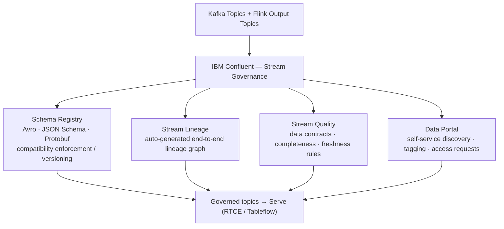

# Govern

**IBM product**: IBM Confluent -- Stream Governance

Use this building block to enforce schema contracts, trace end-to-end stream lineage, evaluate stream quality rules, and enable self-service data discovery across the Streamhouse architecture.

> Assets for this building block are **coming soon**. For stream governance patterns today, the [`../stream/assets/supply-chain-risk-control-tower/`](../stream/assets/supply-chain-risk-control-tower/) asset includes JSON Schema contracts with Schema Registry as part of the full end-to-end streaming demo.

## Architecture



## Included assets

| Path | Purpose |
|---|---|
| [`assets/`](assets/) | Schema Registry templates, Stream Quality rule definitions -- coming soon |
| [`bob-modes/`](bob-modes/) | IBM Bob Stream Governance Builder mode -- coming soon |
| [`bob-skills/`](bob-skills/) | IBM Bob skill for schema design and data contracts -- coming soon |

For Schema Registry JSON Schema contracts available now, see [`../stream/assets/supply-chain-risk-control-tower/code/schemas/`](../stream/assets/supply-chain-risk-control-tower/code/schemas/).

## Example data contract

```json
{
  "contract": "supply-chain-events-v1",
  "schema": "supply_chain_events",
  "quality_rules": [
    { "field": "supplier_id", "rule": "not_null", "threshold": 1.0 },
    { "field": "risk_score",  "rule": "range", "min": 0, "max": 100 },
    { "field": "event_time",  "rule": "recency", "max_lag_minutes": 5 }
  ],
  "sla": {
    "freshness_minutes": 1,
    "availability_pct": 99.9
  }
}
```

## When to use Govern

- Schema changes in upstream producers are breaking downstream consumers or Flink jobs.
- You need an auditable end-to-end lineage graph for regulatory or compliance requirements.
- Data quality contracts and SLA freshness rules must be evaluated on live event streams.
- Teams need a self-service portal to discover, understand, and request access to data products.

## Production notes

- Set schema compatibility mode per topic based on how consumers tolerate schema changes (BACKWARD is the typical default).
- Automate schema registration in CI/CD pipelines to prevent un-registered schemas reaching production.
- Define Stream Quality rules based on explicit SLAs -- do not apply generic thresholds across all topics.
- Keep Data Portal tags and classifications aligned with enterprise data governance taxonomy.
- Treat lineage graphs as living documentation -- update after topology changes.

## IBM references

- IBM Confluent: https://www.ibm.com/products/confluent
- Confluent Schema Registry: https://docs.confluent.io/platform/current/schema-registry/index.html
- Confluent Stream Lineage: https://docs.confluent.io/cloud/current/stream-lineage/overview.html
- Confluent Stream Quality: https://docs.confluent.io/cloud/current/stream-quality/overview.html
- Confluent Data Portal: https://docs.confluent.io/cloud/current/stream-governance/data-portal.html
