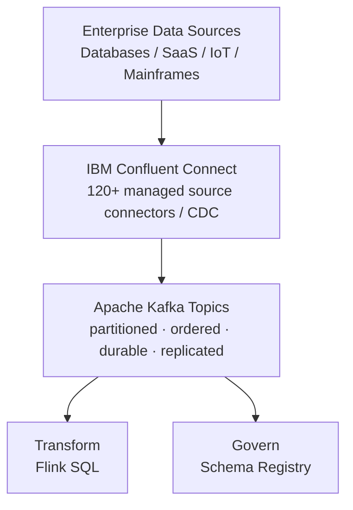

# Stream

**IBM product**: IBM Confluent -- Connectors and Kafka

Use this building block to capture and transport high-throughput enterprise event streams from databases, applications, SaaS platforms, mainframes, and IoT devices into a durable Apache Kafka event backbone.

## Architecture



## Included assets

| Path | Purpose |
|---|---|
| [`assets/supply-chain-risk-control-tower/`](assets/supply-chain-risk-control-tower/) | Runnable supply-chain streaming demo -- Kafka topics, JSON Schema contracts, Python risk engine, Flink SQL reference, Terraform, and Carbon UI |
| [`bob-modes/`](bob-modes/) | IBM Bob Data Ingestion mode |
| [`bob-skills/data-streaming-confluent.zip`](bob-skills/data-streaming-confluent.zip) | Bob skill for Kafka topic design, Schema Registry, Python producers/consumers, and Flink SQL |
| [`bob-skills/confluent-iac-terraform.zip`](bob-skills/confluent-iac-terraform.zip) | Bob skill for Confluent Cloud Terraform infrastructure-as-code |

## Quick start

### Browser simulation (no Kafka cluster required)

```bash
python -m http.server 8080 --directory assets/supply-chain-risk-control-tower/code/ui
```

### Python dry run

```bash
cd assets/supply-chain-risk-control-tower
cp .env.example .env
python -m scrc.risk_engine --dry-run
```

### Full IBM Confluent deployment

Provision infrastructure with Terraform, register schemas, and run the full streaming pipeline. See [`assets/supply-chain-risk-control-tower/README.md`](assets/supply-chain-risk-control-tower/README.md).

## What the asset demonstrates

The supply-chain asset covers:

- Managed Kafka topic provisioning and partition sizing;
- JSON Schema contracts with Schema Registry and compatibility enforcement;
- Python Confluent producers with Schema Registry-aware serialization;
- Reference Apache Flink SQL for risk aggregation over event streams;
- Terraform IaC for Confluent environment, cluster, topics, and service accounts;
- Carbon React dashboard consuming a live Kafka bridge;
- Integration points for IBM watsonx.ai, watsonx Orchestrate, and IBM Cloud services.

## When to use Real-Time streaming

- You need **Change Data Capture (CDC)** from relational databases or mainframes into event streams.
- Applications, IoT sensors, or microservices generate high-frequency operational events.
- Multiple downstream consumers need access to the same event stream with independent read positions.
- You need to decouple source systems from downstream consumers with a fault-tolerant event buffer.

For batch data movement measured in hours or days, use [`../../pipelines/etl/`](../../pipelines/etl/) instead.

## Production notes

- Size partitions based on peak throughput and downstream consumer parallelism.
- Set Kafka event keys intentionally to preserve in-order processing per entity (e.g., `order_id`).
- Define retention policies (time-based or log-compacted) based on downstream consumption models.
- Implement dead-letter queues for unparseable or malformed source messages.
- Keep Confluent API keys and service-account credentials in a secrets manager.
- Validate connector compatibility and CDC impact against the source database version.

## IBM references

- IBM Confluent: https://www.ibm.com/products/confluent
- Confluent Cloud Connectors: https://docs.confluent.io/cloud/current/connectors/overview.html
- Confluent Cloud Apache Kafka: https://docs.confluent.io/cloud/current/kafka/overview.html
- Confluent Terraform provider: https://registry.terraform.io/providers/confluentinc/confluent/latest/docs
