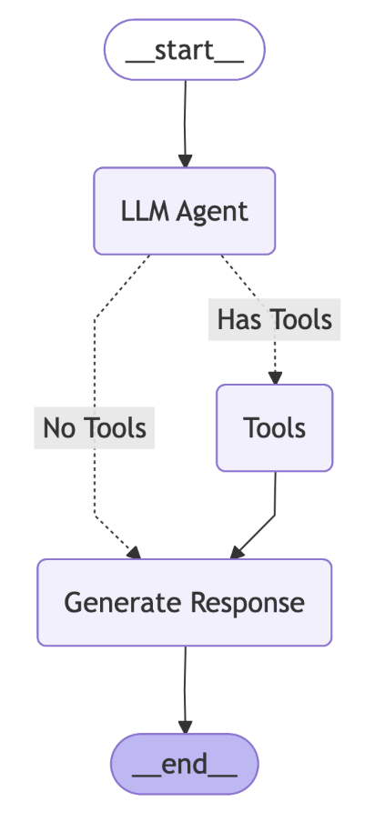

# Design Time Evaluations for Agentic AI Solutions

This folder contains self-serve notebooks for comprehensive evaluation and monitoring of Agentic AI solutions using IBM watsonx.governance SDK.

In "basic-deisgn-time-eval-for-agents" notebook, you will create a LangGraph RAG agent and then use watsonx Agentic AI evaluator to evaluate the agent’s performance. Your agent for this lab has the following architecture. It uses local documents to perform a RAG task. 

We evaluate this agent on range of metrics:
- answer similarity
- context relevance
- faithfulness
- retrieval latency
- generation latency
- interaction cost
- interaction duration
- input token count
- output token count

----
 
In "design-time-eval-for-agentic-toolCalling" notebook, you will create a question answering agent that is equipped with two custom tools. Given the user’s query, an LLM routes it to the relevant tool. If there is not a relevant tool to answer that question, the agent will generate without a tool. 

We will use the Agentic AI evaluators from IBM watsonx.governance Python SDK to evaluate the tool calling functionality of the agent in this lab on metrics such as:
- Tool call accuracy
- Tool call relevance
- Tool call latency

----

In "advanced-design-time-eval-for-agents" notebook, we first create a question answering agent that can use local documents or web search to answer the question. The agent will context relevance to decide what tool. 

We then use the Agentic AI evaluators from IBM watsonx.governance Python SDK to evaluate this agent on metrics including:
- Retrieval context relevance
- Web search context relevance
- Retrieval precision
- Web search precision
- PII
- HAP
- HARM
- Jailbreak
- Sexual content
- Latency
- Cost

