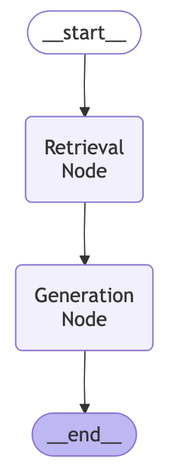
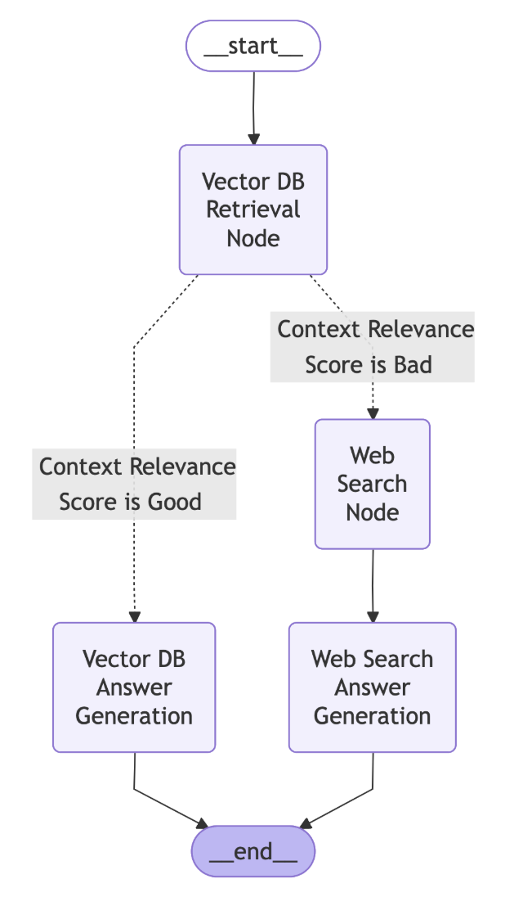

# Design Time Evaluations for Agentic AI Solutions

This folder contains self-serve notebooks for comprehensive evaluation and monitoring of Agentic AI solutions using IBM watsonx.governance SDK.

## 📑 Table of Contents
- [Basic Design-Time Evaluation](#basic-design-time-evaluation)
- [Tool Calling Evaluation](#tool-calling-evaluation)
- [Advanced Design-Time Evaluation](#advanced-design-time-evaluation)

## Basic Design-Time Evaluation

In "basic-deisgn-time-eval-for-agents" notebook, you will create a LangGraph RAG agent and use watsonx Agentic AI evaluator to evaluate the agent’s performance. Your agent for this lab has the following architecture. It uses local documents to perform a RAG task. 

  

**Metrics evaluated:**
- answer similarity
- context relevance
- faithfulness
- retrieval latency
- generation latency
- interaction cost
- interaction duration
- input token count
- output token count

----

## Tool Calling Evaluation

In "design-time-eval-for-agentic-toolCalling" notebook, you will create a question answering agent that is equipped with two custom tools. Given the user’s query, an LLM routes it to the relevant tool. If there is not a relevant tool to answer that question, the agent will generate without a tool. 

  

We will use the Agentic AI evaluators from IBM watsonx.governance Python SDK to evaluate the tool calling functionality of the agent.

**Metrics evaluated:**
- Tool call accuracy
- Tool call relevance
- Tool call latency

----

## Advanced Design-Time Evaluation

In "advanced-design-time-eval-for-agents" notebook, we first create a question answering agent that can use local documents or web search to answer the question. The agent will context relevance to decide what tool. 

  

We use the Agentic AI evaluators from IBM watsonx.governance Python SDK to evaluate this agent.

**Metrics evaluated:**
- Retrieval context relevance
- Web search context relevance
- Retrieval precision
- Web search precision
- PII
- HAP
- HARM
- Jailbreak
- Sexual content
- Latency
- Cost

---

## Technology Stack

- **Python 3.10+**
- **IBM watsonx.governance SDK**
- **Jupyter Notebooks** for interactive development
- **python-dotenv** for environment configuration
- **IBM Cloud SDK** for authentication

## Prerequisites

1. **IBM watsonx.governance Service Instance**
   - Create an instance at [IBM Cloud Catalog](https://cloud.ibm.com/catalog/services/watsonxgovernance)

2. **IBM Cloud API Key**
   - Generate at [IBM Cloud API Keys](https://cloud.ibm.com/iam/apikeys)
   - Requires access to watsonx.governance service

