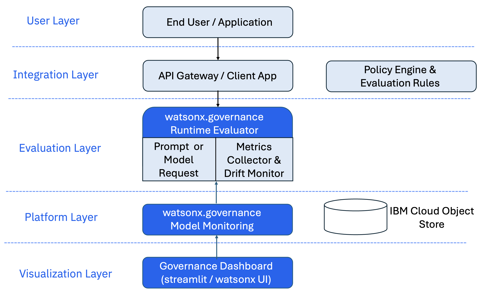

# 🧩 Runtime Evaluations and Production-Grade Monitoring with IBM watsonx.governance

Ensure your Generative and Traditional AI models are trustworthy, compliant, and monitored using the IBM watsonx.governance SDK.

## 📚 Table of Contents
- [Overview](#overview)
- [Architecture](#architecture)
- [Features](#features)
- [Technology Stack](#technology-stack)
- [Prerequisites](#prerequisites)
- [Project Structure](#project-structure)
- [Getting Started](#getting-started)
- [Usage](#usage)
- [Configuration](#configuration)
- [Deployment](#deployment)
- [Examples](#examples)
- [Contributing](#contributing)
- [License](#license)

---

## 🧠 Overview

This repository demonstrates how to perform runtime evaluations and continuous monitoring for AI models using the IBM watsonx.governance SDK.

It includes:
- **Runtime Evaluations** for **Prompt Governance** in **Large Language Models (LLMs)**
- **Production-Grade Monitoring** for **Traditional AI Models**

These components ensure transparency, fairness, and compliance during real-time model deployment and usage.

---

## 🏗 Architecture

Runtime Evaluations and Monitoring integrate directly with **IBM watsonx.governance** for observability, fairness analysis, and continuous compliance enforcement.




**Key Components:**
- **Generative AI Runtime Evaluations:** Policy-driven prompt and response analysis  
- **Traditional AI Monitoring:** Continuous drift, bias, and model risk tracking  
- **Custom Dashboards:** Real-time visualization of evaluation metrics  

---

## ✨ Features

| Feature | Description |
|----------|-------------|
| **Real-time Prompt Evaluation** | Evaluate LLM prompts and responses as they occur |
| **Custom Governance Metrics** | Define and compute domain-specific risk and quality metrics |
| **Policy Enforcement** | Apply compliance and ethical AI policies at runtime |
| **Continuous Model Monitoring** | Track drift, bias, and performance degradation |
| **Cross-Model Compatibility** | Supports IBM Granite, OpenAI, Anthropic, Meta, etc. |
| **Dashboard UI** | Visualize metrics and evaluation results interactively |

---

## 🧩 Technology Stack

- **Python 3.10+**
- **IBM watsonx.governance SDK** — Prompt evaluation & governance
- **IBM watsonx.openscale SDK** — Continuous monitoring
- **IBM Watson Machine Learning SDK** — Lifecycle management
- **Jupyter Notebooks** — Development & experimentation
- **Streamlit** — Runtime dashboard UI
- **python-dotenv** — Environment configuration
- **IBM Cloud SDK** — IBM Cloud authentication

---

## 🔧 Prerequisites

Before starting, ensure you have:

1. **IBM watsonx.governance Instance**
   - Create via [IBM Cloud Catalog](https://cloud.ibm.com/catalog)

2. **IBM Cloud API Key**
   - Generate from [IBM Cloud Account Settings](https://cloud.ibm.com/docs/account?topic=account-userapikey)

3. **Service Access**
   - Access permissions for watsonx.governance and watsonx.openscale services

4. **Environment Setup**
   ```bash
   python -m venv venv
   source venv/bin/activate
   pip install -r requirements.txt
   ```

---

## 🧱 Project Structure

```bash
.
├── README.md
├── generative_ai
│   ├── LICENSE
│   ├── dashboard-ui/
│   │   ├── app.py
│   │   └── requirements.txt
│   └── notebooks/
│       ├── 00-runtime-evaluation-realtime/
│       │   └── Manual_Prompt_Evaluation_for_Production.ipynb
│       ├── 01-runtime-evaluation-scheduled/
│       │   └── Automated_Prompt_Evaluation_for_Production.ipynb
│       ├── 02-custom-metrics-monitoring-deployment/
│       │   └── Custom_Metrics_Monitoring_and_Deployment.ipynb
│       └── assets/
│           ├── RAG_data.csv
│           └── summarisation.csv
└── traditional_ai/
    └── notebooks/
        ├── Custom_Monitors_and_Custom_Metrics_Deployment.ipynb
        ├── Fairness_Monitoring_with_Indirect_Bias_Mechanism.ipynb
        └── Model_Risk_Management.ipynb
```

---

## 🚀 Getting Started

### Clone the repository
```bash
git clone https://github.com/ibm-self-serve-assets/building-blocks.git
cd building-blocks/trusted-ai/runtime-evaluations/generative_ai
```

### Run evaluation notebooks
```bash
cd notebooks
jupyter notebook
```

### Launch Streamlit dashboard
```bash
cd dashboard-ui
pip install -r requirements.txt
streamlit run app.py
```

The dashboard opens at: [http://localhost:8501](http://localhost:8501)

---

## ⚙️ Configuration

You can configure environment variables in a `.env` file:

```
IBM_CLOUD_API_KEY=<your_api_key>
WATSONX_GOVERNANCE_URL=<governance_instance_url>
PROJECT_ID=<your_project_id>
```

Ensure all dependent services (**watsonx.governance**, **openscale**, **WML**) are active.

---

## 🧪 Usage

| Mode | Notebook | Description |
|------|-----------|-------------|
| **Manual Runtime Evaluation** | `00-runtime-evaluation-realtime` | Interactive evaluation of prompts |
| **Automated Evaluation** | `01-runtime-evaluation-scheduled` | Scheduled evaluations and reporting |
| **Custom Metrics Monitoring** | `02-custom-metrics-monitoring-deployment` | Define and deploy custom metrics |

---

## 📊 Examples

| Use Case | Description |
|-----------|-------------|
| **Prompt Evaluation (Generative AI)** | Evaluate prompt safety, bias, and compliance |
| **Model Risk Management** | Track model drift and risk metrics |
| **Fairness Monitoring** | Detect indirect bias in traditional ML |
| **Custom Metrics Deployment** | Deploy governance-driven KPIs |

---

## 🤝 Contributing

We welcome contributions to enhance governance workflows and integrations!

1. Fork this repo  
2. Create a feature branch  
3. Commit your changes  
4. Submit a PR  

---

## 🪪 License

This project is licensed under the **Apache 2.0 License**.  
See the [LICENSE](LICENSE) file for details.

