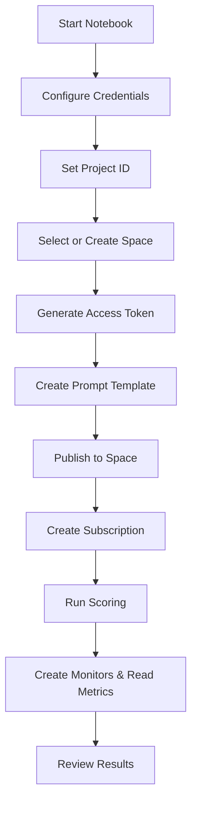

# Realtime Prompt Evaluation for Production

This repository contains the Jupyter notebook **`Manual_Prompt_Evaluation_for_Production.ipynb`**, which walks through how to:

- Create prompt template assets
- Publish them to a deployment space
- Score prompts using WatsonX/Watson OpenScale
- Collect manual evaluation data
- Surface quality, drift, and model health metrics

The workflow targets both **IBM Cloud** and **Cloud Pak for Data (CPD)** environments.

---

## Quick Overview

### What the notebook does:
1. Configure environment (Cloud or CPD)
2. Create or use a project/space
3. Create and publish a **Prompt Template Asset (PTA)**
4. Deploy a **runtime subscription**
5. Score prompt inputs from a CSV
6. Store evaluation feedback
7. Create OpenScale monitors
8. Plot ROUGE metrics and output factsheets

---

<details>

<summary> Requirements</summary>

- **Python 3.10+**
- **Jupyter Notebook** or JupyterLab


#### Required packages:
```bash
pip install jupyter matplotlib requests ibm-watsonx-ai ibm-watson-openscale ibm-watson-studio-lib ibm-cloud-sdk-core
```

</details>

---

<details> <summary>⚙️ Configurable Variables</summary>
Variable	Default / Placeholder	Cell #	Description
use_cpd	False	12	Toggle between IBM Cloud or CPD
IAM_URL	"https://iam.cloud.ibm.com"	12	IAM endpoint
DATAPLATFORM_URL	"https://api.dataplatform.cloud.ibm.com"	12	IBM Cloud base URL
CLOUD_API_KEY	"<apikey>"	12	Never commit this!
project_id	"<project_id>"	16	Project where assets will be stored
use_existing_space	True	19	Use or create a new space
existing_space_id	"<space_id>"	24	Space ID (if using existing space)
test_data_path	"summarisation.csv"	125	Input data for scoring
prompt_template	name="Summarise input"	39	Prompt metadata and config
</details>
---
    
<details> <summary> Execution Flow</summary>

</details>
---

<details> <summary> Outputs</summary>

project_pta_id: Prompt template stored in project

space_pta_id: Prompt template published to space

prod_subscription_id: Runtime subscription ID

scoring_url: Final prompt input endpoint

feedback_data_set_id: OpenScale feedback dataset

fb_records_count: Number of records stored

Monitor IDs: Health, Drift, GenAI Quality

ROUGE plots + factsheets_url displayed inline
</details>
---

<details> <summary> Troubleshooting</summary>
1. Auth Errors: Check CLOUD_API_KEY, IAM_URL, and use_cpd
2. Space Creation Fails: Check COS_RESOURCE_CRN & IAM roles
3. Self-signed Certs: Use verify=False in dev only
4. Empty Feedback Dataset: Validate input CSV format (original_text expected)
</details>
---

## Notebook Index
Section	Cells	Description
Environment Setup	12–16	Configure credentials, project ID
Space Setup	19–32	Use or create deployment space
Auth Helper	35	Token generation
Prompt Template	39	Create prompt template asset
Promotion	~97	Publish PTA to space
Deployment	~100–110	Create runtime + subscription
Scoring & Feedback	112–128	Score prompts and store feedback
Monitoring	129+	Create monitors & read metrics

## Final Note

This notebook is a functional walkthrough for evaluating prompt templates using WatsonX and OpenScale. For production:
1. Refactor procedural cells into modular scripts
2. Use secure credential management (not inline secrets)
3. Automate feedback loops for continuous evaluation
