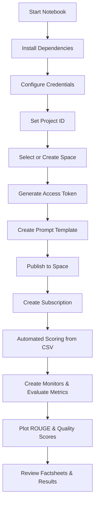

# Automated Prompt Evaluation for Production

This repository contains the Jupyter notebook **`Automated_Prompt_Evaluation_for_Production.ipynb`**, which walks through how to:

- Automate creation of prompt template assets for **RAG (Retrieval Augmented Generation)**
- Publish them to a deployment space
- Configure and monitor them using **WatsonX/Watson OpenScale**
- Collect automated evaluation data (quality, health, and drift metrics)
- Visualize metrics such as ROUGE scores, readability, and risk

The workflow targets both **IBM Cloud** and **Cloud Pak for Data (CPD)** environments.

---

## Quick Overview

### What the notebook does:
1. Configure environment and install dependencies
2. Create or use a project/space
3. Create and publish a **Prompt Template Asset (PTA)**
4. Deploy a **runtime subscription**
5. Score prompt inputs automatically from a CSV
6. Collect evaluation feedback
7. Create OpenScale monitors
8. Plot ROUGE and other generative quality metrics
9. Surface factsheets and monitor outputs

---

<details>

<summary> Requirements</summary>

- **Python 3.10+**
- **Watson Studio Runtime 22.2+**
- **Jupyter Notebook** or JupyterLab

#### Required packages:
```bash
pip install jupyter matplotlib requests ibm-watsonx-ai ibm-watson-openscale ibm-watson-studio-lib ibm-cloud-sdk-core datasets==2.10.0 evaluate sacrebleu sacremoses textstat transformers
```
</details>

---

<details> <summary> Configuration Variables </summary>

| Variable               | Default / Placeholder                  | Purpose / Notes                                                                |
|-------------------------|----------------------------------------|--------------------------------------------------------------------------------|
| `use_cpd`              | `False`                               | Set to `True` for CPD, `False` for IBM Cloud.                                  |
| `IAM_URL`              | `"https://iam.cloud.ibm.com"`          | IAM endpoint (region-dependent).                                               |
| `DATAPLATFORM_URL`     | `"https://api.dataplatform.cloud.ibm.com"` | IBM Cloud Data Platform URL.                                                   |
| `SERVICE_URL`          | `"https://aiopenscale.cloud.ibm.com"`  | Watson OpenScale service endpoint.                                             |
| `CLOUD_API_KEY`        | `"<apikey>"`                          | IBM Cloud API key. **Never commit to Git.**                                    |
| `project_id`           | `"<project_id>"`                      | ID of the project for prompt template assets.                                  |
| `use_existing_space`   | `True`                                | Whether to use an existing space.                                              |
| `existing_space_id`    | `"<space_id>"`                        | Deployment space ID (if reusing).                                              |
| `space_name`           | `"automated_eval_deployment_space"`   | Name of space to create (if not using existing).                               |
| `COS_RESOURCE_CRN`     | `' '`                                 | Cloud Object Storage CRN for space creation.                                   |
| `space_id`             | Derived                               | Taken from existing or newly created space.                                    |
| `csv_file_path`        | `"summarisation.csv"`                 | Input CSV for evaluation/scoring.                                              |
| `prompt_template`      | RAG prompt definition including `model_id` | Prompt setup for retrieval augmented generation.                               |
| `verify`               | `True`                                | Skip SSL verification if `False` (dev only).                                   |
| `version`              | `'2023-07-07'`                        | API version for deployment.                                                    |
| `deployment_id`        | `''`                                  | Populated later. Identifies runtime deployment.                                |
| `scoring_url`          | Generated                             | Endpoint for scoring requests.                                                 |
| `project_pta_id`       | Set programmatically                  | ID of the stored Prompt Template Asset in the project.                         |
| `space_pta_id`         | Set after publishing PTA              | ID of the prompt asset in the deployment space.                                |
| `prod_subscription_id` | Set after subscription creation       | ID of the runtime prompt subscription.                                         |
| `feedback_data_set_id` | Set when dataset is created           | ID of feedback dataset in OpenScale.                                           |
| `fb_records_count`     | Set after ingestion                   | Number of records stored in feedback dataset.                                  |
| `mhm_monitor_id`       | Set during monitor creation           | Model Health monitor ID.                                                       |
| `drift_monitor_id`     | Set during monitor creation           | Drift monitor ID.                                                              |

</details>

---
  
<details> <summary>Execution Flow</summary>


</details>

---

<details> <summary>Outputs</summary>
  
| Output Variable         | Description                                                                 |
|-------------------------|-----------------------------------------------------------------------------|
| `project_pta_id`        | ID of the prompt template asset stored at the project level.                |
| `space_pta_id`          | ID of the prompt template asset promoted to the target space.               |
| `prod_subscription_id`  | ID of the production subscription created for the prompt.                   |
| `scoring_url`           | Endpoint URL used for automated scoring.                                    |
| `feedback_data_set_id`  | ID of the Watson OpenScale dataset used for evaluation/feedback records.    |
| `fb_records_count`      | Number of evaluation records stored in OpenScale.                           |
| `mhm_monitor_id`        | ID of the Model Health monitor.                                             |
| `drift_monitor_id`      | ID of the Drift V2 monitor.                                                 |
| `factsheets_url`        | URL linking to runtime factsheets in Watson Studio / OpenScale.             |

</details>

---

<details> <summary> Troubleshooting</summary>

| Problem                   | Explanation / Fix                                                                 |
|----------------------------|-----------------------------------------------------------------------------------|
| **Authentication failures** | Double-check `CLOUD_API_KEY`, `IAM_URL`, and `use_cpd` settings.                 |
| **Space creation errors**   | Ensure `COS_RESOURCE_CRN` is valid and IAM user has required permissions.         |
| **SSL / cert verification** | Set `verify = False` for CPD with self-signed certs (not for production).         |
| **Empty feedback dataset**  | Check your input CSV and confirm expected fields exist (e.g., `original_text`).   |
| **Scoring issues**          | Confirm `scoring_url` is set correctly and deployment is active.                  |
| **Metric errors**           | Ensure `datasets`, `evaluate`, and `transformers` versions match notebook setup.  |

</details>

---

## Final Note

This notebook provides a fully automated pipeline for evaluating RAG prompt templates with WatsonX and OpenScale.
For production:
1. Refactor notebook steps into scripts or pipelines
2. Use secure credential storage (no inline secrets)
3. Automate feedback dataset ingestion
4. Continuously monitor drift, health, and quality metrics
