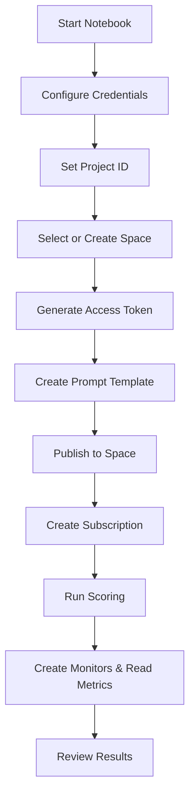

# Realtime Prompt Evaluation for Production

This repository contains the Jupyter notebook **`Manual_Prompt_Evaluation_for_Production.ipynb`**, which walks through how to:

- Create prompt template assets
- Publish them to a deployment space
- Score prompts using WatsonX/Watson OpenScale
- Collect manual evaluation data
- Surface quality, drift, and model health metrics

The workflow targets both **IBM Cloud** and **Cloud Pak for Data (CPD)** environments.

---

## Quick Overview

### What the notebook does:
1. Configure environment (Cloud or CPD)
2. Create or use a project/space
3. Create and publish a **Prompt Template Asset (PTA)**
4. Deploy a **runtime subscription**
5. Score prompt inputs from a CSV
6. Store evaluation feedback
7. Create OpenScale monitors
8. Plot ROUGE metrics and output factsheets

---

<details>

<summary> Requirements</summary>

- **Python 3.10+**
- **Jupyter Notebook** or JupyterLab


#### Required packages:
```bash
pip install jupyter matplotlib requests ibm-watsonx-ai ibm-watson-openscale ibm-watson-studio-lib ibm-cloud-sdk-core
```

</details>

---

<details> <summary> Configuration Variables </summary>

| Variable                  | Default / Placeholder                           | Purpose / Notes                                                                 |
|--------------------------|--------------------------------------------------|----------------------------------------------------------------------------------|
| `use_cpd`                | `False`                                          | Set to `True` for Cloud Pak for Data (CPD), `False` for IBM Cloud.              |
| `IAM_URL`                | `"https://iam.cloud.ibm.com"`                   | IAM endpoint (region-dependent).                                                |
| `DATAPLATFORM_URL`       | `"https://api.dataplatform.cloud.ibm.com"`      | IBM Cloud Data Platform URL.                                                    |
| `SERVICE_URL`            | `"https://aiopenscale.cloud.ibm.com"`           | Watson OpenScale service endpoint.                                              |
| `CLOUD_API_KEY`          | `"<apikey>"`                                     | IBM Cloud API key. **Never commit to Git.**                                     |
| `WML_CREDENTIALS`        | Dict with `url` + `apikey`                      | Machine learning credentials dictionary.                                        |
| `project_id`             | `"<project_id>"`                                 | ID of the project for prompt template assets.                                   |
| `use_existing_space`     | `True`                                           | If `True`, use existing space ID.                                               |
| `existing_space_id`      | `"<space_id>"`                                   | Deployment space ID (if reusing an existing one).                               |
| `space_name`             | `"runtime_evaluation_deployment_space_2"`       | Name of space to create (if not using existing).                                |
| `WML_INSTANCE_NAME`      | `""`                                             | (Optional) WML instance name (for CPD use).                                     |
| `WML_CRN`                | `""`                                             | (Optional) WML CRN (for CPD use).                                               |
| `COS_RESOURCE_CRN`       | `' '`                                            | Cloud Object Storage CRN for space creation.                                    |
| `space_id`               | `existing_space_id`                              | Automatically set from `existing_space_id` or new space.                        |
| `test_data_path`         | `"summarisation.csv"`                            | Path to CSV input for scoring.                                                  |
| `csv_file_path`          | `"summarisation.csv"`                            | Alias for input CSV path.                                                       |
| `prompt_template`        | `name="Summarise input"` + model/task info      | Prompt definition including `model_id` and `task_ids`.                          |
| `verify`                 | `True`                                           | Set to `False` to skip SSL verification (useful in CPD/dev environments).       |
| `version`                | `'2023-07-07'`                                   | API version for model deployment.                                               |
| `DEPLOYMENTS_URL`        | Computed from WML credentials                   | Base URL for WML deployments.                                                   |
| `deployment_id`          | `''`                                             | Populated later; identifies runtime deployment.                                 |
| `scoring_url`            | Computed from deployment/subscription           | Endpoint used for scoring/generation requests.                                  |
| `project_pta_id`         | Set programmatically                             | ID of the stored Prompt Template Asset in the project.                          |
| `space_pta_id`           | Set after publishing PTA                         | ID of the prompt asset in the deployment space.                                 |
| `prod_subscription_id`   | Set after subscription creation                  | ID of the runtime prompt subscription.                                          |
| `feedback_data_set_id`   | Set when dataset is created                      | ID of feedback dataset in OpenScale.                                            |
| `fb_records_count`       | Set after record ingestion                       | Number of records stored in feedback dataset.                                   |
| `mhm_monitor_id`         | Set during monitor creation                      | ID for Model Health monitor.                                                    |
| `drift_monitor_id`       | Set during monitor creation                      | ID for Drift V2 monitor.                                            |
</details>

---
    
<details> <summary>Execution Flow</summary>


</details>

---

<details> <summary>Outputs</summary>

| Output Variable            | Description                                                                 |
|---------------------------|-----------------------------------------------------------------------------|
| `project_pta_id`          | ID of the prompt template asset stored at the project level.                |
| `space_pta_id`            | ID of the prompt template asset promoted to the target space.               |
| `prod_subscription_id`    | ID of the production subscription created for the prompt.                   |
| `scoring_url`             | Endpoint URL used to send generation/scoring requests to the model.         |
| `feedback_data_set_id`    | ID of the Watson OpenScale dataset used for evaluation/feedback records.    |
| `fb_records_count`        | Number of evaluation records successfully stored in OpenScale.              |
| `mhm_monitor_id`          | ID of the Model Health monitor instance.                                    |
| `drift_monitor_id`        | ID of the Drift V2 monitor instance.                                        |
| `factsheets_url`          | URL linking to runtime factsheets in the Watson Studio / OpenScale UI.     |

</details>

---

<details> <summary> Troubleshooting</summary>

| Problem                            | Explanation / Fix                                                                 |
|-----------------------------------|-----------------------------------------------------------------------------------|
| **Authentication failures**       | Double-check `CLOUD_API_KEY`, `IAM_URL`, and `use_cpd` settings.                 |
| **Space creation errors**         | Ensure `COS_RESOURCE_CRN` is valid and your IAM user has necessary permissions.   |
| **SSL / cert verification**       | For CPD with self-signed certs, set `verify = False`. Do **not** do this in prod. |
| **Empty feedback dataset**        | Check your CSV file. It must contain the expected fields (e.g., `original_text`). |
| **Scoring issues**                | Confirm `scoring_url` is set correctly and your deployment is active.             |
</details>

---

## Final Note

This notebook is a functional walkthrough for evaluating prompt templates using WatsonX and OpenScale. For production:
1. Refactor procedural cells into modular scripts
2. Use secure credential management (not inline secrets)
3. Automate feedback loops for continuous evaluation
