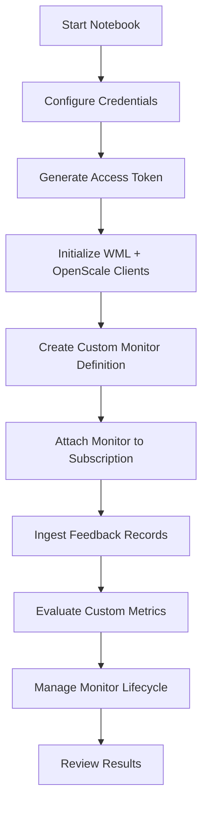

# Custom Metrics Monitoring and Deployment

This repository contains the Jupyter notebook **`Custom_Metrics_Monitoring_and_Deployment.ipynb`**, which walks through how to:

- Configure IBM Cloud / CPD credentials  
- Generate IAM access tokens  
- Connect to **Watson Machine Learning** and **Watson OpenScale**  
- Define and register **custom monitors** (e.g., user feedback metrics)  
- Deploy and manage runtime monitoring  
- Collect and evaluate monitoring results  

The workflow supports both **IBM Cloud** and **Cloud Pak for Data (CPD)** environments.

---

## Quick Overview

### What the notebook does:
1. Configure environment (Cloud or CPD)  
2. Generate access token from API key  
3. Initialize Watson Machine Learning and OpenScale clients  
4. Create a **custom monitor** (e.g., user feedback)  
5. Attach monitor definition to deployment/subscription  
6. Log and evaluate feedback records  
7. Manage monitor lifecycle (update / delete)  
8. Surface results via OpenScale  

---

<details><summary> Requirements </summary>

- **Python 3.10+**  
- **Jupyter Notebook** or JupyterLab  

### Required packages:
```bash
pip install jupyter requests ibm-watsonx-ai ibm-watson-openscale ibm-cloud-sdk-core
```
</details>

---

<details><summary> Configuration Variables </summary>
| Variable              | Default / Placeholder                      | Purpose / Notes                                         |
| --------------------- | ------------------------------------------ | ------------------------------------------------------- |
| `IAM_URL`             | `"https://iam.cloud.ibm.com"`              | IAM endpoint (region-dependent).                        |
| `DATAPLATFORM_URL`    | `"https://api.dataplatform.cloud.ibm.com"` | IBM Cloud Data Platform URL.                            |
| `SERVICE_URL`         | `"https://aiopenscale.cloud.ibm.com"`      | Watson OpenScale service endpoint.                      |
| `CLOUD_API_KEY`       | `"<apikey>"`                               | IBM Cloud API key. **Do not commit secrets.**           |
| `WML_CREDENTIALS`     | `{url, apikey, auth_url, wml_location}`    | Dict for Watson Machine Learning client initialization. |
| `service_instance_id` | `None`                                     | ID of the target OpenScale service instance.            |
| `monitor_name`        | `"user_feedback_metrics"`                  | Name for custom monitor definition.                     |
| `deployment_id`       | `''`                                       | Deployment ID to attach custom monitor.                 |
| `subscription_id`     | `''`                                       | Subscription ID for runtime evaluation.                 |

</details>

---

<details><summary> Execution flow </summary>

</details>

---

<details><summary> Outputs </summary>
  
| Output Variable         | Description                                                      |
| ----------------------- | ---------------------------------------------------------------- |
| `iam_access_token`      | IAM access token used for authentication.                        |
| `wml_client.version`    | Confirms connection to Watson Machine Learning.                  |
| `wos_client.version`    | Confirms connection to Watson OpenScale.                         |
| `monitor_name`          | Identifier for the custom monitor created (e.g., user feedback). |
| `monitor_definition_id` | ID of the custom monitor definition in OpenScale.                |
| `feedback_records`      | Number of records ingested for evaluation.                       |

</details>

---

<details><summary> Troubleshooting </summary>
  
| Problem                     | Explanation / Fix                                                     |
| --------------------------- | --------------------------------------------------------------------- |
| **Authentication failures** | Check `CLOUD_API_KEY`, `IAM_URL`, and environment type (`use_cpd`).   |
| **Monitor creation errors** | Ensure you have permission on the OpenScale instance.                 |
| **Empty feedback dataset**  | Verify your CSV or payload includes the expected fields.              |
| **Deployment not found**    | Confirm `deployment_id` and `subscription_id` are correct and active. |

</details>

---

## Final Note

This notebook demonstrates how to define and manage custom metrics monitoring with Watson OpenScale.
For production usage:
1. Externalize credentials and avoid inline secrets.
2. Automate monitor creation and feedback ingestion.
3. Integrate results into a continuous monitoring pipeline.
